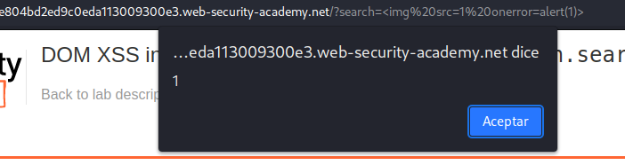
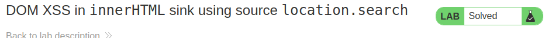

# DOM XSS Laboratories


## Lab: DOM XSS in document.write sink using source location.search

This lab contains a DOM-based cross-site scripting vulnerability in the search query tracking functionality. It uses the JavaScript document.write function, which writes data out to the page. The document.write function is called with data from location.search, which you can control using the website URL.

To solve this lab, perform a cross-site scripting attack that calls the alert function.

```js
"><svg onload=alert()><"
```

## Lab: DOM XSS in document.write sink using source location.search inside a select element


This lab contains a DOM-based cross-site scripting vulnerability in the stock checker functionality. It uses the JavaScript document.write function, which writes data out to the page. The document.write function is called with data from location.search which you can control using the website URL. The data is enclosed within a select element.

To solve this lab, perform a cross-site scripting attack that breaks out of the select element and calls the alert function.
```js
element.innerHTML='...  ...'
```
1. Dom invader nos detecta un problema en el dom


2. probamos escribir directamente el script , al no funcionar vamos al siguiente paso.
3. Buscamos el código, vemos que está dentro de un select
4. 


4. buscamos los parámetros que necesita
   
   

5. Si pongo directamente no funciona, hay que ir cerrando etiquetas

 


```html
product?productId=1&storeId="></select>
```

## Lab: DOM XSS in innerHTML sink using source location.search

This lab contains a DOM-based cross-site scripting vulnerability in the search blog functionality. It uses an innerHTML assignment, which changes the HTML contents of a div element, using data from location.search.

To solve this lab, perform a cross-site scripting attack that calls the alert function.


El dom invader nos avisa que hay una vulnerabilidad


En esta sección puedo directamente poner el script. Lo que hacemos es llamar a una imagen la cual va a dar error al estar src=1 y luego cuando de el error ejecuta una acción.





## Lab: DOM XSS in jQuery anchor href attribute sink using location.search source

This lab contains a DOM-based cross-site scripting vulnerability in the submit feedback page. It uses the jQuery library's $ selector function to find an anchor element, and changes its href attribute using data from location.search.

To solve this lab, make the "back" link alert document.cookie.


Nos quedamos con el attribute


Recordamos los apuntes

```js
?returnUrl=javascript:alert(document.domain)
```
Lo añadimos a la url


## Lab: DOM XSS in jQuery selector sink using a hashchange event

This lab contains a DOM-based cross-site scripting vulnerability on the home page. It uses jQuery's $() selector function to auto-scroll to a given post, whose title is passed via the location.hash property.

To solve the lab, deliver an exploit to the victim that calls the print() function in their browser.

Exploramos la web. Vemos que tiene un exploit server y además una vulnerabilidad en el dom.


Recordamos los apuntes

Vemos que tiene una vulnearbilidad del tipo $() selector


```js

$(window).on('hashchange', function() {
	var element = $(location.hash);
	element[0].scrollIntoView();
});

Poner...

<iframe src="https://vulnerable-website.com#" onload="this.src+=''">
```
Añadimos en el body de nuestro servidor exploit este código y ponemos la dirección de nuestro web que queremos explotar (no la del servidor exploit) Con esto podremos observar en nuestra pantalla cosas. Además en vez del alert el ejercicio pide un print()
```js
<iframe src="https://vulnerable-website.com#" onload="this.src+=''"></iframe>
```


Lo mandamos


## Lab: DOM XSS in AngularJS expression with angle brackets and double quotes HTML-encoded

This lab contains a DOM-based cross-site scripting vulnerability in a AngularJS expression within the search functionality.

AngularJS is a popular JavaScript library, which scans the contents of HTML nodes containing the ng-app attribute (also known as an AngularJS directive). When a directive is added to the HTML code, you can execute JavaScript expressions within double curly braces. This technique is useful when angle brackets are being encoded.

To solve this lab, perform a cross-site scripting attack that executes an AngularJS expression and calls the alert function.


Comprobamos que está dentro de un ng-algo


>Creía que poniendo únicamente {{alert()}} funcionaría pero no

He buscado en google alert angular xss


Por lo que probaré

{{constructor.constructor('alert(1)')()}}


## Lab: Reflected DOM XSS

This lab demonstrates a reflected DOM vulnerability. Reflected DOM vulnerabilities occur when the server-side application processes data from a request and echoes the data in the response. A script on the page then processes the reflected data in an unsafe way, ultimately writing it to a dangerous sink.

To solve this lab, create an injection that calls the alert() function.


Intento cerrar las comillas cargar el javascript  y comentar pero parece que no. Además he visto que no se puede comentar en los json

" alert(1)}//


Aquí lo interesante es 
  1. nos está escapando automáticamente el "

Si ponemos un \delante de las comillas nos lo va a escapar también

Voy a intentar

\" alert(1)}//


Si vemos ahora nos lo ha escapado. Abajo aparece el espacio como un + por lo que en vez de espacio pondré un + en el search

\"+alert(1)}//

Y me lo ejecuta


## Lab: Stored DOM XSS

This lab demonstrates a stored DOM vulnerability in the blog comment functionality. To solve this lab, exploit this vulnerability to call the alert() function.


Entiendo que el comentario va donde el exploit por lo que hay que cerrarlo de alguna forma para que lance el alert.

Vimos antes que el alert stored se hace con
```
element.innerHTML='...  ...'


```

Si lo pongo directamente en la url me dice que la id no es válida

Si lo pongo dentro del comentario desaparece totalmente... pienso que puede estar borrando las cadenas. Voy a probar ponerlo dos veces

```html

```

Perfecto funciona, pero podría haber probado varias XD

