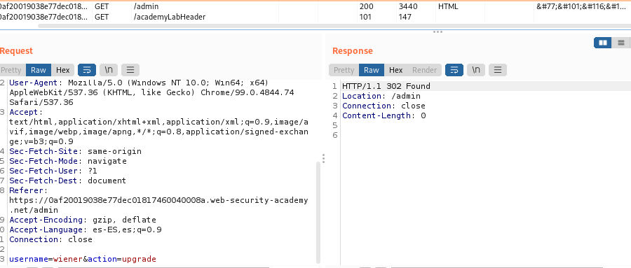

# labs access controls vulnerabilities

## Lab: Unprotected admin functionality
This lab has an unprotected admin panel.

Solve the lab by deleting the user carlos.

Encontramos con un mapeo robots.txt y dentro aparece la url administrator-panel, el cual no tiene protección

Borramos carlos.


## Lab: Unprotected admin functionality with unpredictable URL

This lab has an unprotected admin panel. It's located at an unpredictable location, but the location is disclosed somewhere in the application.

Solve the lab by accessing the admin panel, and using it to delete the user carlos.

Vamos a my-account y miramos el código

```js
var isAdmin = false;
if (isAdmin) {
   var topLinksTag = document.getElementsByClassName("top-links")[0];
   var adminPanelTag = document.createElement('a');
   adminPanelTag.setAttribute('href', '/admin-xkqtid');
   adminPanelTag.innerText = 'Admin panel';
   topLinksTag.append(adminPanelTag);
   var pTag = document.createElement('p');
   pTag.innerText = '|';
   topLinksTag.appendChild(pTag);
}
</script>
```


## Lab: User role controlled by request parameter

This lab has an admin panel at /admin, which identifies administrators using a forgeable cookie.

Solve the lab by accessing the admin panel and using it to delete the user carlos.

You can log in to your own account using the following credentials: wiener:peter

Nos logueamos con wiener, en burpsuite vemos


Tenemos que cambiarlo a true y enviamos desde repeater.

una vez que está en true cambiamos la url por /admin pudiendo ver las url de eliminación del usuario


Copiamos la url de eliminación y enviamos


## Lab: User role can be modified in user profile

This lab has an admin panel at /admin. It's only accessible to logged-in users with a roleid of 2.

Solve the lab by accessing the admin panel and using it to delete the user carlos.

You can log in to your own account using the following credentials: wiener:peter

Es igual que el de antes sino que en vez de aparecer isadmin... te aparece el rol y habrá que cambiarlo a 2

El sitio que parece que es para cambiarlo es cuando realizas un cambio de mail


Pasamos en el json tambien el rolid=2


Ahora ponemos admin en la url, y luego la url de eliminacion de carlos


## Lab: URL-based access control can be circumvented

This website has an unauthenticated admin panel at /admin, but a front-end system has been configured to block external access to that path. However, the back-end application is built on a framework that supports the X-Original-URL header.

To solve the lab, access the admin panel and delete the user carlos.

- add X-Original-URL 

Añadimos el X-Original-URL: /admin

Al enviar nos deja entrar en admin


Cambiamos el xriginal por la de borrar a carlos


Vemos que nos deja por que le hace falta el parámetro. Pongo arriba en la url el parámetro ?username=carlos ya que hemos visto que ese era el parámetro de la url


## Lab: Method-based access control can be circumvented

This lab implements access controls based partly on the HTTP method of requests. You can familiarize yourself with the admin panel by logging in using the credentials administrator:admin.

To solve the lab, log in using the credentials wiener:peter and exploit the flawed access controls to promote yourself to become an administrator.

-nos deja ver el admin pero necesitamos que wiener sea administrador

Entrando como administrador en el panel de control podemos hacer que wiener se administrador , entiendo que realmente quiere que lo hagamos con burpsuite


La url es admin-roles

