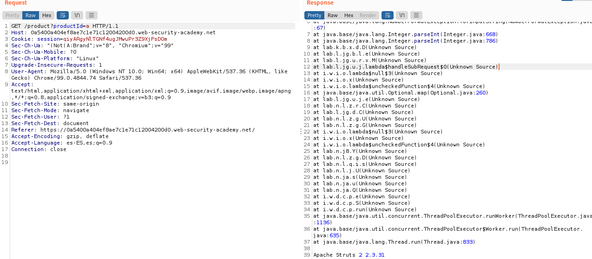
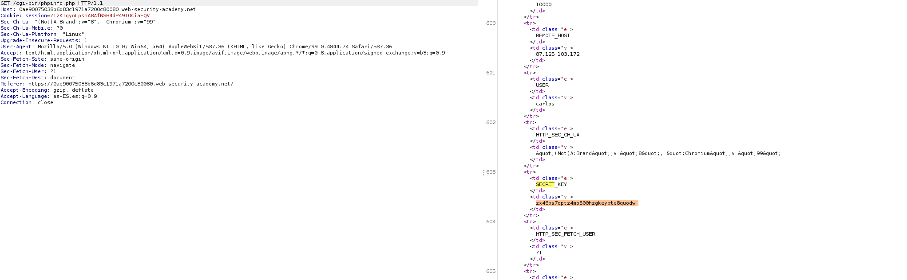
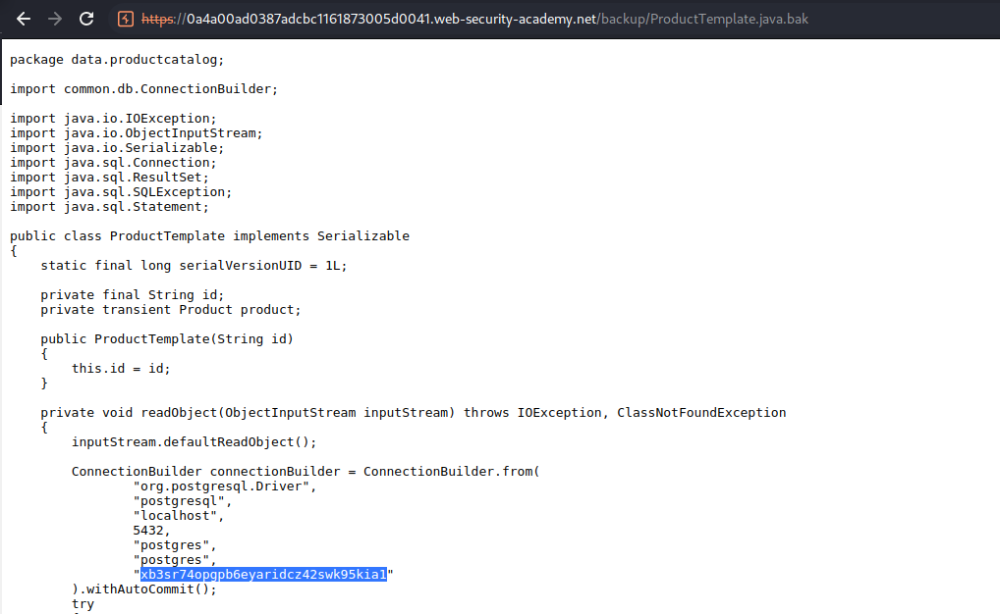
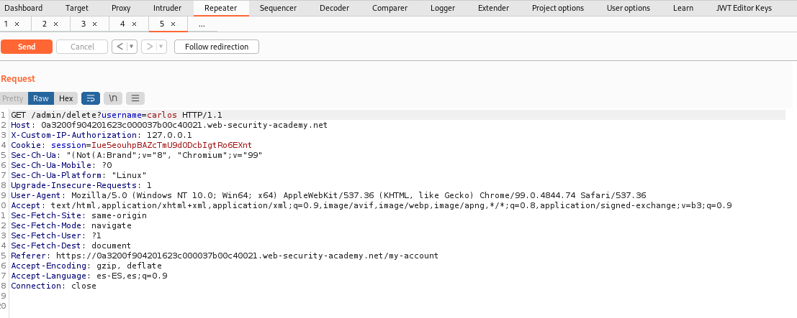
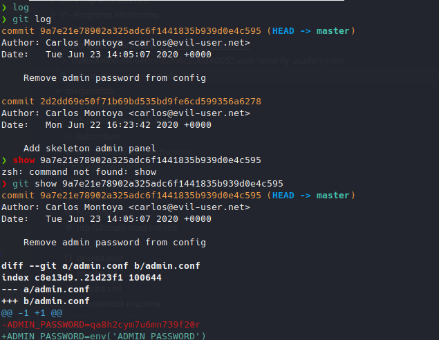

## Lab: Information disclosure in error messages

This lab's verbose error messages reveal that it is using a vulnerable version of a third-party framework. To solve the lab, obtain and submit the version number of this framework.

Simplemente forzamos el error cambiando la id del producto por una cadena



## Lab: Information disclosure on debug page

This lab contains a debug page that discloses sensitive information about the application. To solve the lab, obtain and submit the SECRET_KEY environment variable.

Mirando el código de la página aparece comentado  /cgi-bin/phpinfo.php por lo que enviamos esta petición y buscamos secret_key, aparece.



## Source code disclosure via backup files

This lab leaks its source code via backup files in a hidden directory. To solve the lab, identify and submit the database password, which is hard-coded in the leaked source code.

Simplemente he puesto el backup al final y me ha salido el código de la copia de seguirdad con su password



## Authentication bypass via information disclosure

This lab's administration interface has an authentication bypass vulnerability, but it is impractical to exploit without knowledge of a custom HTTP header used by the front-end.

To solve the lab, obtain the header name then use it to bypass the lab's authentication. Access the admin interface and delete Carlos's account.

You can log in to your own account using the following credentials: wiener:peter


Cambiamos a /admin . Una vez hecha nos aparece un mensaje que solo en localhost es accesibe.

```bash
X-Custom-IP-Authorization: 127.0.0.1

#También tenemos la opción de ponerla en proxy --> matcha an replace : match vacío y replace 

X-Custom-IP-Authorization: 127.0.0.1
```



## Information disclosure in version control history

This lab discloses sensitive information via its version control history. To solve the lab, obtain the password for the administrator user then log in and delete Carlos's account.

Directamente nada más ver que tiene un github he cogido y he ido a la carpeta .git. Hay programas para poder extraer, pero ese directamente aparece el repositorio.

Vamos a una consola y hacemos 

```bash
wget -r ip/.git

#Entramos en la carpeta 
git log

git show ..... 
```




Usamos para entrar Administrator : qa8h2cym7u6mn739f20r