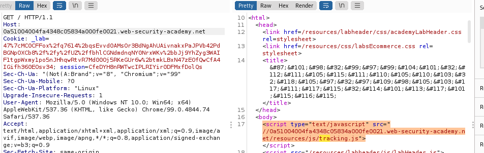

# laboratories web cache poisoning

## Lab: Web cache poisoning via ambiguous requests

This lab is vulnerable to web cache poisoning due to discrepancies in how the cache and the back-end application handle ambiguous requests. An unsuspecting user regularly visits the site's home page.

To solve the lab, poison the cache so the home page executes alert(document.cookie) in the victim's browser.


1. Vemos que se le pueden añadir parámetros sin problemas a la petición get .  Se puede cambiar este parámetro cada vez que desee una respuesta nueva del servidor back-end.


>**Para construir un ataque de envenenamiento de caché web, debe obtener una respuesta del servidor que refleje una carga útil inyectada. El desafío es hacer esto mientras se conserva una clave de caché que aún se asignará a las solicitudes de otros usuarios. Si tiene éxito, el siguiente paso es almacenar en caché esta respuesta maliciosa. A continuación, se mostrará a cualquier usuario que intente visitar la página afectada.**

Observamos que si ponemos un segundo host en el código aparece un /resources/js/tracking.js con la url que pusimos.


No se porque pero después de elimianr el segundo host se queda guardado la url en la cache. ¿Un poco random? ¿Por qué?





Crear un archivo que se llame /resources/js/traking.js que contenga lo que nos dice el enunciado **alert(document.cookie)**

Tenemos que guardar.


Copiamos la url y la ponemos como segundo host . Recordad que debemos ir estropeando la cache, eso se hacía con el ?adfadf=22 cualquiera, luego se quita y se envia.

> NO FUNCIONA. No ser porque no funciona... pero está bien creo.

He hecho lo mismo pero en el exploit le he quitado las etiquetas ```<script>```que puse. Y he dejado solo el alert.

